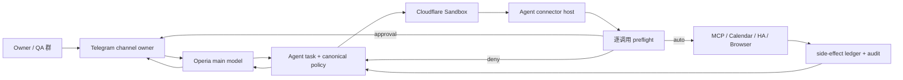

# Operia Sandbox 自治、外部工具审批与 QA 群控制面设计

## 0. 决策摘要

本 Spec 将 Owner 已确认的方案冻结为一个统一合同：Operia 在隔离的 Cloudflare Sandbox 内默认自主，
但任何跨出 Sandbox、影响真实外部世界或扩大权限的行为，都必须经过 Agent 控制层的确定性策略判断。

系统分成两个互不替代的控制面：

1. **向内的自我管理**：Operia 可以自主运行代码、安装临时依赖、构建、测试、转换数据，并写入明确
   标记为 `operia-owned` 的持久资源；删除必须软删除或可补偿，Owner 有 30 天恢复窗口。
2. **向外的工具调用**：低风险、明确 allowlist、目标和预算受限且可验证的动作自动执行；其余动作在
   固定 QA 群中以 Telegram 选择框审批。拒绝只拒绝当前动作，任务可尝试安全替代；停止任务是独立动作。

生产代码、自身安全策略、权限、预算、审计记录和生产部署不属于 Operia 的自治范围。第一阶段不接入邮件、
其他群聊、第三方私聊，也不开放永久删除、付款、账号权限变更或任意外部写入。

随附策略清单仍为 **disabled candidate**。正式 Agent 已获授权并启用 P1 隔离脚本执行与 P2 只读公网访问；
Code Mode、Policy v3 enforcement 与所有外部写入继续关闭。本 Spec 不授权 OAuth、Provider、付费调用、
生产写入或开通任何其他 HOLD 能力。

## 1. 目标与成功定义

### 1.1 产品目标

- 绝大多数日常任务不再因每条 shell、每个内部步骤反复等待审批；
- Operia 可以像一个可靠的长期 Agent 一样维护自己的运行状态、任务记录和可恢复数据；
- 用户只在真正越过风险边界时收到一张有足够上下文的审批卡；
- 审批、拒绝、超时、暂停、恢复、重放和补偿均有确定性状态机，不依赖模型“自觉”；
- 每个外部动作都可归因到固定 Owner、任务、策略版本、参数摘要、预算和幂等键；
- Cloudflare Sandbox 只负责隔离执行，不被误当成身份认证或授权系统。

### 1.2 P0 成功标准

1. Sandbox 内部代码、临时文件、构建和测试在配额内自动完成，不产生逐命令审批。
2. 所有外部调用在 Agent connector 边界再次执行策略判断；Sandbox 不能直接携带长期凭据绕开 connector。
3. QA 群内所有可变更状态的命令和按钮只接受精确 Owner Telegram user ID；管理员、注册 Bot 或群成员身份
   均不能替代 Owner 权限。
4. 相同任务内批准恢复不会重跑已经成功的副作用；未知结果不会被盲目重试。
5. Operia-owned 数据删除进入 30 天墓碑期，Owner 可恢复；审计账本不可被 Operia 编辑或删除。
6. `/pause` 能立即冻结新的外部动作并撤销临时授权；`/resume` 必须先展示冻结期间的状态并再次确认。
7. 第一阶段功能可通过单一开关回退到现有直接工具路径，且不迁移或破坏 Operia Memory 真源。

## 2. 非目标与硬边界

本阶段不做：

- 不允许 Operia 修改、合并或部署自己的生产代码；
- 不允许 Operia 修改策略、权限、预算、熔断器、Owner 绑定或审计保留规则；
- 不把 Sandbox ID、会话 ID、群管理员身份或 Bot 注册状态当作认证；
- 不把长期 token、Cookie、OAuth refresh token、Service bearer 或 Provider key 放进 Sandbox；
- 不允许 Sandbox 直接向任意 API 执行写请求；写入必须经过受控 connector；
- 不开放其他 Telegram 群、第三方私聊、邮件、Slack、WeChat 或其他出站消息渠道；
- 不开放永久删除、即时清空、支付、下单、订阅、ACL、账号授权或生产发布；
- 不开放摄像头/麦克风的查看、抓拍、录制、监听、云台、播报；状态读取例外见 allowlist；
- 不假设门锁、门禁、危险电器等未接入 Home Assistant 的实体存在，也不为其预先放权；
- 不让 Code Mode 取代上游身份验证、工具授权、参数校验、预算或审计。

## 3. 当前现场与差距

### 3.1 现有 QA 群真实边界（2026-07-26 只读审计）

远程 D1 的当前状态为：

- 只有 1 个 active room；
- 唤醒策略是 `mention_or_reply`，topic 策略为 `exact`，线程为 `general`；
- audience 为 `owner_debug_shared`；
- active agents 为 `operia_worker` 与 `cc_connect`，两者 Telegram membership 均为 administrator；
- `bot_to_bot_mode=enabled`；
- shared summary 为 `off / empty`；
- 未过期 room turns 和 transcript items 均为 0。

因此这个群应被定义为 **Owner + Codex + Operia 的固定 QA / 控制群**，不是一般家庭群，也不是可扩展的
多成员工作空间。第一阶段它是 Operia 唯一可自动发言和投递审批卡的 Telegram 目标。

### 3.2 已经成立的边界

- 消息入口要求 active room、精确 thread、注册 actor、显式 mention 或 reply；
- 群消息不会自动获得 Owner 私有 Memory、persona 或通用工具；
- 群内模型表面目前只保留 `react_to_message` 与 `reply_to_message`；
- room envelope 绑定内部来源、频道、recipient、room 和 D1 状态；
- 普通审批票据的仓库候选实现已经绑定 owner、chat、task、round、server、tool、args hash、policy version、
  expiry 和 nonce。

这些边界应保留。新的审批和控制能力属于确定性的 channel transport，不应通过给群内模型增加高风险工具实现。

### 3.3 必须先修的差距

| 差距 | 当前风险 | 本 Spec 要求 |
| --- | --- | --- |
| callback 路由先使用旧 chat allowlist，room 例外主要存在于消息路径 | 固定 QA 群可能收不到或被迫绕开正常审批回调 | 为 QA room 建立精确 callback transport binding，不复用宽泛消息例外 |
| `taskctl:*` 回调未在 TG handler 入口绑定 clicker Owner | 看见按钮的非 Owner 成员可能触发任务变更 | 每个 mutation callback 都必须携带并验证 Telegram clicker user ID |
| Browser 域审批含“永久允许”按钮 | TG 临时界面能扩大长期策略 | TG 只允许 once/task；永久策略只能在版本化 Admin 控制面修改 |
| 普通审批只有允许/拒绝；拒绝或超时会把整个 task 终止 | 与“只拒绝当前动作并安全改道”冲突 | 引入 `action_denied` / `action_expired`，保留 task continuation |
| 当前 static risk 把所有 write/device/message/purchase/delete 一律审批 | 无法表达可逆的 Operia-owned 写入和细粒度浏览器后果 | 改为 capability + target + consequence + sensitivity + budget 策略 |
| `browser_task` 被标记为 read，但内部可 click/fill/submit | 工具名风险无法代表真实后果 | 按 typed action 和最终效果逐步判定，提交前再次 preflight |
| 生产 Agent 仍落后于仓库候选审批实现 | 不能把仓库绿灯当生产能力 | 零 live ticket 窗口下先部署审批 P0 或其继任版本，再启用 Sandbox 写入 |

2026-07-26 的初始生产只读观测显示：Telegram 版本为
`<UUID>`；Agent 版本为
`<UUID>`。后续 Owner 单独授权的正式 Agent flags-off 基础设施部署见
16.4；Telegram 未因本 Spec 改动。

## 4. 唯一 Owner 与信任边界

| 事实 / 能力 | Canonical owner | Operia 权限 | 其他层权限 |
| --- | --- | --- | --- |
| Persona、用户身份、长期 Memory | Memory | 通过现有 purpose-bound capsule 消费 | Agent/Sandbox 不复制真源 |
| Tool policy、任务、审批、预算、熔断、审计 | Agent | 只读策略版本和本任务裁决 | TG 只展示和回传 Owner 决定 |
| MCP provider、工具启停、credential 引用 | MCP Gateway | 只通过 Agent connector 调用 | Sandbox 不见真实 secret |
| QA room/channel/binding/delivery | Telegram | 可向固定 room 发言 | Agent 提供内容和审批状态，不拥有群策略 |
| Sandbox 生命周期、session、资源配额 | Agent Sandbox Orchestrator | 在 task capability 内使用 | Cloudflare 只提供隔离原语 |
| Operia-owned D1/KV/R2/index/log/schedule | 对应资源 owner，namespace 标记 `operia-owned` | 配额内读写、软删除、恢复 | 权限/配额/保留策略仍由 Agent/Admin 控制 |
| Calendar event 与 credential | Calendar owner / Google Calendar | 只通过 Calendar connector | TG/Sandbox 不持有 credential |
| HA entities 与 credential | HA / MCP Gateway | 只调用暴露的 façade | 不开放任意 `call_service` |

策略优先级固定为：

```text
global pause / hard deny
  > owner deny override
  > approval-required rule
  > exact auto rule
  > default deny
```

任何层只能收紧，不能放宽上游裁决。工具目录可见不等于可执行。

## 5. 运行架构

### 5.1 调用路径



简单、单步、已有稳定执行路径的工具不必强行绕进 Code Mode。Code Mode 只用于需要依赖调用、循环、筛选、
分支或批量整理的复合任务，并通过独立 feature flag 进入 shadow / limited rollout。

### 5.2 Cloudflare Sandbox 合同

基于当前 Cloudflare 官方合同：

- 每个 Sandbox 有独立 VM 级文件、进程、网络和资源隔离；同一 Sandbox 内的进程彼此可见；
- 对任务而言 public web 默认可用，但底层 `enableInternet=false`：所有 HTTP(S) 必须经过统一 egress handler，
  从而阻止非 80/443 原始流量绕过 method、SSRF、size、audit 和 Phase flag；DNS 仍按平台合同工作；
- Sandbox 使用 RPC transport；不依赖已弃用的 HTTP/WebSocket transport；
- 设置 `enableDefaultSession: false`，每个 task 显式创建 session；
- isolation key 至少绑定 `ownerId + taskId + environment`，不同任务默认不共享 Sandbox；
- approval replay 可复用同一 task Sandbox，但不能复用跨任务能力票据；
- Sandbox 只收到短期 capability token、代理地址和任务级非敏感输入，不收到长期 secret；
- Sandbox ID 不是 authorization token，所有 proxy/connector 请求仍验证签名、task、policy version、expiry、
  nonce 和调用预算。

### 5.3 Egress policy

Owner 已接受“网络默认可用”，但该默认必须具体化为：

- public HTTPS GET/HEAD、DNS 和必要的 80/443 流量可自动；
- 拒绝 loopback、RFC1918、link-local、metadata endpoint、`.local`、未批准 IP literal 和显式端口；
- `allowedHosts` 适用于高约束任务；普通研究任务可使用 programmable handler 做 host / method / size / rate 检查；
- 非 GET/HEAD 的任意直连默认拒绝，只允许发往 Agent connector/proxy；
- credentials 由 Worker proxy 在边界注入，Sandbox 不见真实值；
- 下载设单文件和任务总量上限，响应体在进入模型前做类型、大小和敏感信息清洗；
- 所有 egress 记录 target origin、method、bytes、decision 和 correlation ID，不记录完整 secret/query。

### 5.4 Code Mode 与 durable approval

Cloudflare Code Mode 仍为 experimental，因此：

- 只把一个 code-execution tool 暴露给 planning model，内部 connector 调用仍由 Agent host 实现；
- 每个内部调用先执行 canonical policy，动态决定 `auto / approval / deny`；
- 批准后恢复同一脚本，已经完成的调用使用 ledger 结果，不重新产生副作用；
- rejection 只终止当前待批调用，Agent 将结构化 `action_denied` 返回 planner，允许选择安全替代；
- Cloudflare `revert` 只表示补偿动作，不承诺外部系统真正回到历史状态；
- Code Mode 版本固定，升级需重跑授权、replay、revert、网络和 resource-isolation 回归测试；
- 任意异常可切回现有 direct delegated-tool 路径。

## 6. 向内：Operia 自我管理

### 6.1 默认自动

在 task 配额内自动允许：

- 执行代码、shell、构建、测试和静态检查；
- 创建、修改、移动和删除 Sandbox 临时文件；
- 安装临时依赖和使用临时缓存；
- 数据格式转换、压缩、解压、解析、筛选和生成中间 artifact；
- 写入明确标记为 `operia-owned` 的 D1/KV/R2、memory index、task checkpoint、日志和 schedule；
- 对上述持久资源创建新版本、墓碑、恢复和垃圾回收候选。

### 6.2 不可越过的边界

Operia 不得：

- 把普通用户数据、共享数据或系统表重新标记为 `operia-owned`；
- 调高 CPU、内存、时长、存储、调用数、费用或并发配额；
- 修改 schema owner、权限、策略、审计、加密密钥或生产路由；
- 直接永久删除持久数据；
- 把 candidate code 合并或部署到 production。

### 6.3 删除与恢复

- 默认删除写入 tombstone，并记录 `deleted_by_task`、reason、previous_version、restore_deadline；
- Owner 恢复窗口为 30 天；
- pinned、审计、法律保留、仍被引用或处于 unknown side-effect 调查的数据不得 purge；
- 30 天后只允许系统 lifecycle job 按保留策略清理；Operia 无即时 purge 能力；
- 外部系统若支持原生 undo/version，应记录原生 rollback reference；否则只声明 compensating action；
- 任何补偿失败都进入 `attention_required`，不得把“已尝试撤销”报告成“已恢复”。

## 7. 向外：首版 allowlist

机器可读候选清单位于 `config/operia-sandbox-allowlist-v1.example.json`。它默认 disabled，下面是人类可读
摘要。规则匹配必须同时考虑 capability、target、consequence、sensitivity、reversibility、intent 和 budget，
不能只看工具名。

### 7.1 自动允许

| 能力 | 自动条件 | 关键限制 |
| --- | --- | --- |
| `request_context` | purpose-bound capsule | 不含 persona/secret；不能扩大 scope |
| `delegate_action` | 只创建 task envelope | 内部每个调用重新判定 |
| system/observer status | read-only | 无 secret、无 mutation |
| public web search/read | GET/HEAD、public origin、大小/速率内 | paid search 另受 intent + budget |
| browser read/navigation | open/read/expand/download/search/filter | 不跨 SSRF 边界，不产生最终外部效果 |
| browser draft fill | 非敏感字段且尚未提交 | 敏感字段在输入前审批 |
| health summary/trends | Owner-bound read | 不返回 raw sample |
| Operia-owned storage | namespace 明确、配额内 | 写入版本化；删除为 30 天 tombstone |
| private artifact creation | Operia-owned artifact namespace | 不自动发布或外发 |
| QA 群消息 | 固定 chat/thread/bot/env | 仅回复、报告、提问、提醒、测试、审批卡；不转发 |
| Calendar read | primary projection/free-busy/summary | credential 留在 Calendar owner |
| Operia Calendar write | Operia-owned calendar/event | 可撤销、带来源标记 |
| Owner 明确本轮 Calendar 指令 | 精确事件和动作 | 当前指令本身作为 once intent；不重复弹卡，仍做 etag/idempotency |
| 普通自主提醒 | primary calendar，新建且可撤销 | metadata `created_by=operia`，详情显示“由 Operia 创建” |
| HA normal read | 已 allowlist entity | 只读状态；新实体先 quarantine |
| HA bounded comfort action | 精确已审查 façade 和范围 | 仅灯、简单 scene/media/音量及明确窗帘/扫地/空调范围 |

### 7.2 需要 Telegram 审批

| 能力 | 审批时点 | 说明 |
| --- | --- | --- |
| 新站点登录 | 发起认证前 | 已 allowlist 账号可由 proxy 注入；Sandbox 不见 credential |
| browser 最终 submit/publish/comment/like/vote/upload/send | 外部生效前 | 草稿可先准备；展示目标、摘要和后果 |
| 敏感表单 | 敏感值写入页面前 | 包括身份、健康、财务、精确位置等 |
| Calendar 编辑/取消 Owner 既有事件 | mutation 前 | 没有当前轮精确指令时显示 diff、etag 和撤销方式 |
| guest/invite/RSVP | 发送前 | 这是对外消息，不因 Calendar allowlist 自动放行 |
| recurring/batch/cross-calendar | mutation 前 | P1 仍不开放新 shared calendar/ACL |
| 摄像头/麦克风查看或控制 | 访问内容/设备前 | 仅 online/fault 状态可自动 |
| paid capability 超预算或非明确 intent | 付费前 | 显示本次估价和当日累计 |
| 未知结果后的人工重试 | 第二次副作用前 | 先 read-after-write；paid unknown 禁止自动重试 |
| production promotion | 部署前 | 当前阶段保持 disabled，审批也不能越过 HOLD |

### 7.3 硬拒绝（Phase 1）

- 向其他群、第三方私聊、邮件或未登记渠道发送消息；
- 添加群成员、转发 QA 群内容、改变目标群或 Bot identity；
- 自改生产代码、安全策略、Owner 绑定、权限、预算、熔断器或审计；
- 永久删除、立即 purge、删除 audit/pinned/referenced 数据；
- 支付、下单、订阅、账号权限、ACL、shared calendar 创建或公开可见性；
- Sandbox 直接携带 secret 或绕过 connector 执行外部写入；
- 任意未 attested schema、未知 risk、未知 owner、漂移 policy 或过期 projection 的工具；
- 任何未经本 Spec 后续明确授权的生产启用或部署。

## 8. Telegram 审批与控制 UX

### 8.1 审批卡

审批卡必须显示：

- Operia 想做什么、目标是谁/哪里；
- 预计产生的外部效果；
- 为什么现有规则不能自动放行；
- 将发送或写入的脱敏摘要；
- 可否撤销、撤销窗口和不确定性；
- 费用估计、当日已用和预算上限（如适用）；
- task ID 短码、policy version 和 ticket expiry。

按钮固定为：

1. `允许一次`；
2. `本任务同类允许`；
3. `拒绝当前动作`；
4. `停止任务`；
5. `查看详情`。

TG 不提供“永久允许”。永久 allowlist 只能在 Admin 控制面以版本化变更、模拟结果、审计和回滚完成。

### 8.2 临时授权

- once grant：15 分钟，单次消费；
- task-class grant：任务结束即失效，硬上限 2 小时；
- payment/permission/production ticket：5 分钟；
- grant fingerprint 绑定 capability、target domain/account/calendar/entity set、consequence、sensitivity、
  cost ceiling 和 argument constraints；
- 模型不得扩大 fingerprint；参数、目标、策略版本或 schema 漂移后必须重新 preflight；
- ticket 过期等同拒绝当前动作，不能静默重放。

### 8.3 Owner 绑定

所有 mutation callback 和 slash command 必须同时验证：

- 固定 QA `chat_id + thread_id + bot identity + environment`；
- Telegram callback `from.id` 精确等于 Owner ID；
- task/ticket/approval round/policy version/args hash/nonce/expiry；
- callback query 未消费且幂等；
- 当前 task 未被全局 pause、取消或 supersede。

注册 Bot、群管理员、消息发送者或被 reply 的 actor 均不能替代 Owner clicker 身份。错误 actor 只收到无敏感
信息的拒绝提示，不能观察票据详情。

### 8.4 紧急命令

- `/pause`：立即全局冻结新的外部动作，撤销临时 grant 和 pending tickets；无需二次确认；
- `/stop`：停止当前任务；并发任务多时显示 Owner-only picker；
- `/resume`：先显示暂停时间、原因、pending/unknown、费用和状态，再由 Owner 确认；
- `/status`：只读显示任务、预算、熔断和 unknown side effects。

命令必须在模型和通用 command routing 之前由确定性 handler 处理。已经离开系统的请求可能无法撤回；其结果
进入 quarantine，不得触发后续动作。暂停后 Sandbox 保留 24 小时，之后按无副作用清理合同销毁。

## 9. 重试、并发与熔断

### 9.1 重试

- read 最多自动重试 2 次，指数退避；
- Sandbox 构建/测试可在 CPU、时长和迭代预算内自动修复重试；
- 只有带幂等键且可证明未生效的写入可自动重试；
- external write 结果未知时先 read-after-write；确认不存在后才允许一次重试；
- unresolved unknown 显示 `查看详情 / 重试一次 / 跳过 / 停止`；
- paid unknown 永不自动重试；
- 同一动作失败不自动终止整个任务，planner 可选择不扩大权限的替代路径。

### 9.2 并发与 fuse

- Sandbox 内部工作按 CPU、内存和时长配额并行；
- 每任务最多 4 个并发外部 read；
- external write 串行；同目标必须等待前一动作 terminal；
- paid call 最大并发 1；
- 同类错误连续 3 次触发 fuse；
- 20 次调用仍无可验证进展时暂停并报告；
- 普通任务硬上限 30 分钟；明确 long-running task 可单独扩大；
- fuse 只冻结外部动作并保留状态，不丢弃 Sandbox 或伪造完成。

## 10. 费用与付费能力

- 用户当前明确请求图片、语音、付费搜索或其他付费结果时，可在工具 task/daily preset 内自动执行；
- Operia 不得为了“把回答做得更漂亮”自主新增付费调用；优先免费路径或发起审批；
- 超过单任务或每日额度时，审批卡显示本次估价、当日累计和剩余额度；
- Operia 不能提升预算、关闭 cost fuse 或把多个任务拆分以规避限额；
- Cloudflare 费用分别记录 Workers、Containers、Durable Objects 和可选日志，但不在每个正常动作中打扰用户；
- 费用估算错误或账单数据延迟时显示 `estimate`，不能包装成最终账单。

## 11. 审计、摘要与保留

每个 tool attempt 记录：

- task、owner、channel、target、tool/capability、redacted args hash；
- policy version、rule ID、decision 和 reason；
- approval ticket、clicker、decision、expiry、grant scope；
- budget reservation、estimate、actual（可得时）；
- idempotency key、provider correlation、result class、unknown 状态；
- rollback/revert reference、tombstone、restore deadline；
- Sandbox/session/code hash 与 connector version。

完整普通审计保留 90 天；费用、安全、审批和 rollback 记录保留 1 年。审计账本与 Operia-owned 数据分离，
Operia 只能 append 自己的 task event，不能编辑或删除 canonical audit。

用户体验采用：Operia 自然语言说明结果；自动调用数、审批数、拒绝数、费用、外部写入和可回滚项放入
Telegram `<blockquote expandable>`；异常、fuse、unknown side effect 和 rollback failure 立即单独提示；完整
timeline 在 Mini App 中查询。

## 12. Policy 生命周期

- canonical policy 位于 Agent 控制层，版本化、可回滚；
- 每个 task pin policy version；收紧立即生效，放宽只对新 task 生效；
- Operia 只读当前 version 和本次裁决，不能修改 rule；
- policy change 必须先对近期脱敏 task traces 做 simulation，展示新增 auto/approval/deny 差异；
- TG grant 永远不写入 permanent policy；
- schema、provider owner revision、tool risk 或 connector version 漂移时 fail closed；
- 策略 manifest 只作为候选输入，运行时必须编译为受版本和 hash 约束的 canonical snapshot。

## 13. 分阶段实施

### Phase 0：合同与 shadow（推荐首步）

- 合入本 Spec 与 disabled policy manifest；
- 修复 QA callback/command Owner 绑定和普通审批 continuation 状态机；
- 增加 policy evaluator v3，但只做 shadow decision，不改变真实工具结果；
- 用近期脱敏 task traces 比较现有 static-v2 与新规则；
- 不创建 Sandbox、不调用付费 Provider、不改变生产 allowlist。

### Phase 1：Sandbox 内部自治

- 启用 RPC、explicit session、task isolation、egress handler 和 proxy secret injection；
- 只开放 Sandbox 内部 code/file/build/test 与 Operia-owned test namespace；
- 验证 30 天 tombstone、恢复、配额、pause、fuse 和审计；
- Code Mode 仅对 synthetic connector 和无外部副作用任务开放。

### Phase 2：外部只读 connector

- 接 public web/browser read、system status、Health bounded read 和 Calendar read；
- 验证 SSRF、download limit、schema drift、replay 和模型不可绕过 preflight；
- 逐步将复合只读任务切到 Code Mode，简单工具继续 direct path。

### Phase 3：可逆写入与 TG 审批

- 开放固定 QA 群消息、Operia-owned persistent write、普通 reminder 和 allowlist Calendar create；
- 开放 browser final-effect approval、Calendar edit/invite/batch approval；
- 外部写入串行并完成 unknown side-effect readback；
- 保持其他群、邮件、付款、权限和永久删除 hard deny。

### Phase 4：有限设备控制

- 只在 HA façade、实体 quarantine、精确范围、状态回读和本地幂等全部通过后开放绿色/黄色动作；
- 摄像头/麦克风内容与控制仍逐次审批；
- 新设备类型必须另行扩展 policy，不从“同属 HA”继承权限。

## 14. 验收矩阵

### 14.1 安全

- 错误 chat/thread/bot/env、非 Owner clicker、forwarded command、重放 callback 全部拒绝；
- Sandbox 访问 metadata/private/link-local、携带 secret、直连外部 write 全部失败；
- registered Bot 和 group administrator 无法批准、暂停、恢复或停止 Owner task；
- policy/tool schema 漂移、过期 ticket、参数 hash 变化、预算不足均 fail closed；
- `/pause` 后新的外部调用为 0，running result 不触发 follow-on。

### 14.2 正确性

- approval replay 不重复已完成副作用；
- reject/expiry 产生 action-level 结果，任务可安全继续；
- paid unknown 不重试；idempotent confirmed-absent write 最多按合同重试一次；
- 30 天内 tombstone 可恢复，pinned/audit/referenced 数据不被 lifecycle purge；
- Calendar reminder 同时有机器 metadata 和可见“由 Operia 创建”标记；
- Browser search/filter 自动，最终 submit 产生审批，敏感值在写入 DOM 前产生审批。

### 14.3 可用性

- 普通内部任务审批数为 0；
- 同任务同类 grant 生效且不超过 2 小时；
- 用户只收到必要审批卡，普通计数进入 expandable block；
- fuse、unknown、rollback failure 在 TG 和 Mini App timeline 中一致；
- 关闭 Sandbox feature flag 后现有 direct tool path 继续工作。

## 15. 回滚

- 全局 `agent.sandbox.enabled=false` 停止创建新 Sandbox，现有 task 转入 pause/terminal；
- `agent.codemode.enabled=false` 只关闭 Code Mode，不影响 direct delegated tools；
- `agent.policy.v3.enforce=false` 回到 static-v2 执行，但保留 shadow audit；
- 写入 capability 独立 deny-only gate，可逐域关闭；
- QA approval transport 可回退为 private-owner surface，但不能回退到无 Owner clicker binding；
- 回滚不删除 task、ticket、ledger、tombstone 或 audit；
- 任何生产回滚都要求 read-back deployed version、effective flags 和零重复副作用证据。

## 16. Owner 授权与 Phase 0-2 执行记录

Owner 于 2026-07-26 接受本 Spec 与 `operia-sandbox-allowlist-v1` 作为实施基线，并授权以下确认包：

> 是否接受本 Spec 与 `operia-sandbox-allowlist-v1` 作为实施基线，并授权下一阶段只做 **Phase 0 shadow**：
> 修复 QA 回调 Owner 绑定、实现 action-level 审批状态机和 policy v3 shadow evaluator；不启用 Sandbox、
> 不开放生产写入、不调用付费 Provider、不部署生产？

Phase 0 隔离候选已经按该授权实现：

- QA mutation callback 在 Telegram ingress 处绑定 `tgbot` 环境、精确 Owner clicker、精确 chat/thread，
  群内还绑定实际发送按钮的本地 Operia Bot 身份；Agent task-control 再次校验 Owner/chat/task scope；
- Browser TG grant 只保留 once、task 和 reject，永久 allowlist 继续只由 Admin 控制面维护；
- 普通审批与 Browser domain challenge 的 reject/expiry 生成 `action_not_executed` 结果并恢复任务，
  只有显式 stop/cancel 才终止整个 task；
- policy v3 shadow evaluator 已接入，但 `AGENT_POLICY_V3_SHADOW_ENABLED=false`，不会改变 static-v2 裁决；
- 专项 verifier、完整 Agent verifier、Agent Wrangler dry-run 与全仓回归用于验收候选；没有创建 Sandbox、
  没有调用付费 Provider、没有发送 Telegram 消息，也没有部署或改变生产 allowlist。

Owner 随后明确批准按本 Spec 继续实现 P1/P2；在总控无法回传后又明确要求本专线直接继续。因此，P1/P2
仓库候选已在同一隔离分支实施，但生产授权仍为 `false`：

- 固定 `@cloudflare/sandbox@0.12.4`，新增 `<Sandbox>` Container/DO、RPC transport、
  `enableDefaultSession:false`、owner + task + environment 隔离键和显式 session；
- Sandbox 只获得 15 分钟 HMAC capability，不获得 Provider、Calendar、Health、HA 或模型长期凭据；
- 底层 raw internet 关闭，P2 打开后 public HTTPS GET/HEAD 才经 egress handler 代理；私网、metadata、
  link-local、IP literal、非 443 显式端口、userinfo、认证头和超限响应 fail closed；
- P1 自有持久数据只落入 `operia-test`，有版本、配额、append-only version row、30 天 tombstone、restore、
  pin/reference reclaim gate；P1/P2 不提供任何物理 purge 路径；
- Code Mode 只暴露单一 `execute_read_plan`；P1 只有 synthetic echo，P2 才加入 system/Health/Calendar read，
  Dynamic Worker 的 `globalOutbound:null`，Calendar 输出强制 `calendar_sensitive` 标记；
- `/pause` 是全局闸门：撤销临时 grant、取消待审批、暂停任务并 abort in-flight；pause generation 变化后的
  返回结果进入 `quarantined`。`/resume` 先展示冻结状态，再由一次性 5 分钟按钮确认，且不自动续跑旧任务；
- 私聊控制绑定 exact Owner；QA 群控制继续绑定 room registry 的 exact Owner/chat/thread/local Operia bot，
  Agent 端还要求显式 `AGENT_SANDBOX_QA_CHAT_ID` 与 `AGENT_SANDBOX_QA_THREAD_KEY` 双重匹配；
- `AGENT_SANDBOX_ENABLED`、`AGENT_SANDBOX_P2_READ_ENABLED`、`AGENT_CODEMODE_ENABLED`、
  `AGENT_POLICY_V3_ENFORCE` 全部保持 `false`。本轮未部署、未发 Telegram、未调用 Provider、未写生产数据。

候选验证包括类型检查、P0 verifier、P1/P2 capability/SSRF/tombstone/static verifier、TG command/room
回归和全仓测试。随后在 `<HOME_BUILD_SERVER>` 的独立临时目录对 commit <COMMIT> 补齐 Docker 证据：官方
`cloudflare/sandbox:0.12.4` 镜像 build 通过；container server 以版本 `0.12.4` 启动；真实 container API
完成 ping、explicit isolated session create、Node 命令/文件写入、200ms timeout、无网络执行和 session delete；
普通 `wrangler deploy --dry-run` 也实际调用 buildx 重建镜像并识别全部 bindings，四个新 flag 仍为 false。
该验证没有 Cloudflare 认证、上传或部署。Owner 随后明确授权一次 flags-off 预发布 rollout。为避免在正式
`<AGENT_SERVICE>` 上引入新的 Durable Object migration、破坏既有回滚链，本轮没有修改正式 Worker，而是新增
完全隔离的 `<AGENT_SERVICE>-sandbox-staging`：只绑定独立的 `<AgentRuntime>`、`<Sandbox>`、Container
与 Worker Loader，不绑定生产 R2、AI、Browser、Workflow、Calendar、Health、Memory/MCP 或自定义域名。

### 16.1 Flags-off Cloudflare staging rollout

- staging 配置固定 `docker.io/cloudflare/sandbox:0.12.4`、RPC transport、`lite` 和
  `max_instances=1`；`AGENT_SANDBOX_ENABLED`、`AGENT_SANDBOX_P2_READ_ENABLED`、
  `AGENT_CODEMODE_ENABLED`、`AGENT_POLICY_V3_ENFORCE` 以及其余运行能力全部为 `false`；
- `workers_dev=true` 仅用于已知 staging 地址，随机 Preview URLs 已显式关闭；staging Secret 列表为空，
  因此不存在 capability signing secret、Provider secret 或长期 credential 注入；
- 首次尝试沿用 Dockerfile，并用本机认证通过 SSH 连接 `<HOME_BUILD_SERVER>` Docker daemon；Worker 包上传后，
  远端 Docker Hub auth 被异常 IPv6/DNS 路径超时，镜像 build 失败。没有改宿主网络，也没有复制 OAuth。
  随后采用 Cloudflare 官方支持的完整 Docker Hub image reference，由 Cloudflare 直接拉取同一固定 tag；
- 最终 source commit <COMMIT> 已推送 private `<BRANCH>`。Cloudflare 当前 staging
  version 为 `<UUID>`，100%，`has_preview=false`；Container app
  `<AGENT_SERVICE>-sandbox-staging-operiasandbox` 状态 `ready`、image version `1`；
- Container 详情回读为 Firecracker/private network、`active=0`、`assigned=0`、`failed=0`、
  `healthy=1`。`containers instances` 返回空数组，即部署完成但没有任务触发真实 Sandbox 实例；
- staging `/health` 返回 200；公网 `/service/sandbox/connector` 返回 404；当前 version bindings 回读到
  两个隔离 DO、Loader、RPC transport 和所有 false flags；Secret 列表为空；
- 正式 `<AGENT_SERVICE>` 仍为原 deployment `<UUID>`、version
  `<UUID>`、100%，生产 route、binding、migration 和 flags 未变化；
- 全量 `npm run verify`、staging typecheck、P1/P2 verifier、Wrangler dry-run 与 `git diff --check`
  均通过。没有 TG send、模型/付费 Provider 调用、外部 connector write 或生产数据写入。

本次 rollout 证明 Cloudflare 已接受 Worker、两个 DO migration、Container application、固定镜像、RPC 配置和
flags-off 边界，但**没有**把“配置已部署”写成“真实 RPC 已执行”。严格仍未验证：实际 DO → Container RPC、
15 分钟 capability 注入、outbound handler、全局 pause/quarantine 的部署态行为。下一步若要补齐，必须另行
授权 staging-only 的单个 synthetic flag-on canary，先设置专用短期 capability secret，禁止生产绑定与真实
外部写入，结束后立即 flags-off 并读回 active instance、audit、费用与零副作用。

### 16.2 Synthetic flag-on canary 现场结果

Owner 随后明确授权 staging-only 单任务 synthetic flag-on canary。测试入口、Agent runtime 与 task 均使用
独立 canary 名称；三个随机 Secret 只通过 Wrangler secret/version 输入，未写入仓库、命令参数、日志或
Sandbox 输出。canary 没有 AI、Browser、Provider、Calendar、Health、Memory/MCP、生产 R2 或正式 route
binding，P2 public read 保持关闭，外部写入计数为零。

为区分候选代码、Cloudflare 传播与真实运行，本轮得到以下分层证据：

- direct synthetic task 在没有 AI binding 的 staging 上完成，证明 direct path 没有触发 planner/model；
- 新建 Sandbox Container 并通过 RPC 创建 explicit isolated session；session 内正确获得非空的短期
  capability、精确 task ID 与 policy 标记，但测试从未输出 token 值；
- RPC 命令与 `/workspace` 文件写入/读回成功；错误发生在这些断言之后，因此 DO → Container RPC、
  session env 注入和文件往返属于真实边缘证据，不再只是本地 Docker smoke；
- 容器请求 `connector.operia.test` 时返回 HTTP 520。当前 `@cloudflare/containers` 的 egress 合同将 520
  定义为 handler 链未命中后的默认拒绝；直接入口导出 `ContainerProxy` 并等待 Worker/DO 传播稳定后仍复现，
  因此当前阻塞定位为 Container static outbound handler wiring，而不是 Agent capability 拒绝；
- 因 Connector E2E 未通过，invalid-capability 403、P2-off public egress 403 与部署态 pause/quarantine
  没有继续执行。对应 capability、SSRF、generation quarantine 的本地 verifier 仍通过，但不能替代 field gate。

测试结束后每轮均先重新部署原 flags-off 配置，再删除三枚临时 Secret。最终 staging Secret 列表为 `[]`，
Container `active=0`、`assigned=0`、`failed=0`、`starting=0`、`healthy=1`，两次实际实例均为 inactive，
公开 canary 路由恢复 404。最终 staging deployment/version 为 secret-removal 产生的
`<UUID>` / `<UUID>`；正式
`<AGENT_SERVICE>` 仍为 deployment `<UUID>`、version
`<UUID>`、100%。

结论：候选已取得真实 RPC/session/env/file 的部分 field evidence，但 **Connector、capability enforcement 与
pause/quarantine field gate 未通过，因此不得部署到正式 Agent，也不得启用生产自治**。下一步应先用最小
Cloudflare Sandbox egress fixture 复现并修复 520，再回到本 canary；不要扩大到生产 binding 或真实外部写入。

### 16.3 Egress 与 pause/quarantine 修复闭环

后续 staging-only 修复确认 520 不是网络或 capability 业务拒绝，而是 JavaScript class static field 绕过了
`@cloudflare/containers` 的 inherited static setter。`static outboundByHost = ...` 与
`static outbound = ...` 只在 subclass 上创建 data property，没有向每个 Worker execution context 的 handler
registry 注册。改为在 class 定义后执行 `<Sandbox>.outboundByHost = ...` 与
`<Sandbox>.outbound = ...`，与 Cloudflare Sandbox 官方示例保持一致；同时 verifier 禁止恢复 class
static field 写法。

修复后的首次 field run 已通过 Connector 200、invalid capability 403 与 P2-off public egress 403，随后暴露
`/pause` 只 abort 调用却没有原子 quarantine 已开始 side effect 的第二个问题。最终实现将所有 `started`
side effect 在 generation 增量与 abort 前原子改为 `quarantined`、清空 response；generation fence 继续作为
晚到结果的第二层保护。canary 在 paused 状态额外保持 3000ms，确认 side effect 仍为 `quarantined` 后才执行
prepare/confirm resume。

最终 synthetic canary HTTP 200，证据为：direct no-model task completed；DO → Container RPC、explicit
session、task env/capability、`/workspace` 往返 PASS；Connector 200 且 `synthetic=true`；伪造 capability
返回 403；P2-off public egress 返回 403；pause generation `0 → 1`；side effect quarantined 且 sticky；
二次 resume 成功并保持旧 task paused。`modelCalls=0`、`externalWrites=0`。

结束后已恢复 flags-off、删除全部临时 Secret，最终 staging deployment/version 为
`<UUID>` / `<UUID>`；Container
`active=0`、`assigned=0`、`failed=0`、`starting=0`、`healthy=1`，四个现场实例均 inactive，公开 canary
route=404、`/health`=200。正式 `<AGENT_SERVICE>` 仍为 deployment
`<UUID>`、version `<UUID>`、100%。

结论：P1/P2 候选的 synthetic staging field gate 已通过；这证明候选可以交总控做 canonical integration
review，**不等于 Owner 已授权正式部署或启用生产自治**。正式 merge、migration、rollout 与生产 flag 仍保持
HOLD，必须另行批准。

### 16.4 正式 flags-off 基础设施与普通任务 Container 接线

Owner 随后明确授权：正式 Agent 先做 flags-off 基础设施 rollout，再把普通任务接到 Sandbox，并只在隔离
staging 做 canary；生产 P1/P2 不自动开启。总控失效后，本专线按 Owner 指示直接汇报。

正式基础设施 rollout 使用 commit <COMMIT>，把 Container image 固定为
`docker.io/cloudflare/sandbox:0.12.4`。生产 deployment/version 为
`<UUID>` / `<UUID>`，100%；
Container app 为 `<AGENT_SERVICE>-operiasandbox`（`<UUID>`）。现场回读
`active=0`、`assigned=0`、`failed=0`、`starting=0`、`healthy=1`，且
`AGENT_POLICY_V3_ENFORCE=false`、`AGENT_SANDBOX_ENABLED=false`、
`AGENT_SANDBOX_P2_READ_ENABLED=false`、`AGENT_CODEMODE_ENABLED=false`。这一步只创建可供后续版本使用的
DO/Container 基础设施，没有启用生产任务执行。

普通任务接线由 commit <COMMIT> 实现：

- 新增 `sandbox-runtime/execute_script`，进入 normal direct/delegated task registry 与 planner allowlist；
- 每次执行使用 owner + task + environment 确定性隔离 ID、explicit isolated session 和任务后
  `killAllProcesses → deleteSession → destroy`；session-open 超时也会销毁确定性 Sandbox，避免占满容量；
- 普通执行不签发 connector capability，不注入长期凭据；脚本最大 16 KiB，超时 1–60 秒，stdout/stderr
  各按 24 KiB 做 UTF-8 安全截断；
- raw internet 继续关闭；P2 public HTTPS GET/HEAD 仍受独立 flag 与 egress handler 控制；
- 执行错误在无外部持久副作用前提下收口为 definitive failure，不伪装成 unknown external write。

staging 首次重测发现旧 canary 遗留实例
`b132da89adee04b50ce60d9bd01bacd01ad7911d423a524f7b7087bea9d77cfd` 占用了唯一
`max_instances=1` 槽位，导致后续 `createSession` 超时。Wrangler 只能列实例，不能按实例删除；因此在仅
canary entrypoint、bearer 保护且严格校验 `operia-<36 hex>` 的维护路径调用官方 `sandbox.destroy()`，只销毁
精确目标。清理后该实例转为 inactive，未删除 Container app 或其他持久资源。

最终 staging canary HTTP 200，普通任务证据为：side effect=`completed`、stdout=
`normal-task-container-ok`、`connectorCapabilityExposed=false`、`workspaceDiscarded=true`、session deleted、
sandbox destroyed。原有 connector canary 同时再次确认 Connector 200、伪造 capability 403、P2-off public
egress 403、pause 后 quarantine 保持 3000ms、二次 resume 成功且旧任务不自动续跑；`modelCalls=0`、
`externalWrites=0`。

runner 结束后 staging 已恢复 flags-off，三枚临时 Secret 列表为 `[]`；最终 staging deployment/version 为
`<UUID>` / `<UUID>`，Container
`active=0`、`healthy=1`，所有列出实例均 inactive。生产部署仍是上述 `c8c7f19b…` / `59fe43db…`，未部署
<COMMIT> 的普通任务代码，也未开启任何 Sandbox flag。

类型检查、Phase 1/2 verifier、staging canary verifier、Agent task runtime verifier、完整 `npm run verify`、
生产与 canary Wrangler dry-run、`git diff --check` 均通过。截至该步骤，严格下一门仍是单独的 production
P1 激活授权与部署；P2 公网读取、外部写入、生产 policy v3 enforcement 继续 HOLD。

### 16.5 正式 production P1 激活

Owner 随后明确授权继续执行正式 P1。commit <COMMIT> 只把
`AGENT_SANDBOX_ENABLED` 从 false 改为 true，并把回归合同更新为“P1 必须开启，但
`AGENT_SANDBOX_P2_READ_ENABLED`、`AGENT_CODEMODE_ENABLED`、`AGENT_POLICY_V3_ENFORCE` 必须保持
false”。没有改 route、Secret、Provider、预算、外部写入 allowlist、Container image、DO migration 或
Home Assistant 边界。

部署前通过 Wrangler 回读确认旧 deployment/version 为
`<UUID>` / `<UUID>`，作为精确回滚点；
生产 Container app health 为 active/assigned/failed/starting=0、healthy=1。控制环境没有
`AGENT_ADMIN_BEARER`，且已有 Chrome 管理页的只读 API 回读超时，因此没有取得 authenticated
`liveTasks/liveApprovalTickets/unknownSideEffects` 数字；没有搜索、读取或搬运 Worker Secret。这个缺口不被
伪装为零状态。

发布后的 deployment/version 为 `<UUID>` /
`<UUID>`，100%。`wrangler versions view` 的生产绑定回读确认：

- `AGENT_SANDBOX_ENABLED=true`；
- `AGENT_SANDBOX_P2_READ_ENABLED=false`；
- `AGENT_CODEMODE_ENABLED=false`；
- `AGENT_POLICY_V3_ENFORCE=false`；
- Container image 仍为 `docker.io/cloudflare/sandbox:0.12.4`，app ID 仍为
  `<UUID>`；
- Container instances=`[]`，health active=0、failed=0、starting=0、healthy=1；
- 匿名 `/` 与 `/api/runtime/snapshot` 均继续返回 Cloudflare Access 302。

切换前完整 `npm run verify` 与 Wrangler production dry-run 通过；部署回读没有发现异常，因此未触发回滚。
本轮没有合成生产任务：没有模型/Provider 调用、Telegram send、connector capability、外部写入或 Container
启动。真实 production P1 task canary 留给 Owner 下一次自然任务；P2、Code Mode、Policy v3 enforcement、
所有外部写入和 Operia 自修改后自行部署生产继续 HOLD。若需回退 Worker code/config，使用
`wrangler rollback <UUID> --config wrangler.agent.toml --message <reason>`；
本次没有 storage resource 变更。

### 16.6 正式 production P2 只读公网激活

Owner 继续明确授权完成 P2。commit <COMMIT> 将正式 Agent 的
`AGENT_SANDBOX_P2_READ_ENABLED` 从 false 改为 true；`AGENT_CODEMODE_ENABLED=false`、
`AGENT_POLICY_V3_ENFORCE=false`，所有外部写入、Provider/付费调用、长期凭据注入与自主生产部署仍未开放。
同时将显式 session open 的边缘等待上限从固定 30 秒对齐到既有 60 秒命令上限，避免 Cloudflare Container
冷启动尚未完成时过早判失败；超时后的确定性 Sandbox destroy 清理路径不变。

P2 field canary 使用生产相同的 `publicOutbound` handler，并取得以下确定性结果：公开 HTTPS GET=200、
HEAD=200；POST=403；`https://127.0.0.1/`=403；传入的 Authorization 与 Cookie 未到达目标，调用方伪造的
User-Agent 被替换；`modelCalls=0`、`externalReads=2`、`externalWrites=0`。此前的真实 Container canary 已证明
Container 到该 handler 的 P2-on GET=200；本轮使用 handler 直测隔离剩余 header/method/SSRF 断言，避免把
Cloudflare Container 冷启动波动误判为 egress policy 失败。测试只向公开 `https://httpbin.org/headers`
发送虚构 sentinel，不含真实 token、Cookie 或用户数据。

staging runner 随后恢复 flags-off，三枚临时 Secret 列表为 `[]`；一个历史遗留 running sandbox
`operia-9cbc3859cdce776e23ebbf0cb3e0908c9c90` 已通过精确 ID 的 staging-only destroy 路径删除。最终 staging
deployment/version 为 `<UUID>` /
`<UUID>`。

部署前 typecheck、P1/P2 verifier、staging canary verifier、完整 `npm run verify`、Wrangler production
dry-run 与 `git diff --check` 全部通过。正式 deployment/version 为
`<UUID>` / `<UUID>`，100%；版本绑定独立回读为：

- `AGENT_SANDBOX_ENABLED=true`；
- `AGENT_SANDBOX_P2_READ_ENABLED=true`；
- `AGENT_CODEMODE_ENABLED=false`；
- `AGENT_POLICY_V3_ENFORCE=false`。

Container app 仍为 `<AGENT_SERVICE>-operiasandbox`（`<UUID>`）、固定镜像
`docker.io/cloudflare/sandbox:0.12.4`；instances=`[]`，health active/assigned/failed/starting=0、healthy=1。
匿名 `/` 与 `/api/runtime/snapshot` 仍为 Cloudflare Access 302。没有生产合成任务、Telegram send、模型或
Provider 调用、外部写入、Secret 变更或 storage migration。精确回滚点是 P1 版本
`<UUID>`；回滚只关闭 P2 并保留 P1。

### 16.7 Telegram 审批卡、任务状态与 Sandbox-first 路由收口

2026-07-27 的首个 Owner 自然任务暴露出 Agent/TG 配对发布缺口：Agent 已按 Phase 0 新合同只返回
`once/task/reject`，生产 TG 仍运行旧版 <COMMIT>，旧 fallback 要求不存在的 `approve` 字段，最终生成一个
没有 `callback_data` 的“批准”按钮。Telegram 对该审批卡持续返回确定性 HTTP 400；任务从未进入 Sandbox，
实际被 planner 选成 Browser 并停在跨域审批。Container 不存在 active instance，因此不能把该现象归因为
Sandbox 执行超时。

commits <COMMIT> 与 <COMMIT> 完成以下收口：

- Browser 审批卡严格显示“仅这一次 / 本任务允许 / 拒绝当前动作”，任何缺少 callback/URL 的按钮都不再
  序列化；确定性 Telegram 400 立即进入 `attention_required`，不再无限重试；只有仍存活的 continuation
  用同一 intent 重建出合法 payload 时，才会把该消息重新置为 pending；
- 任务卡标题改为 `Operia 调用了 <工具>`，正文使用 `正在规划 / 正在执行 / 审批步骤 / 已暂停 / 已完成 /
  已停止 / 需要检查 / 执行失败` 等确定性状态；移除 task-progress guide-dog 模型调用，避免额外费用和状态
  改写漂移；
- `/pause` 与 `/resume` 进入生产 BotFather 菜单。`/pause` 是全部工具调用的全局闸门；卡片上的 per-task
  pause 仍只在 Agent 真正返回可暂停的 Browser lease 时出现，普通 Sandbox 调用不能用一个虚假按钮冒充
  可暂停；
- 显式“用 Sandbox/沙盒”会把 planner catalog 硬收窄为 `sandbox-runtime/execute_script`；普通公网
  HTTP/API 读取、下载、代码、临时文件、构建、测试和数据转换默认优先 Sandbox，Browser 仅用于确实需要
  渲染、客户端 JavaScript 或 UI 交互的任务；
- “所有向外调用走沙盒”的目标解释为统一经过 Sandbox 执行平面，而不是把长期 connector 凭据放入
  Container。Calendar、邮件、HA 等权威写入后续仍应由 Sandbox 持一次性 capability 调 egress/MCP broker，
  删除、生产部署、发送、设备控制等边界继续审批。

生产 Agent version 为 `<UUID>`，TG 最终 version 为
`<UUID>`，均为 100%。P1=true、P2-read=true、Code Mode=false、Policy v3
enforcement=false。旧任务 `tg_a143e838cc006c0b685c340e447f` 已停止，continuation 已删除，任务卡
为 terminal/cancelled；其孤立坏审批 outbox 最终固定为 `attention_required`、attempts=40，不再增长。
BotFather 菜单 revision 已回读包含 pause/resume。匿名 Agent/TG root 与 health 均继续由 Access 返回 302。

主修复发布前 typecheck、专项测试、完整 `npm run verify`、Agent/TG dry-run 与 `git diff --check` 均通过；
随后增加的永久 400 隔离补丁再次通过 typecheck、TG approval/outbox、inference recovery、latency 专项与 TG
dry-run。代码实现停在 <COMMIT>，文档收口在其后续 commit。本轮没有替 Owner 点击审批、没有外部写入、
Secret/storage migration 或 Code Mode 开启。
Agent 回滚点为 `<UUID>`，TG 回滚点为
`<UUID>`；回滚到旧 TG 会重新引入 Phase 0 callback 不兼容，除紧急整版回退外
不应单独执行。

### 16.8 Browser 生产能力可逆停用

Owner 判断现阶段没有网页渲染/UI 交互需求后，明确同意撤下 Browser。为避免破坏历史审计和未来恢复，本轮
采用可逆停用而非删除 Cloudflare Browser Run binding 或代码：`BROWSER_ENABLED`、
`BROWSER_INTERACTIVE_ENABLED`、`BROWSER_TASK_LEASES_ENABLED` 全部改为 false，Agent 因此不再把 Browser
provider 投影进可调用目录，Quick Actions、interactive execution 与 task lease 均不可执行。

TG 同时从 BotFather 可见命令和 MCP 内置工具菜单移除 Browser；隐藏 `/browser` 兼容命令只保留诊断用途。
`browse_web` 的精确 HTTPS URL 读取不再直达 `browser_markdown`，而是委派为显式 Sandbox read-only 任务；
下载也按只读 Sandbox 工作处理。需要点击、登录、表单、上传、翻页、观察或渲染 JavaScript 的请求不得用
Sandbox 假装完成：planner 只能在纯 HTTP 足够时降级，否则明确返回 rendered UI unavailable。实时搜索仍走
既有搜索 provider，不受 Browser 停用影响。

发布前生产 D1 回读 active presentations=0、active continuations=0、pending Browser approvals=0。commit
<COMMIT> 的主改动通过 typecheck、完整 `npm run verify`、Agent/TG dry-run；最后移除 MCP 内置 Browser 按钮
后又通过 typecheck、TG commands/MCP menu/web router 专项与两份 dry-run。生产 Agent/TG versions 为
`<UUID>` / `<UUID>`，均 100%。Agent version
独立回读三项 Browser flag=false、P1/P2-read=true、Code Mode/Policy v3=false；TG command menu revision 已回读
无 Browser、仍含 `/pause` 和 `/resume`，发布后 active presentations/continuations 继续为 0。

Cloudflare Browser binding、allowlist、预算配置、代码和历史数据仍保留但不可调用；没有删除资源、迁移存储、
改变 Access/route/Secret 或发起 Browser/Sandbox/Provider 生产任务。精确回滚点为 Agent
`<UUID>`、TG `<UUID>`；两者应配对回滚，避免
恢复 Agent Browser 却没有 TG 入口，或反之。

## 17. 官方依据

- [Cloudflare Sandbox SDK](https://developers.cloudflare.com/sandbox/)
- [Sandbox security model](https://developers.cloudflare.com/sandbox/concepts/security/)
- [Outbound traffic controls](https://developers.cloudflare.com/sandbox/guides/outbound-traffic/)
- [Proxy requests and credential injection](https://developers.cloudflare.com/sandbox/guides/proxy-requests/)
- [Cloudflare Agents Code Mode](https://developers.cloudflare.com/agents/tools/codemode/)
- [Durable Code Mode runtime and approvals](https://developers.cloudflare.com/agents/tools/codemode/durable-runtime/)
- [Code Mode with MCP](https://developers.cloudflare.com/agents/model-context-protocol/codemode/)
- [Sandbox pricing](https://developers.cloudflare.com/sandbox/platform/pricing/)
- [Use Docker Hub images with Containers](https://developers.cloudflare.com/changelog/post/2026-03-24-docker-hub-images/)
- [Container rollouts](https://developers.cloudflare.com/containers/platform-details/rollouts/)
- [Sandbox SDK feature deprecations](https://developers.cloudflare.com/changelog/post/2026-06-09-deprecating-sandbox-sdk-features/)
