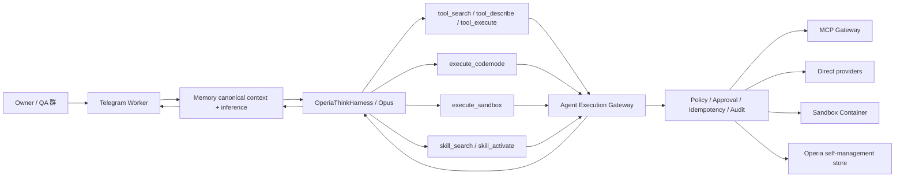

# Operia Think、Code Mode 与 Sandbox 工具编排 v2 Spec

> 2026-07-27 Owner acceptance: the Owner accepted this Spec and authorized only Gate A local synthetic
> compatibility work. The authorization excludes real Opus, Telegram sends, external writes, remote
> migrations, staging/production rollout, secrets, paid calls and production flag changes. Because the
> coordinator session is unavailable, this workstream reports directly to the Owner in the current window
> until the Owner gives a different instruction.
>
> 2026-07-27 Owner follow-up: after reviewing the compatibility proposal, the Owner authorized Gate A.1
> to align Agents, Think, Code Mode and the local Wrangler/workerd toolchain. This follow-up still excludes
> deployment, production flags, remote migrations, paid/model calls, Telegram sends and external writes.
>
> 2026-07-27 Owner follow-up: after Gate A.1 passed, the Owner authorized continuing under this updated
> Spec with Gate B local Tool Router v2. Gate B remains zero-model, flags-off and local-only: no Code Mode,
> external write, Telegram send, remote migration, deployment, Secret or production flag change.
>
> 2026-07-27 Owner follow-up: after Gate B passed, the Owner authorized Gate C. Gate C is limited to a
> Memory-owned local Think shadow over recorded sanitized traces. It must make zero model/tool/provider
> calls, write no transcript or external state, and make no production configuration or deployment change.
>
> 2026-07-27 Owner follow-up: after Gate C passed, the Owner authorized Gate D staging read-only
> Think + Direct. Production canary, production flags, paid/provider model calls, Telegram delivery,
> external writes and production data remain unauthorized.
>
> 2026-07-27 Owner follow-up: after the Cloudflare OAuth recovery and Gate D staging PASS, the Owner
> instructed this workstream to continue the remaining Gates under the accepted Spec. Gate E begins as
> local read-only Code Mode work: no production flag, production rollout, external write, Telegram send,
> paid/provider model call or long-lived credential exposure is authorized.
>
> 2026-07-27 Owner continuation: after Gate E local PASS, continue with Gate F local durable approval.
> Gate F may change candidate Agent/TG/Think contracts and use local synthetic fixtures, but still excludes
> Telegram delivery, real Calendar/HA/MCP writes, production flags, remote migration, deployment and paid calls.
>
> 2026-07-27 Owner continuation: after Gate F local PASS, continue Gate G in the isolated
> `operia-test` namespace. Additive local schema, versioning, tombstone, restore, quota, idempotency,
> undo and purge-eligibility work is authorized. The production namespace, production enablement,
> deployment, remote migration, Telegram delivery and external writes remain unauthorized.
>
> 2026-07-27 Owner continuation: after Gate G local PASS, continue Gate H as local synthetic
> reversible-write contracts. Calendar and MCP fixture domains may exercise approval, serialization,
> CAS, idempotency, read-after-write and undo/compensation without any real connector or provider call.
> Every real Calendar/MCP resource domain still requires independent Owner enablement.
>
> 2026-07-27 Owner production authorization: after reviewing the Gate H result and the strict distinction
> between candidate code and live Operia behavior, the Owner authorized the next ordered production
> sequence: deploy the Agent candidate with every new Think/Code Mode/self-management/reversible-write
> gate disabled; run one bounded read-only Think/Code Mode canary; and, only after those two steps pass,
> prepare `calendar.primary` as the first exact reversible resource gate. This does not waive the Gate I
> observation threshold, does not authorize email, other groups, third-party messaging, physical delete,
> Browser restoration, self-modifying code, policy/credential changes, or Operia deploying itself.
>
> 2026-07-27 Owner clarification and activation: the Owner rejected using the 7-day / 50-task observation
> threshold as a prerequisite for starting the observation itself and authorized real Think + Code Mode
> execution immediately for read-only or strictly reversible natural tasks. The entry cohort is restricted to
> the Owner private chat and the exact registered family QA room/chat/thread triple. Browser, email, other
> chats, irreversible delete, self-code modification/deployment and all real resource writes remain disabled.
> The 7-day / 50-natural-task threshold is therefore an expansion and legacy-cleanup gate, not an entry gate.

## 0. 审批摘要

本 Spec 把 Operia 的工具执行从当前的：

```text
Memory/Opus
  -> delegate_action
  -> Agent/GLM 读取完整工具目录并规划
  -> Agent 执行一个或多个工具
  -> Memory/Opus 续轮并最终回答
```

迁移为：

```text
Telegram
  -> Memory owner
  -> Memory 域内的 Cloudflare Think + 同一个 Opus
  -> 渐进式发现工具 / 选择 direct、Code Mode 或 Sandbox
  -> Agent canonical execution gateway
  -> MCP / direct provider / Sandbox / self-management
  -> 同一个 Think/Opus 读取结果并继续
  -> Memory canonical final
  -> Telegram delivery
```

核心决策如下：

1. **Think 部署在 Memory 域内**，是 Memory-owned inference 的实现组件，不是新的 Agent owner。
2. **不使用 subagent**。Operia 始终是一个主 Agent，不创建父子 Agent、Agent-as-tool 或每线程 child agent。
3. **不使用 Think Messenger 接管 Telegram**。TG Worker 继续拥有 webhook、房间边界、命令、审批按钮、
   outbox 和 delivery。
4. **不使用 Think 自带 workspace bash**。Shell、Python、文件、临时依赖、构建和数据转换继续进入现有
   Cloudflare Sandbox Container。
5. **不把完整 MCP catalog 注入模型**。MCP 与 Skills 通过 search / describe / activate / execute 渐进发现，
   复合任务优先进入 Code Mode。
6. **Agent 继续拥有 policy、approval、task、幂等、side-effect ledger、pause、quarantine 和 audit**。
   Think 的 Action/approval 状态只能是 Agent ticket 的执行投影，不能成为第二个审批真源。
7. **Memory 继续拥有 persona、长期记忆、对话、Opus transport、prompt cache 和最终回答**。Think 不建立
   第二套长期记忆，也不允许模型直接写 Think context blocks 形成影子 persona。
8. **Operia 的向内自治仅限数据和工作区**：允许 append/upsert/version/soft-delete/restore；不允许自改代码、
   策略、权限、凭据或自行部署生产。
9. **现有 GLM planner 保留为迁移期 fallback**。只有 Think 生产观察通过后才停用，不在第一批提交中删除。
10. **本 Spec 当前只供审批**。接受本 Spec 不等于授权安装依赖、迁移 DO、启用 Code Mode、调用模型、写生产
    数据、部署或执行真实 Telegram canary。

## 1. 目标

### 1.1 产品目标

- Operia 能像当前 Codex 一样根据任务主动选择简单工具、组合工具、Skills 和 Sandbox；
- 简单单步读取不被迫经过额外规划模型；
- 多步骤任务由同一个 Opus 读取真实工具结果后继续，不再让 GLM 猜完整流程；
- MCP 和 Skills 数量增长时，不把全部 schema 反复塞进 prompt；
- 普通内部计算默认 YOLO，真正越过外部边界时才审批；
- 审批后从原工具调用位置恢复，不重新规划或重复已经完成的副作用；
- 用户能在 TG 看到“Operia 调用了什么、处于什么状态”，而不是模糊的等待提示；
- 向外工具调用与向内自我管理使用同一 correlation、policy、undo 和 audit 体系；
- 任何一阶段都能用 feature flag 回退到现有 direct / GLM / Sandbox P1/P2-read 路径。

### 1.2 工程目标

- 一个事实只有一个 owner，不新增 Memory、MCP、TG 或审批的复制真源；
- Think、Agent Fiber 和 Sandbox session 的恢复边界明确，不发生双重重试；
- 工具 catalog、policy、Skill、connector 与 model harness 版本在每个 run 中固定；
- 工具结果、动态网页内容、Skill 文本和 Sandbox 输出始终按不可信数据处理；
- secret 只在最终资源 owner 或 connector host 注入，不进入 Think prompt、Dynamic Worker 或 Container；
- 生产外部写入严格串行，未知结果不盲重试；
- 包版本固定，Cloudflare experimental API 升级必须重新通过兼容和恢复测试。

## 2. 非目标与硬边界

本阶段不做：

- 不迁移或复制 persona、长期 Memory、precious data、conversation archive；
- 不改变主模型 Provider、Opus 型号、prompt cache 策略或付费预算；
- 不开放 Think subagent、Agent-as-tool、父子 Agent RPC 或每个 Telegram thread 一个 child agent；
- 不让 Think Messenger 接管 Telegram webhook、群聊订阅、消息投递或 callback；
- 不启用 Think 默认 `workspaceBash`、Browser、client tool 或任意网络工具；
- 不恢复当前已停用的 Browser；
- 不把 MCP credentials、OAuth refresh token、Calendar token、HA token 或 Provider key交给模型、Code Mode
  或 Sandbox；
- 不允许 Operia 修改自身源代码、系统策略、Owner 绑定、allowlist、预算、审计或生产部署；
- 不开放邮件、其他群聊、第三方私聊、支付、权限、永久删除或未登记设备控制；
- 不因为 Think 提供 Actions/approvals 而绕开 Agent 现有 ticket 和 policy；
- 不把 Think 的消息 Session、FTS、context block 或 compaction 自动宣布为 Memory 真源；
- 不在未完成 shadow、只读 canary 和回滚演练前删除 `toolPlanner.ts`、旧 task runtime 或旧数据库字段。

## 3. 当前生产基线

截至 2026-07-27：

- Agent version：`<UUID>`；
- TG version：`<UUID>`；
- `AGENT_SANDBOX_ENABLED=true`；
- `AGENT_SANDBOX_P2_READ_ENABLED=true`；
- `AGENT_CODEMODE_ENABLED=false`；
- `AGENT_POLICY_V3_ENFORCE=false`；
- Browser 三项生产 flag=false，Telegram 和内置工具菜单均无 Browser；
- 精确公开 HTTPS URL 的读取/下载优先进入 Sandbox；
- live search 继续使用现有 search provider；
- `/pause` 与 `/resume` 已进入 Telegram command menu；
- 现有 `src/agent/toolPlanner.ts` 使用
  `@cf/zai-org/glm-4.7-flash`，最多 4 次调用、2 个规划轮次；
- Planner 每轮接收完整 enabled tool schema，显式 Sandbox 请求才硬收窄到
  `sandbox-runtime/execute_script`；
- `src/agent/sandboxCodeMode.ts` 已固定 `@cloudflare/codemode@0.4.3`，只提供 synthetic、system、
  Health 和 Calendar read；
- `@cloudflare/sandbox@0.12.4` 已在生产 P1/P2-read 验证；
- 当前仓库已在 Gate A.1 / Gate I 热修后对齐为 `agents@0.19.0`、`ai@7.0.37`；
- 2026-07-27 npm readback：`@cloudflare/think` latest=`0.15.0`、
  `@cloudflare/codemode` latest=`0.5.0`、`@cloudflare/sandbox` latest=`0.12.4`。

这组版本事实只用于设计兼容 Gate。实现时不得把 `codemode 0.4.3 -> 0.5.0` 与 Think 接入塞进同一个不可分
提交；先证明当前 Code Mode adapter 与 Think 兼容，再决定是否独立升级。

## 4. 唯一 Owner 与职责矩阵

| 事实 / 能力 | Canonical owner | Think 权限 | 禁止复制 |
| --- | --- | --- | --- |
| Persona、identity、长期 Memory、conversation truth | Memory | 获取本轮 bounded projection | Think context blocks、Agent DO、TG D1 不成为副本 |
| 主模型、Opus transport、prompt cache、reasoning | Memory | 在 Memory 域内调用 | Agent 不新增第二套 Opus/Provider |
| Think harness 配置与本轮执行投影 | Memory | 运行本轮 agentic loop | TG/Agent 只读状态投影 |
| MCP provider、tool enable、schema/auth ref | MCP Gateway | 通过 Agent catalog index 发现 | Think/Agent 不复制 MCP mutation |
| Tool task、policy、risk、approval、idempotency、audit | Agent | 只发起并消费结果 | Think Action 不成为审批真源 |
| Code Mode runtime、Skill execution、Sandbox orchestration | Agent | 调用单一受控入口 | Memory 不复制执行实现 |
| Telegram room/binding/commands/presentation/delivery | Telegram | 接收 progress/final projection | Think Messenger 不接 webhook |
| Operia-owned persistent data | 资源 owner + Agent policy | append/upsert/version/soft-delete/restore | Think 不直接写底层表 |
| Deployment、route、Worker/DO/Container version | Ops | 只读状态 | Think/Operia 不可部署 |

### 4.1 Think 的物理位置

目标类为 Memory Worker 内的 `OperiaThinkHarness`。它通过 Memory-owned model adapter 获得 Opus，并通过
`AGENT_SERVICE` Service Binding 调用 Agent。

Think 不是新的公开 Worker、域名或 Telegram endpoint。P0/P1 如需独立 staging，只能使用：

- 无生产 Memory、persona、TG、Provider credential 的 staging binding；
- 独立 DO class/migration；
- flags-off；
- synthetic/read-only fixture；
- 明确销毁或保留的回滚记录。

### 4.2 Think Session 边界

Think 默认提供持久消息、搜索、compaction 和 context blocks，但本设计初期只使用：

- task-local turn state；
- tool-call parts；
- stream/continuation recovery；
- bounded execution metadata。

每个请求使用现有 canonical `request_id` 派生 session locator，且绑定：

```text
owner_id + channel + recipient_type + recipient_id + request_id + environment
```

初期不把整个对话历史复制到 Think Session。Memory 为每次 turn 生成 bounded context projection，并附：

- `memory_owner_version`；
- `conversation_revision`；
- `projection_hash`；
- `expires_at`。

Think 的 task-local projection 默认最多保留 24 小时；审批、unknown side effect 或恢复中的任务按 Agent
canonical task 状态延长。任务 terminal 且审计投影完成后可以清理正文，仅保留 hash、状态和 correlation。

Think 不获得任意 Memory mutation tool。未来如果要让 Think Session 成为 Memory 内部 conversation
implementation，必须另写 Memory schema migration ADR、dual-read、old-write freeze、cutover flag、观察与回滚，
不由本 Spec 自动授权。

## 5. 目标运行架构



### 5.1 同一个 Operia

- Think 只运行一个 root harness；
- `subAgent()`、`agentTool()`、`runAgentTool()` 和 parent/child retained run 不进入允许接口；
- 不根据 TG thread 自动创建 child；
- 工具分工是 execution mode，不是 Agent 分身；
- Code Mode 是同一 Operia 生成的一段受限编排程序；
- Sandbox 是同一 Operia 的隔离计算环境。

### 5.2 顶层工具面

Think 初始最多看到以下稳定工具，不看到完整 MCP 或 provider catalog：

| Think 工具 | 作用 | 默认风险 |
| --- | --- | --- |
| `tool_search` | 按自然语言、tag、risk、owner 查询元数据 | read |
| `tool_describe` | 按精确 key 读取当前 schema、风险和 revision | read |
| `tool_execute` | 执行一个已 describe 的简单工具 | dynamic |
| `execute_codemode` | 运行依赖调用、循环、筛选、批量整理 | dynamic per inner call |
| `execute_sandbox` | Shell/Python/TS/文件/依赖/构建/转换 | sandbox-local + egress |
| `skill_search` | 搜索 enabled Skill 元数据 | read |
| `skill_activate` | 获取 pinned Skill instruction/resource handle | read |
| `self_manage` | Operia-owned data append/upsert/version/soft-delete/restore | bounded write |

现有 Telegram `reply_to_message`、`react_to_message` 等渠道工具仍按 Memory/TG canonical contract 暴露，
不塞进 Agent catalog，也不经过 Code Mode。

### 5.3 路由原则

```text
任务不需要工具
  -> Opus 直接回答

一个已知、参数明确、结果较小的调用
  -> tool_describe（如缓存未命中） -> tool_execute

需要发现可用工具
  -> tool_search -> tool_describe -> direct 或 Code Mode

多个相互依赖的 MCP/connector 调用、循环、筛选或批量整理
  -> execute_codemode

需要 Linux/Python/Shell/临时依赖/文件/构建/大中间结果
  -> execute_sandbox

需要权威外部写入
  -> direct 或 Code Mode 内 connector
  -> 每个真实调用都由 Agent preflight
  -> 必要时 TG durable approval
```

不得仅凭“向外调用”就把 credential-bearing MCP 塞进 Container。统一安全边界是
`Agent Execution Gateway`，不是“所有逻辑必须物理运行在同一个 Sandbox”。

## 6. Think Harness 合同

### 6.1 初始配置

实现 spike 的目标配置：

```ts
class OperiaThinkHarness extends Think<Env> {
  workspaceBash = false;
  includeMcpTools = false;
  sendReasoning = false;
  maxSteps = 12;
  messageConcurrency = "queue";
  chatRecovery = {
    maxAttempts: 3,
    noProgressTimeoutMs: 120_000,
    terminalMessage: "Operia 的工具任务中断且未能安全恢复。",
  };
}
```

约束：

- `getMessengers()` 返回空；
- `getSkills()` 初期只返回 Agent projection，不允许 Think 自行安装/启用；
- `getSkillScriptRunner()` 初期为 `null`，直到 Skill Gate 通过；
- `getTools()` 只返回第 5.2 节的稳定工具；
- `authorizeTurn()` 默认不是 full grant，而是从 Agent 取得本轮 capability snapshot；
- `beforeToolCall()` 只负责顶层工具名、schema、scope 和 correlation 完整性；canonical policy 仍在 Agent；
- `afterToolCall()` 只写 execution projection 和 sanitized metrics；
- `onChatResponse()` 把最终候选交回 Memory canonical finalization，不直接发 Telegram；
- `onChatError()` 返回 typed terminal/attention 状态，不自行拼接第二条用户回复；
- `chatStreamStallTimeoutMs` 必须大于单次工具最长受控等待，不能在审批等待期间误判 stall。

`sendReasoning=false` 不妨碍 TG 展示确定性 progress。展示内容来自 tool/run events，不展示或推断 hidden CoT。

### 6.2 Model adapter

`getModel()` 必须返回 Memory-owned adapter：

```text
OperiaThinkHarness
  -> OperiaMemoryLanguageModel
  -> existing Memory Anthropic transport / request policy
  -> Opus
```

必须保留：

- persona 和稳定 system prefix 的 Memory owner；
- prompt cache breakpoint；
- reasoning/effort/temperature owner snapshot；
- provider request id、usage、cache read/create、TTFT 和总耗时；
- current visual/context refs；
-现有 final-only、empty-final 和 channel interaction contracts。

不得：

- 在 Agent Worker 配置第二个 Opus key；
- 为 Think 增加独立 persona 或 system prompt 真源；
- 通过 Workers AI planner 替换用户当前主模型；
- 为兼容 Think 静默丢失 prompt cache 或 usage 归属。

Gate A 必须证明现有 transport 能实现当前 AI SDK 所需的 LanguageModel/stream contract。如果必须引入官方
provider adapter，应固定版本并继续在 Memory 域内使用同一 credential owner；此变更单独提交和测试。

### 6.3 Think experimental API

设计目标版本是 `@cloudflare/think@0.15.0`，但 Gate A 现场解析确认它要求 `agents>=0.18.0`，与当前
`agents@0.17.4` 不兼容。为避免把 Agents SDK、Code Mode 和 Think 三组升级塞入同一提交，Gate A 精确
最初 pin `@cloudflare/think@0.13.0`；后续 Gate A.1 已独立完成升级至 Think 0.15、Agents 0.19 和
Code Mode 0.5。Gate I 真实 provider canary 进一步证明 Think 0.15 bundled
`workers-ai-provider@4` 需要 AI SDK 7 的 v4 model contract；AI SDK 6 的 synthetic injected-model
测试不足以证明字符串 catalog model 可用，现已固定 `ai@7.0.37` 并加入生产专项断言。

`runTurn()` 与 Actions 当前仍处于 experimental 状态。首批实现必须：

- 精确 pin，不使用 `^` 或 `latest`；
- 将 Think API 隔离在 `src/memory/think/` adapter 后；
- 不让业务代码直接依赖 experimental execution IDs；
- 保存 `harness_version`、`agents_version`、`ai_sdk_major`；
- 升级前跑完整 replay、approval、recovery、compaction、schema 和 cost 回归；
- 版本漂移或 API 不兼容时一键关闭 Think，恢复旧 Memory inference + Agent GLM path。

## 7. Tool Catalog v3 与渐进发现

### 7.1 Owner 关系

- MCP Gateway 继续拥有 provider/tool enabled、authoritative catalog、schema/auth reference；
- Agent 把 Gateway 和 Agent-owned provider 规范化为可执行 projection；
- Think 只消费 Agent 的 metadata index；
- Think 不接受 catalog mutation；
- TG 不保存 catalog 副本。

### 7.2 Metadata index

Agent 新增或演进为 `ToolDescriptorV3`：

```ts
type ToolDescriptorV3 = {
  toolKey: string;
  ownerDomain: string;
  providerId: string;
  name: string;
  summary: string;
  tags: string[];
  riskClass: "read" | "write" | "message" | "device" | "purchase" | "delete";
  consequences: string[];
  sensitivity: string[];
  reversibility: "none" | "native_undo" | "compensating" | "soft_delete";
  schemaHash: string;
  catalogRevision: string;
  connectorVersion: string;
  enabled: boolean;
  executable: boolean;
};
```

`tool_search` 只返回 metadata 和稳定 key，不返回完整 schema。`tool_describe` 才返回：

- input schema；
- bounded output schema/size；
- exact owner revision；
- policy hints；
-是否需要 fresh auth；
- 是否可能产生费用或外部写入；
- 当前 unavailable/stale reason。

### 7.3 Task pinning

每个 Think run 和 Agent task 固定：

- `catalog_revision`；
- `catalog_snapshot_hash`；
- `policy_version`；
- `connector_versions`；
- `skill_installation_revision`；
- `think_harness_version`；
- `memory_context_projection_hash`。

执行前如果 tool schema、owner revision、connector version 或 policy 漂移：

- read 可以重新 describe 后由同一 Opus 决定；
- write/message/device/purchase/delete 必须重新 preflight；
- 已有 approval grant 不随 schema 漂移继承；
- 不允许用旧 schema 调新工具。

## 8. Direct、Code Mode 与 Sandbox

### 8.1 Direct path

Direct 用于：

- system status；
- Health/Calendar bounded read；
-一个精确 MCP read；
- search provider；
-一个明确的可逆写入；
-当前已有稳定 provider adapter。

执行顺序：

```text
Think tool_execute
  -> Agent prepare
  -> schema validation
  -> policy decision
  -> optional approval
  -> side-effect ledger
  -> invoke
  -> sanitize
  -> Think tool result
```

Direct 不调用 GLM。GLM 只在 Think disabled/fallback 路径继续存在。

### 8.2 Code Mode

现有 `src/agent/sandboxCodeMode.ts` 演进为通用 `OperiaCodeModeRuntime`，保留：

- Dynamic Worker 隔离；
- `globalOutbound:null`；
- AST / generated code 限制；
- 30 秒初始 timeout；
- bounded executions；
- result truncation；
- connector host 位于 Agent。

新增 connector：

```text
catalog.search
catalog.describe
mcp.call
direct.call
skill.activate
skill.readResource
sandbox.run
selfManage.call
```

Code Mode 代码不能直接：

- `fetch`、WebSocket、raw socket；
-读取 secret/env；
-调用未 describe 的 tool key；
-改变 policy、catalog、Skill installation；
-绕过 Agent preflight；
-将上一次 task 的 capability 用在本任务；
-把完整 sensitive result返回模型。

Code Mode 内部每次 connector 调用都生成独立 `call_key`，逐次 policy、approval、idempotency 和 audit。
外层 `execute_codemode` 获准不代表内部外部写入自动获准。

### 8.3 Code Mode MCP

Think 配置固定 `includeMcpTools=false`。MCP 工具只通过 Agent 的 Code Mode connector 或 direct executor：

- search/describe 渐进发现；
- Gateway credential 留在 Gateway；
- Agent 验证 owner revision、schema hash、delegated allowlist、risk 和 result size；
- stale/missing/drifted provider fail closed；
- MCP Elicitation 继续使用独立 ticket namespace，不与普通 tool approval 混用；
- Code Mode 无权注册、启用、禁用或删除 MCP provider/tool。

### 8.4 Sandbox

现有 P1/P2-read Container 合同不变：

- `@cloudflare/sandbox@0.12.4`；
- explicit session；
- owner + task + environment 隔离；
- raw internet disabled；
- public HTTPS GET/HEAD 经统一 egress；
- connector capability 短期、task-scoped；
-长期凭据不进入 Container；
- task 后 kill process、delete session、destroy；
- output、file、time、CPU、download 和 call budget 有界。

Think 的 `workspaceBash=false`，避免同时存在 Think workspace 与 Sandbox workspace 两套执行面。

Sandbox 文件分为：

- `/workspace/input`：任务输入 projection，只读或 task-local；
- `/workspace/work`：临时工作区；
- `/workspace/output`：待 sanitizer/Artifact 接收的结果；
- 持久结果必须通过 `self_manage`、Artifact 或受控 connector 写出。

任务结束时默认销毁 workspace。需要跨审批恢复时保留同一 task Sandbox，但 capability、generation 和
pending call 必须重新验证；超过 24 小时按原 Spec 清理。

## 9. Skills v2

### 9.1 保留的既有合同

继续保留：

- immutable version；
- schema/source/content/manifest hash；
- publisher/key/signature/trust；
- pinned installation revision；
- enable/disable soft state；
- permission diff；
- durable run/checkpoint；
- deterministic workflow idempotency；
- Prompt/Reference 始终是不可信 task content；
- Skill 不能扩大工具 allowlist 或 permission snapshot。

### 9.2 渐进激活

Think 初始只看到：

```ts
type SkillDescriptor = {
  key: string;
  alias: string;
  version: string;
  description: string;
  tags: string[];
  trust: string;
  enabled: boolean;
  sourceHash: string;
};
```

流程：

```text
skill_search
  -> skill_activate
  -> bounded instructions + resource handles
  -> optional readSkillResource
  -> direct / Code Mode / Sandbox execution
```

不得把全部 Skill 正文加入稳定 system prefix。

### 9.3 Skill kind 演进

现有：

- `prompt`
- `reference`
- `deterministicWorkflow`

继续可用。`prompt.target` 从 `opus | glm` 迁移为 harness-neutral target，例如 `operia`，迁移期双读旧值。

未来 `script` 不直接解禁。新增 script capability 前必须声明：

- runtime=`codemode | sandbox`；
- allowed connectors/tool keys；
- network policy；
- file input/output contract；
- timeout/resource budget；
- content/source hash；
- approval class；
- replay behavior。

Script 只能由 Agent-provided runner 执行，不能由 Think 自由读取源码后调用任意 shell。

## 10. 向内自我管理

### 10.1 `self_manage` 能力

自动允许：

- append task note、observation、preference candidate；
- upsert Operia-owned structured data；
-创建新版本；
- 写入 task checkpoint 和 schedule candidate；
- 创建 private artifact candidate；
- soft-delete；
- restore；
- 列出自己的版本、tombstone 和 restore deadline。

每次写入必须绑定：

- owner；
- namespace=`operia-owned`；
- task/request；
- schema owner；
- previous revision；
- idempotency key；
- policy version；
- created_by=`operia`；
- undo/tombstone reference。

### 10.2 不自动允许

- 将普通用户数据重新分类为 Operia-owned；
- 修改 persona、precious、Memory retention 或 recall policy；
-修改 Skill installation、MCP registry、allowlist、budget 或 credential；
-物理 purge；
-覆盖 audit；
-修改源代码、CI、route、Worker vars、Secret 或部署。

### 10.3 删除

默认删除为：

```text
active
  -> tombstoned
  -> 30-day restore window
  -> lifecycle purge candidate
```

- Operia 不能立即 purge；
- pinned、referenced、audit、legal hold、unknown side-effect 相关记录不能 purge；
-外部系统有原生 undo 时保存 undo reference；
-只有补偿动作时必须明确标记 `compensating`，不能声称完全恢复；
- rollback failure 进入 `attention_required` 并立即通知。

## 11. Policy、Approval 与 Think Action Bridge

### 11.1 Canonical decision

所有实际 connector 调用仍按：

```text
global pause / hard deny
  > owner deny
  > approval-required
  > exact auto
  > default deny
```

Think、Code Mode 和 Sandbox 均无权放宽。

### 11.2 Approval bridge

Cloudflare Think Actions 支持 idempotency、durable-pause、`pendingApprovals()`、
`approveExecution()` 和 `rejectExecution()`，但 Agent ticket 仍是 canonical truth。

每个需要审批的调用建立映射：

```ts
type ThinkApprovalProjection = {
  thinkExecutionId: string;
  agentTicketId: string;
  taskId: string;
  approvalRound: number;
  toolKey: string;
  argsHash: string;
  policyVersion: string;
  ownerId: string;
  channelScopeHash: string;
  expiresAt: string;
  status: "projected" | "approved" | "rejected" | "expired" | "consumed" | "quarantined";
};
```

TG callback 顺序固定：

1. Telegram 验证 exact clicker/chat/thread/bot/env/nonce；
2. Agent 原子消费或拒绝 canonical ticket；
3. Agent 返回已授权/拒绝的固定结果；
4. Memory/Think 才调用对应 `approveExecution` 或 `rejectExecution`；
5. Think action execute 再次携带 ticket/call fingerprint 调 Agent；
6. Agent recheck task、round、tool、args hash、policy、ticket consumption 和 pause generation；
7. 已完成 call 复用 ledger result，不重跑副作用；
8. Think auto-continue；
9. Memory finalization；
10. TG delivery。

如果 Think 的 dynamic durable-pause API 不能无损承载 Agent 先裁决的 ticket，Gate A 必须使用兼容 fallback：

- Think 收到 typed `approval_required` 后安全终止当前 turn；
- Agent ticket 保持 canonical；
- TG 决定后 Agent执行或拒绝；
- Memory 通过 programmatic continuation 注入该 exact tool result；
-同一 Think request/session 继续。

两种 transport 的安全语义必须一致。未通过 Gate A 前，不开放生产 approval bridge。

### 11.3 Unknown side effect

Think Action 默认 stale pending reclaim 可能重跑。对于外部写入，本设计要求：

- `actionLedgerPendingRetryLeaseMs=false`，或 adapter 对 external writes 等效禁用自动 reclaim；
- Agent `started/uncertain/quarantined` 为 canonical；
- read-after-write reconciliation 只由 Agent 发起；
- unresolved unknown 不调用 Think auto retry；
- paid/message/device/delete unknown 永不自动重试；
- TG 展示 `需要检查`，提供查看、跳过、停止和人工批准重试。

### 11.4 Reject

- `拒绝当前动作` 只产生结构化 `action_not_executed`；
- Think/Opus 可以选择不扩大权限的替代方案；
-拒绝不能变成“默认允许相似调用”；
-显式 `/cancel` 或停止任务才 terminalize 整个 task；
- ticket expiry 等同拒绝当前动作，不静默继续原副作用。

## 12. Pause、Resume、Cancel 与恢复

### 12.1 权责

| 层 | 负责 |
| --- | --- |
| TG | `/pause`、`/resume`、`/cancel` 命令与 Owner UI |
| Agent | global pause generation、task lease、ticket revoke、side-effect quarantine |
| Think |停止/恢复本轮 model/tool loop，不决定外部副作用真相 |
| Sandbox | abort process/session，晚到结果不触发 follow-on |
| Memory | canonical finalization 与 continuation |

### 12.2 `/pause`

- 在模型 routing 前由 TG deterministic handler 接受；
- Agent generation 原子递增；
-停止新的 tool prepare；
-撤销临时 grants、pending approval；
-将 started side effects 标为 quarantined；
- abort Think turn、Code Mode execution 和 Sandbox process；
-保留 task/session 供 24 小时内检查；
-不把已经离开系统的请求报告成已撤回。

### 12.3 `/resume`

-先显示 pausedAt、reason、pending、unknown、费用、workspace retention；
- Owner 明确确认；
- Agent 创建新的 resume generation；
-不自动执行旧 pending write；
-Think 从 fixed checkpoint/continuation 恢复；
-已完成 call 复用 ledger；
-schema/policy/catalog 漂移时重新 describe/preflight。

### 12.4 恢复层次

- Think `chatRecovery`：只恢复模型 stream、tool-loop continuation；
- Agent Fiber：恢复 app task、ticket、side-effect 和 TG handoff；
- Sandbox cleanup：恢复/销毁 process 和 session；
- TG outbox：恢复可见 delivery。

不得让 Think recovery 与 Agent Fiber 同时重新执行同一个外部 call。每次恢复先查询 Agent call ledger。

## 13. Telegram UX

### 13.1 确定性状态

任务状态使用工具/阶段事件，不调用额外 narrator model：

```text
Operia 正在查找可用工具
Operia 找到了 Calendar 读取能力
Operia 正在读取日历
Operia 正在运行 Code Mode
Operia 正在启动 Sandbox
Operia 正在整理 12 条结果
Operia 请求修改日历，需要你的确认
Operia 已完成；1 项可撤销
Operia 需要你检查一项结果未知的调用
```

### 13.2 审批卡

仅存在 canonical pending ticket 时显示：

- `允许一次`
- `本任务同类允许`
- `拒绝当前动作`
- `停止任务`
- `查看详情`

不显示虚假“任务正在等待确认”而没有按钮；不显示永久允许。

### 13.3 命令

必须保留：

- `/pause`
- `/resume`
- `/cancel`
- `/status`

`/pause` 为全局闸门；task card 可以提供 task-specific cancel，但不能伪造 Sandbox process pause。

### 13.4 任务摘要

最终由 Operia 自然语言说明结果。`<blockquote expandable>` 或 Mini App detail 展示：

- direct / Code Mode / Sandbox 调用数；
-审批、拒绝、unknown 数；
-费用 estimate/actual；
-外部写入；
- undo/restore deadline；
- catalog/policy/harness revision；
-关键时延；
-查看 Agent 执行的 deep link。

不展示 hidden reasoning、secret、完整 prompt、敏感 tool result 或 Container env。

## 14. 数据与事件

### 14.1 Memory / Think execution projection

建议 additive 表：

```text
think_runs
think_run_events
think_context_projections
think_tool_call_projections
think_approval_projections
think_recovery_incidents
```

只保存：

- correlation IDs；
- status/phase；
- owner/catalog/policy/harness revisions；
- tool key 和 args/result hash；
- sanitized summary；
- usage/latency；
- Agent ticket/call locator；
- recovery/expiry。

不保存：

- secret；
-完整 sensitive tool result；
- Sandbox env；
- hidden CoT；
-第二份长期 persona/Memory；
-未过期 bearer/capability。

### 14.2 Agent

建议演进：

```text
tool_catalog_snapshots
tool_descriptor_index
tool_runs
connector_calls
codemode_executions
skill_activations
self_manage_versions
self_manage_tombstones
undo_records
```

现有 task、approval_ticket_calls、side-effect ledger、audit 继续 canonical；不因 Think 重建同名真源。

### 14.3 Correlation envelope

```ts
type ThinkToolCorrelation = {
  traceId: string;
  requestId: string;
  memoryRunId: string;
  thinkRunId: string;
  thinkRequestId: string;
  agentTaskId: string;
  toolCallId?: string;
  connectorCallId?: string;
  approvalId?: string;
  channel: string;
  channelMessageId?: string;
};
```

跨域只传 locator、hash、状态和 bounded summaries。

## 15. Feature Flags

建议 registry key：

| Flag | Owner | 初始值 | 作用 |
| --- | --- | --- | --- |
| `memory.think.shadow_enabled` | Memory | false | 零副作用 shadow |
| `memory.think.execution_enabled` | Memory | false | Think 处理真实 turn |
| `memory.think.tool_loop_enabled` | Memory | false | Think 可调用 Agent |
| `agent.tool_router.v2_enabled` | Agent | false | search/describe/execute |
| `agent.codemode.enabled` | Agent | 现有 false | 通用 Code Mode |
| `agent.mcp.codemode_enabled` | Agent | false | MCP 渐进 Code Mode |
| `agent.skills.progressive_enabled` | Agent | false | Skill 渐进激活 |
| `agent.self_manage.write_enabled` | Agent | false | Operia-owned 持久写 |
| `agent.policy.v3.enforce` | Agent | 现有 false | canonical v3 enforcement |
| `telegram.think_progress_enabled` | TG | false |新状态展示 |

安全开关使用 deny-only resolution。生产回滚优先顺序：

1. `memory.think.tool_loop_enabled=false`；
2. `memory.think.execution_enabled=false`；
3. `agent.mcp.codemode_enabled=false`；
4. `agent.codemode.enabled=false`；
5. `agent.self_manage.write_enabled=false`；
6. 保留现有 Sandbox P1/P2-read；
7. 回到 GLM/direct fallback。

## 16. 文件级改造

### 16.1 Memory

建议新增：

```text
src/memory/think/OperiaThinkHarness.ts
src/memory/think/operiaLanguageModel.ts
src/memory/think/tools.ts
src/memory/think/agentGatewayClient.ts
src/memory/think/contextProjection.ts
src/memory/think/approvalBridge.ts
src/memory/think/recoveryBridge.ts
src/memory/think/events.ts
```

修改：

- Memory inference entry：按 flag 选择 legacy 或 Think；
-现有 Anthropic adapter：提供 AI SDK v6 compatibility；
- Memory continuation：接 Think request/session locator；
- usage/cache/finalization：保持 owner 和现有合同；
- types/env/wrangler：新增 flags 和 Think DO binding/migration，仅在相应 Gate。

### 16.2 Agent

建议新增：

```text
src/agent/toolRouterV2.ts
src/agent/toolDescriptorIndex.ts
src/agent/connectors/mcpConnector.ts
src/agent/connectors/skillsConnector.ts
src/agent/connectors/sandboxConnector.ts
src/agent/connectors/selfManageConnector.ts
src/agent/thinkGateway.ts
src/agent/approvalProjection.ts
```

重构：

- `src/agent/sandboxCodeMode.ts` -> 通用 Code Mode runtime；
- `src/agent/skillsRegistry.ts` -> metadata/activate/resource/run contracts；
- `src/agent/toolCatalog.ts` -> catalog v3 snapshot/search/describe；
- `src/agent/taskRuntime.ts` ->接收 Think-originated exact calls，但保留现有 task/approval/fiber；
- `src/agent/runtime.ts` -> Agent Execution Gateway 和 connector dispatch；
- `src/agent/toolPlanner.ts` -> 迁移期 fallback，不立即删除；
- provider registry -> 保持 server-side credential owner。

### 16.3 Telegram

建议修改：

- Think/tool progress event projection；
- approval card 只在 ticket pending 时显示；
- `/pause`、`/resume`、`/cancel`、`/status` 一致性；
- expandable summary；
- room/private exact scope regression；
-不接 Think Messenger。

### 16.4 配置与测试

建议新增：

```text
scripts/verify-think-harness.ts
scripts/verify-tool-router-v2.ts
scripts/verify-think-approval-bridge.ts
scripts/verify-think-recovery.ts
scripts/verify-progressive-skills.ts
scripts/verify-self-manage-rollback.ts
```

依赖变更必须在兼容 spike 通过后单独提交：

```text
@cloudflare/think: 0.15.0
```

不在同一提交顺便升级 `@cloudflare/codemode`。

## 17. 分阶段实施与授权 Gate

### Gate 0：Spec 与 ADR

产物：

-接受本 Spec；
- ownership matrix；
- Think 在 Memory 域内的 ADR；
- experimental dependency risk note；
-无代码、无依赖、无部署。

需要 Owner 审批后才能进入 Gate A。

### Gate A：本地兼容 spike

目标：

-安装精确 pin 的 Think；
- synthetic model fixture；
-验证 AI SDK v6、runTurn、tool result、abort、continuation；
-验证 durable-pause 或兼容 approval continuation；
-验证 no-subagent、no-messenger、workspaceBash=false、includeMcpTools=false；
-不调用真实 Opus、MCP、Telegram 或 Sandbox production。

通过条件：

-同一个 tool call 在 recovery 中最多执行一次；
- approval park/reject/approve 可恢复；
-任务取消不自动 continuation；
-所有 experimental ID 被 adapter 隔离；
-完整卸载/flag-off fallback 通过。

#### Gate A 实施结果（2026-07-27）

状态：**本地 synthetic PASS；没有生产授权。**

- 精确安装 `@cloudflare/think@0.13.0`，未升级根依赖 `agents@0.17.4` 或
  `@cloudflare/codemode@0.4.3`；
- 独立 `OperiaThinkGateA`、synthetic AI SDK v6 model 和 local-only Wrangler 配置，不含 AI、
  Browser、Service、Container、Workflow、route 或 secret binding；
- `runTurn` 完成两轮 tool-call -> tool-result -> final；
- 相同 action idempotency key 跨两次 turn 只执行一次；
- durable-pause 在一个模型调用后停止，approve/reject 均从原 transcript 继续；重复 resolve
  归一化为 `already_resolved`；
- abort 返回 `status=aborted`、`continuation=false`，没有第二次模型调用；
- 原始 experimental `executionId` 只留在 adapter/Think transcript 内，对外只暴露稳定
  `approvalRef`；
- `workspaceBash=false`、无 Messenger、无 Skill runner、无 MCP 注册；Think 0.13 尚无
  `includeMcpTools` 开关，因此用显式 `activeTools` allowlist 实现等价 fail-closed；
- flag-off 或不兼容时选择 legacy 路径；
- 本地 workerd 最晚支持 compatibility date `2026-06-24`，所以 Gate A 专用本地配置使用该日期；
  生产配置未改。

已知依赖事实：Think 0.13 直接复用根 `@cloudflare/codemode@0.4.3`，但其
`@cloudflare/shell@0.4.3` 会在内部安装 `@cloudflare/codemode@0.5.0`。Gate A 禁用
`workspaceBash` 且不创建 execute runtime，因此该嵌套版本不可达；进入 Gate B 前仍需做 bundle/运行面
依赖审计，不得把它误当成根 Code Mode 已升级。

依赖审计同时把既有 `fast-uri@3.1.3` 升到兼容的安全补丁 `3.1.4`，高危项归零。仍有 6 个中危项来自
`@modelcontextprotocol/sdk@1.29.0 -> @hono/node-server@1.19.14` 的 Windows `serve-static` 路径穿越
公告；Gate A Worker 不使用该 Node adapter，`npm audit fix --force` 反而会把 MCP SDK 破坏性降级到
1.24.3，因此不在本 Gate 强修。后续应等待/验证 MCP SDK 支持 Hono 2.0.5+ 后单独升级。

#### Gate A.1 依赖兼容结果（2026-07-27）

状态：**本地依赖与运行时兼容 PASS；没有生产授权。**

Owner 在 Gate A 通过后另行授权独立兼容门。本 Gate 没有混入 Gate B 功能接线，精确对齐为：

```text
agents: 0.19.0
@cloudflare/think: 0.15.0
@cloudflare/codemode: 0.5.0
ai: 6.0.224
wrangler: 4.114.0
@cloudflare/workers-types: 5.20260727.1
```

- `agents@0.18.0` 仍依赖 Code Mode 0.4.x；选择 `0.19.0` 后，应用、Agents、Think 与 Shell 的
  Code Mode 全部 dedupe 为唯一 `0.5.0`；
- Think 0.15 的真实 `includeMcpTools=false` 已替代 Gate A 的 MCP schema 兼容绕路。`activeTools`
  继续只承担本轮工具收窄，不再被描述为阻止 MCP schema 转换的机制；
- AI SDK 继续保持 v6，Gate A 使用显式注入的 synthetic `LanguageModel`。Think 0.15 附带但本路径
  不使用的 `workers-ai-provider@4.0.0` 只声明 AI SDK 7 peer，因此 `npm ci` 会输出一条已知 peer
  warning；没有使用 `--force`、`--legacy-peer-deps` 或不受支持的 override 隐藏它；
- 首次恢复测试暴露 Agents 0.19 tracing 与旧 `wrangler@4.102.0` /
  `workerd@1.20260617.1` 不兼容：DO 构造时报
  `this.runtime.startActiveSpan is not a function`。没有 monkey-patch SDK，而是升级本地工具链；
- `wrangler@4.114.0` 要求 Workers Types 5，而 `agents -> partyserver@0.5.8` 仍声明 Types 4。
  npm 锁文件使用根 Types 5，并在 `agents` 子树保留 Types 4；完整 typecheck 证明现有代码兼容，
  且不需要 peer override；
- `npm ci`、TypeScript、Think durable compatibility、完整 `npm run verify`、Sandbox Phase 0/1/2
  和十份 Wrangler 配置 dry-run 全部通过；
- Think Gate dry-run 为 `6844.04 KiB / gzip 1352.18 KiB`，相对 Gate A 约增加
  `0.304 MiB / gzip 0.050 MiB`；
- `npm audit --omit=dev` 为 0 critical、0 high、6 moderate。剩余项仍来自
  `@modelcontextprotocol/sdk@1.29.0 -> @hono/node-server<2.0.5` 的 Windows 路径公告；当前建议的
  自动修复会破坏性降级 MCP SDK，因此继续留待独立兼容门。

本 Gate 没有修改任何生产 Wrangler 配置、DO migration、route、binding、Secret 或 feature flag，
也没有调用模型、Telegram、MCP Provider、Sandbox 云实例或外部写入。回滚仅需回退本次依赖/adapter
提交与锁文件；生产状态不受影响。

### Gate B：Agent Tool Router v2

目标：

- catalog v3 metadata index；
- search/describe/execute；
- current direct read tools；
-GLM 与 Think shadow 路由对照；
-不启 Code Mode，不写外部。

通过条件：

-模型初始 prompt 不含完整 catalog；
- search/describe schema drift fail closed；
- direct result 与旧路径语义一致；
- catalog revision pin 与审计完整。

#### Gate B 实施结果（2026-07-27）

状态：**本地 Tool Router v2 PASS；未接 Think，未部署生产。**

- `src/agent/toolCatalog.ts` 已增加 catalog v3 snapshot、metadata-only `tool_search` 和 pinned
  `tool_describe`。Search 只返回 descriptor 与稳定 `toolKey`，不返回 input/output schema；
- v3 descriptor 固化 owner domain/revision、provider、risk、consequences、sensitivity、
  reversibility、schema hash、catalog revision、connector version、enabled/executable；
- snapshot hash 对完整 description、policy version 和 connector versions 做稳定序列化；重复
  tool key 拒绝，stored/observed schema 均重新计算 hash，不相信目录自报 hash；
- `src/agent/toolRouterV2.ts` 已实现 Gate B read-only `tool_execute`：必须先持有 catalog snapshot、
  policy、connector、owner revision 和 schema pin，再复用现有 `evaluateToolPolicy`、connector invoke
  与 `sanitizeToolResult`；write/message/device/purchase/delete 以及可能收费的调用均 fail closed；
- 每次 direct read 生成 bounded audit contract，包含 tool key、args/result hash、catalog/snapshot、
  owner/schema/policy/connector、Skill、Think harness 与 Memory context projection pin；
- `AGENT_TOOL_ROUTER_V2_ENABLED` 缺省为 false；本 Gate 没有在生产 Wrangler 中设置该变量，也没有
  新增公开或 Service route。Think-to-Agent 接线仍属于后续 Gate；
- recorded legacy GLM JSON plan 通过现有 `parseToolPlan` 解析后，与 deterministic progressive
  search/describe route 比较 tool sequence；没有调用 GLM、Opus、Workers AI 或其它模型；
- 专项 verifier 要求初始 progressive tool surface 不含 schema，且相对 recorded legacy full
  catalog 至少缩小 50%；schema/catalog snapshot/connector/owner revision 任一漂移均在 invoke 前拒绝；
- `npm run verify:tool-router-v2`、TypeScript、完整 Agent regression 和 Agent Wrangler dry-run
  已通过，旧 direct sanitizer 输出与 v3 direct 输出逐字段一致，connector 只执行一次。

本 Gate 没有 Code Mode、Sandbox 云实例、MCP Provider 调用、Telegram send、外部写入、远端
migration、生产 deploy、Secret、route、binding 或线上 flag 变化。下一 Gate C 才是 Memory-owned
Think shadow；仍须单独授权，且默认继续使用 recorded sanitized traces，不增加第二次付费主模型调用。

### Gate C：Think shadow

目标：

- Memory 为同一真实请求生成 Think shadow plan；
-不执行 shadow 工具；
-不增加第二次付费主模型调用：优先使用 deterministic fixtures/recorded sanitized traces；
-如必须使用真实模型对照，另行申请预算和最小 canary。

比较：

- route；
- tool keys；
-参数 schema validity；
-是否需要 Code Mode/Sandbox；
-预计审批；
-步骤数和 catalog token 量。

#### Gate C 实施结果（2026-07-27）

状态：**本地 recorded-trace Think shadow PASS；线上真实请求 shadow NOT-RUN。**

- `src/memory/think/shadow.ts` 在 Memory 域实现严格的
  `recorded_sanitized_trace -> ThinkShadowPlan -> comparison` 合同；
- trace 只允许 correlation IDs、instruction class、稳定 tool keys、risk/executable/schema-validity、
  Code Mode/Sandbox route hints、legacy bounded plan 和 catalog/policy/harness/context hashes；
- trace 明确拒绝 prompt、message/content/text、instruction 原文、args/arguments、result、secret、
  credential、authorization、cookie 和 token/key 类敏感字段；未知字段、重复 tool、缺失 candidate、
  classification/tool-count 不一致、非法 revision/hash 和不自洽 legacy plan 均 fail closed；
- deterministic shadow 覆盖 answer-only、single direct、multi-tool Code Mode、Sandbox compute、
  Browser-disabled rendered UI unavailable、schema invalid unavailable 和可逆 write approval prediction；
- shadow 只预测 route、tool keys、schema validity、Code Mode/Sandbox、approval、step count 与 catalog
  token delta，不执行任何工具、Provider、Code Mode、Sandbox、审批或外部写入；
- shadow 运行在隔离本地 `OperiaThinkGateA` DO 内，但不调用 `runTurn()`，不组装 executable tools，
  不写 Think Session message；同一 recorded trace 生成稳定 `shadowRunId`；
- `MEMORY_THINK_SHADOW_ENABLED` 缺省 false，只在 local-only
  `wrangler.think-gate-a.toml` 为专项验证设 true；Memory/Agent/TG 生产配置均没有该变量；
- 对照不强行归一化：recorded legacy 与 shadow route/step 不一致时明确返回 mismatch，不能把差异藏成
  PASS；
- `npm run verify:think-gate-c`、Gate A durable compatibility、TypeScript、Think Worker dry-run 与完整
  `npm run verify` 全部通过；Assembler `194/194`；
- Think local dry-run bundle 为 `6859.42 KiB / gzip 1355.57 KiB`，只有 Think DO 和本地 shadow flag，
  没有 AI、Browser、Service、Container、Workflow、route 或 Secret binding。

本 Gate 没有读取生产真实请求或聊天正文，没有模型/Provider/MCP/Telegram/Sandbox 云调用，没有 D1/R2/
Queue/Vectorize/Think transcript 或外部写入，也没有 deployment、remote migration、Secret、route、
binding 或生产 flag 变化。下一 Gate D 才会在 staging 接入真实只读 Think + Direct；需要 Owner 单独授权，
且生产 canary 仍须再次独立授权。

> 2026-07-28 状态补记：以上是 Gate C 当日历史结论。后续 Owner 已在 SDK-first 瘦身 Spec 中单独授权
> 零副作用生产 observer；Memory 生产配置现在显式设置 `MEMORY_THINK_SHADOW_ENABLED=true`，Agent/TG
> 不设置。它只在主结果持久化/响应之后的 best-effort telemetry 中运行 Gate C 比较器，四个 SDK 真执行
> 开关仍为 false。当前准确信息以
> `2026-07-28-operia-cloudflare-sdk-first-slimming-design.md` 第 11 节为准。

### Gate D：只读 Think + Direct

目标：

- staging；
- system status、public HTTPS read、Health/Calendar bounded read；
-无 MCP write、无 self-management write；
- TG 仍不由 Think Messenger接管。

生产 canary 需单独授权，并只允许 Owner 自然发起一个只读任务。

#### Gate D 当前实施结果（staging PASS）

Gate D 使用两个与生产隔离的 staging Worker：

1. Memory-owned `operia-think-gate-d-staging`，由 Think 0.15 持有工具循环；
2. Agent-owned `<AGENT_SERVICE>-think-gateway-staging`，复用 Tool Catalog v3、Tool Router v2、
   policy 和 sanitizer，通过 Service Binding 提供 catalog/describe/execute。

Think 侧关闭 MCP tool merge、Messenger、Skills、fetch 和 workspace bash，并把
`activeTools` 收窄为单一 `tool_execute`；Agent gateway 只接受内部 Service Binding hostname、
临时 bearer、固定 task pins 和 read-only direct route。四个 canary 场景为 system status、
Cloudflare Docs public HTTPS read、synthetic staging Health summary 和 synthetic staging Calendar list。
公共读取仍经过 host/private-address/redirect/content-type/16 KiB egress policy。

本地 multi-worker Miniflare 已运行真实 Think 两轮工具循环，并实测：

- 4 次 `direct_read`，其中 1 次真实 public HTTPS egress；
- 0 次 Provider/model、0 approval、0 external write；
- Think Session 最终 retained message 为 0；
- flags-off 返回 404，未认证返回 401；
- stale catalog pin 和私网 URL 均在调用前拒绝；
- catalog search 只暴露 metadata，不返回 schema。

`npm run verify:think-gate-d`、TypeScript、完整 `npm run verify`、`git diff --check` 和四份 Wrangler
dry-run 均通过。Think bundle 为 `6843.82 KiB / gzip 1352.47 KiB`，Gateway bundle 为
`86.28 KiB / gzip 18.88 KiB`。

Cloudflare OAuth 已由 Owner 在本机浏览器完成完整 Wrangler 授权，`wrangler whoami` 回读成功。首次
现场请求暴露两层环境问题：系统 `curl` 没有继承本机图形代理；显式通过
`OPERIA_THINK_GATE_D_HTTPS_PROXY` 后网络恢复。随后外层 Worker 虽运行新 flags，但复用了上一轮
flags-off 的常驻 Durable Object，内层按安全合同返回 `legacy`。实现改为用每轮随机 canary bearer 的
SHA-256 截断哈希生成独立 DO 名称；原始 bearer 不进入对象名、日志或仓库。

修复后 staging 现场 canary 通过。canary Worker versions 为 Gateway
`<UUID>`、Think
`<UUID>`；四个场景均为 `direct_read`，`directCalls=4`、
`externalReads=1`、`externalWrites=0`、`providerModelCalls=0`、`approvalCount=0`、
`retainedMessageCount=0`。脚本随后自动恢复 flags-off、删除三个 Secret 副本；最终 Secret 列表均为
`[]`，Think deployment/version 为 `<UUID>` /
`<UUID>`，Gateway deployment/version 为
`<UUID>` /
`<UUID>`，公开 canary route 最终返回 404。

稳定化实现 commit 为 <COMMIT>，已推送私有分支。当前结论严格为
**Gate D local PASS / staging PASS / flags-off restored / production unchanged**。

### Gate E：Code Mode read-only

目标：

-通用 Code Mode connector；
- MCP search/describe/read；
- Skills metadata/activate/reference；
-现有 Sandbox P1/P2-read；
-无 external write。

通过条件：

-每个 inner call 都有 Agent preflight/audit；
- Code Mode 不能直接 fetch/secret；
-replay/abort/pause 不重复调用；
-结果大小和敏感标记正确。

#### Gate E 当前实施结果（local PASS）

新增 `src/agent/operiaCodeMode.ts`，在 `@cloudflare/codemode@0.5.0` durable runtime 上提供五个
Agent-owned read-only connector：

1. `catalog.search/describe`；
2. `mcp.call`；
3. `direct.call`；
4. `skill.metadata/activate/readResource`；
5. `sandbox.run`。

Dynamic Worker 固定 `globalOutbound:null`、30 秒上限、最多 20 份 terminal execution 和 4k-token
result transform。生成代码仍先通过 AST gate；除 `fetch`、WebSocket、raw connection、eval、Function、
process、globalThis 和 import 外，本 Gate 还拒绝 `window/self/Deno/Bun` 以及 computed
`constructor/__proto__/prototype/env/secret` 逃逸。生产 `AGENT_CODEMODE_ENABLED` 继续为 false。

每个 inner call 必须带 task 内稳定 `callId`；Agent host 使用
`taskId + executionId + callId + connector + method` 生成不可伪造 `call_key`。调用顺序固定为：

```text
preflight(read-only + pins)
  -> durable receipt lookup
  -> invoke
  -> JSON/credential-field/result-size gate
  -> receipt save
  -> audit
```

相同 execution/callId 的 replay 复用 receipt，不重复 invoke；参数或 policy/catalog/connector pin 漂移
则 fail closed。pause/deny 在 invoke 前停止；credential-shaped 或超限结果不写 receipt，只记录失败审计。
所有 audit 固定 `externalWrites=0`，结果显式保留 classification、sensitivity、truncated 和 replayed。
Skill activate 只表示本任务激活已经安装且 pinned 的 Skill，不安装、不修改 registry。

`wrangler.think-gate-e-local.toml` 是无公网、无 Secret、无 Service/AI/Browser/Container/Workflow
binding 的 local-only Worker Loader + Agent DO harness。真实本机 Wrangler canary 已由隔离 Dynamic
Worker 顺序完成八个 inner call，Agent SQLite 回读 `completed=8`、`receipts=8`、`replayed=0`、
`failed=0`、`externalWrites=0`；MCP 结果保留 `mcp_sensitive_read/owner_scoped` 标记。该 harness 的
MCP/Skill/Sandbox owner 使用 deterministic fixture；现有 Sandbox P1/P2-read 的真实 Container/egress
现场证据保持不变，本 Gate 没有新建云 Container。

`npm run verify:think-gate-e`、TypeScript、Wrangler dry-run、完整 `npm run verify` 与
`git diff --check` 均通过。实现 commit <COMMIT> 已推送私有分支。当前结论严格为
**Gate E local PASS / production Code Mode flags-off / no remote deployment / no external write**。

### Gate F：TG durable approval

目标：

- Agent ticket <-> Think execution projection；
- once/task/reject/stop/details；
-审批后原位继续；
-reject 允许安全替代；
- unknown side effect fail closed。

只使用 synthetic/reversible fixture，未单独授权前不写真实 Calendar/HA/外部系统。

#### Gate F 当前实施结果（local PASS）

新增 `src/memory/think/approvalBridge.ts`，把 Agent canonical ticket 与 Think durable-pause execution
连接为两阶段桥：

```text
TG exact authority
  -> Agent reserve canonical decision
  -> Think approve/reject original execution
  -> action execute
  -> Agent recheck exact ticket/call/pins/pause generation
  -> invoke-or-replay receipt
  -> Think original transcript continuation
```

公开 `approvalRef` 是 execution/call/ticket/task/pins 的 SHA-256 截断引用；TG 详情不返回原始参数、
凭据、Think execution ID 或内部执行标识。projection 固定绑定 owner、channel scope、task、ticket、
approval round、tool、args hash、schema hash、risk、policy、pause generation 和 expiry。Think resolve
失败或 Agent 报告 unknown side effect 时进入 `quarantined`，不自动 reclaim 或重放。

普通 Agent ticket 的 TG 合同升级为：

- `仅这一次`：只消费当前 canonical call，重复回放复用 receipt；
- `本任务允许`：只建立同 task/owner/chat/tool/args hash/policy-schema 的 30 分钟临时 grant；
- `拒绝当前动作`：向原 transcript 注入 `action_denied`，允许规划安全替代，不终止整个任务；
- `查看详情`：Owner-scoped bounded redacted projection；
- `停止`：先停 Agent task、撤销 grants/tickets，再拒绝仍 pending 的 Think execution。

`approval_task_grants` 在任务结束、全局 `/pause` 或到期时自动失效。旧 `ap:a` callback 仍按
allow-once 兼容读取；Mini App 的旧 `approve` 请求也只映射为 `once`。任务状态卡继续显示
`Operia 调用了 XX`，没有真实 pending ticket 时不显示审批按钮，也不再显示“任务正在等待你的确认”。

`npm run verify:think-gate-f` 先运行真实本机 Think 0.15 durable-pause fixture，证明 approve/reject
均从原 transcript 自动续跑；随后验证 Agent-first 顺序、once 单次效果、task grant 七类 scope/pin
漂移拒绝、details 脱敏、stop 顺序、reject 安全替代、receipt replay 和 unknown-side-effect quarantine。
TypeScript 与 Agent/TG/Mini App 定向回归通过。当前结论严格为
**Gate F local PASS / synthetic only / production flags-off / no Telegram send / no external write**。

### Gate G：Operia-owned self-management write

目标：

-append/upsert/version；
-30 天 tombstone；
-restore；
-quota；
-pin/reference/purge gate；
-undo summary。

先 test namespace，再 production namespace；生产启用需单独授权。

#### Gate G 当前实施结果（local PASS）

Agent 的 additive self-management store 现已支持 `storage.append`、`storage.upsert`（兼容旧
`storage.write`）、`storage.history`、`storage.soft_delete`、`storage.restore`、
`storage.rollback` 与只读 `storage.purge_status`。每次 mutation 固定 owner、task、request、
schema owner/version、resource type、previous version、idempotency key、policy version 与
`created_by=operia`；版本行、当前态和 mutation receipt 在同一个 Durable Object SQLite
transaction 内提交。重复的 exact request 只回放 receipt，同 key 漂移 fail closed。

当前只接受 `namespace=operia-test`，resource type allowlist 明确排除 persona、audit、policy、
credential、Skill/MCP registry、代码、route 和 deploy。单资源上限 64 KiB、单 owner 最多
1,000 个 active resources / 10 MiB；append 最多 1,000 items，upsert/append、restore 和
rollback 都重新检查配额和 expected version。

删除只写 30 天 tombstone，保留值与完整 version history；restore 生成新版本，rollback 也
生成新版本而不改写历史。pinned、referenced、legal hold、unknown-side-effect 记录不能进入
purge candidate；即使恢复窗口已过，也只返回 Owner review marker，Operia 没有物理 DELETE
路径。每个成功 mutation 返回 native undo 或明确标注的 compensation summary。

`npm run verify:think-gate-g` 编译并执行真实 policy helper，使用内存 SQLite 装载生产 additive
DDL，验证 schema、复合主键、idempotency 冲突、墓碑保留、30 天期限、quota/purge blockers、
undo/compensation 和事务合同。生产与 Sandbox staging 配置中的
`AGENT_SELF_MANAGE_WRITE_ENABLED` 均保持 `false`。当前结论严格为
**Gate G local PASS / test namespace only / production flags-off / no deployment / no external write**。

### Gate H：MCP/Calendar 可逆写入

目标：

-一个资源域一个 gate；
-外部 write 串行；
-etag/idempotency/read-after-write；
-TG approval；
-native undo 或 compensation；
-无邮件、其他群、第三方。

每个资源域都需要独立 Owner enablement。

#### Gate H 当前实施结果（local PASS）

新增 Agent-owned `src/agent/reversibleWrite.ts`，作为一个明确可逆 write 的 direct execution
state machine。每次请求固定 owner、task、Owner channel scope、resource gate、tool/args/schema、
policy/connector pins、etag/owner revision、idempotency key 和 Agent approval ticket；只允许
Owner private 或固定 QA room 发起、target 必须仍是 resource owner。Calendar 只接受
`calendar.primary`，MCP 必须使用独立的 exact `mcp.<resource>` gate；其它群、第三方 target、
邮件路径和共享 Calendar gate 均不可达。

每个 resource gate 只有一条 lease，外部 write 严格串行；Provider 前先写 durable invocation
reservation，成功 receipt 原子关闭 reservation，遗留 reservation 一律按 unknown 处理。执行前后都重新检查 global pause、
resource preflight 和 exact approval scope；旧 schema/policy/connector、过期 ticket、Owner/task/
channel/tool/args 漂移全部 fail closed。provider invoke 只允许一次，成功后必须 read-after-write
匹配 provider snapshot；etag/owner revision 冲突不覆盖远端。

网络结果未知时只由 Agent 做一次 read-after-write reconciliation：确认目标状态已经落地才生成
`reconciled=true` receipt；无法确认则进入 `attention_required`，`autoRetry=false`，不创建成功
receipt，也不让 Think reclaim。exact idempotency replay 复用原 receipt，不重复外部写；同 key
漂移拒绝。成功 receipt 必须携带 native undo，若 provider 只有补偿动作则明确标记
`kind=compensation` 和说明，不能伪装完全恢复。

`npm run verify:think-gate-h` 使用零网络的 Calendar primary 与 MCP todo fixture 覆盖：native undo、
compensation、exact replay、idempotency drift、stale etag、owner revision、resource gate disabled、
approval mismatch、serialized lease、provider 412、unknown-applied reconciliation、
unknown-unresolved attention 和 read-after-write mismatch。Calendar/TG 现有 write flags 继续为
false。当前结论严格为
**Gate H local PASS / synthetic reversible fixtures only / all real resource gates disabled /
no provider call / no external write**。

### Gate I：Think primary tool-loop cutover

Gate I 拆成两个不循环的阶段：

**I-entry：严格 cohort 真实 canary（允许开始观察）**

- Owner 私聊或登记过的固定家庭 QA room/chat/thread 三元组；
- 只读工具和隔离 Code Mode；所有调用都通过 Agent Service Binding 与独立 bearer；
- Browser、邮件、其他群聊/私聊、真实资源写、自我改代码/部署保持关闭；
- fail closed；Think 已开始后不得为了“看起来可用”再调用旧 Provider 形成双调用；
- D1 逐任务记录模型、direct/Code Mode/skill 调用、token、结果与 `external_writes=0`。

**I-expand：扩围、启用首个真实可逆资源门或清理旧 planner 的前置**

-至少 7 天只读/可逆观察；
-至少 50 个自然工具任务；
-零未解释 duplicate side effect；
-零 scope leak；
-审批/resume/unknown 回归为零；
-成本和 P95 满足第 19 节。

I-expand 不能作为 I-entry 的前置，否则观察窗永远无法由真实任务启动。达到阈值前保留旧
planner/task runtime 作为 flags rollback/fallback，不扩大 chat cohort，不开启资源写门。

#### Gate I 生产前检查（2026-07-27）

Owner 已授权按顺序执行 flags-off Agent 发布、一次有界只读 Think/Code Mode canary，并在二者
通过后准备 `calendar.primary` 的独立资源门。本轮已完成候选全量 `npm run verify` 和
`wrangler.agent.toml` dry-run；构建读回确认 Sandbox P1/P2-read 保持 enabled，Think/Code Mode、
self-management write、policy-v3、Browser 和所有真实资源写门均保持 disabled。

Gate D 唯一公网只读调用曾在 Miniflare 中出现无界等待，因此 Gateway 现在使用 15 秒
`AbortSignal.timeout`；修复后专项 Gate D 与全量验证均通过，四个固定只读调用中只有一个
public HTTPS read，真实 Provider model call、approval 和 external write 均为 0。

生产 Agent 仍为版本 `<UUID>`。本轮曾从与该生产版本时间/
代码基线一致的 <COMMIT> 上传一个 0-traffic 诊断候选
`<UUID>`，但没有把它加入 deployment；Cloudflare 对包含
Durable Object 的 Worker 不生成 preview URL，且该 Worker 的 `workers.dev` 关闭，因此测试
URL 只返回 404，诊断代码没有执行、没有请求 Agent DO。该 inactive version 只能作为失败的
预检尝试记录，禁止部署。

Cloudflare tail 已现场确认 Telegram 的 `/api/tg/agent-capabilities` 与 Agent 的
`/service/runtime/snapshot` 都返回 200；后者 Worker 外层约 51ms、DO 查询一次约 7.7s。
但旧版 Telegram 安全投影没有暴露部署门要求的完整精确计数，浏览器控制面的只读执行环境也不
提供 page `fetch`，直接打开 JSON endpoint 被客户端以 `ERR_BLOCKED_BY_CLIENT` 拦截。因此
先按 UNKNOWN 停止发布。随后通过独立临时 Worker 的跨脚本 Durable Object binding 做了一次
只读 RPC 预检；它不修改 Agent version、route、secret 或任务状态，只返回现有
`runtimeSnapshot().freezeState` 和受限 operations projection。

`2026-07-27T10:03:59.906Z` 的精确生产结果为：

- `liveTasks=1`：`tg_4c47e3ff8d4d14ef3b6a251592c3`，状态 `paused`，只允许 `stop`；
- `liveApprovalTickets=0`；
- `unknownSideEffects=14`；
- delegated task 总计包含 `attention_required=14`、`paused=1`；
- approval ticket 总计包含 `attention_required=6`，均已过期且不可操作；
- side effect 总计包含 `uncertain=14`。

所以当前门禁不是 UNKNOWN，而是明确 **FAIL/BLOCKED**。不得为了上线自动取消 paused task，
也不得把 14 个 uncertain side effect 批量标为 completed/failed；每个 uncertain 都必须按原
provider/result 做人工 reconciliation。临时诊断 Worker
`operia-gate-i-preflight-20260727` 最终已恢复为无 DO binding 的 inert version
`<UUID>`，现场 `GET /` 返回 410；生产 Agent deployment
仍为 `<UUID>`。

Owner 随后对 `tg_4c47e3ff8d4d14ef3b6a251592c3` 给出精确 `stop` 授权。
`2026-07-27T10:14:51.799Z` 读回确认该 task 从 `paused` 进入 `cancelled`，
`liveTasks` 从 1 降为 0，`liveApprovalTickets` 保持 0，`unknownSideEffects` 仍为 14。
该 task 的历史 evidence 表明它来自 2026-07-15 的 Browser `browser_execute`，对应 side effect
已是 `completed`；旧 checkpoint 没有 event/phase/updatedAt，后续全局 pause 才把它留成
`paused`，不是 Sandbox/Think 新任务。

停止后完整 `npm run verify` 再次通过：Gate A-H、Assembler 194/194 与
Agent/TG/Calendar/Health/MCP/Skills/Browser 回归全绿。已抽查的 uncertain 包含 Grok search、
Grok image 与旧 Browser task/resume/execute；其中两条 Grok search 的
`provider_attempt_count=1`，其余可见样本为 0，不能按同一种结论批量处理。

Owner 随后要求把 14 个 uncertain side effect 全部逐项测试并收口。维护过程使用生产版本
<COMMIT> 的同源基线，只临时增加带一次性 challenge 的只读 inventory RPC 和
evidence-bound reconciliation RPC；所有现有 feature flags 保持不变，且 reconciliation 路径
不启动 Fiber、不重放 Provider。完整枚举确认这 14 条是 2026-07-14 至 2026-07-25 的
5 条 Grok 和 9 条旧 Browser 记录，可分为：

- 4 条调用前 validation/policy failure，结论为 `not_applied`；
- 6 条已有 terminal execution/upstream failure 且没有 usable result，结论为
  `failed_no_usable_result`；
- 4 条 Grok 只读 search 因 network/timeout 无法证明远端是否收到，结论保留为
  `remote_outcome_unknown_read_only`，但明确 `noRetry=true`，不再把它们作为可恢复任务；
- 全部 14 条都没有可复用 `response_json`，没有任何一条被标成 completed。

第一次 reconciliation POST 在 Cloudflare RPC 返回 1101；立即只读复核仍为
`uncertain=14`，证明没有部分写入。第二次 exact-set/14-of-14 guard 下提交成功：
side effect 统一进入带 reconciliation receipt 的 `failed`，对应 task 进入 `failed` 并清空
fiber，相关已过期 approval/Browser lease 同步进入 `expired`。该动作没有 Provider、
Browser 或外部写调用。

`2026-07-27T11:08:29.626Z` 的生产读回为：

- `liveTasks=0`；
- `liveApprovalTickets=0`；
- `unknownSideEffects=0`；
- delegated tasks：`cancelled=3`、`completed=22`、`failed=29`；
- approval tickets：`approved=6`、`attention_required=1`、`expired=9`、`rejected=1`；
- side effects：`completed=37`、`failed=18`。

剩余 1 个 `attention_required` approval 已过期且不可操作，属于另一条已失败旧任务，不在这
14 个 uncertain 范围内，也不计入 `liveApprovalTickets`。临时 Agent 诊断/维护版本
`<UUID>` 与
`<UUID>` 均已撤下；生产已恢复 canonical
`<UUID>` 100%。临时 Worker
`operia-gate-i-preflight-20260727` 已恢复为无 DO binding 的 inert
`<UUID>`，现场 endpoint 返回 410。

候选永久增加 `close_without_retry` 人工收口语义：只有提供
`not_applied`、`failed_no_usable_result` 或 `remote_outcome_unknown_read_only` 之一、
非空 evidence 且 `noRetry=true` 才能把 uncertain 终止为 failed；该路径绝不启动 repair
Fiber。这避免未来再次依赖一次性维护版本，同时不把未知远端结果伪装成“确认未发生”。

生产存量门禁现已通过，flags-off Agent 发布不再被历史 live/uncertain 记录阻塞。但 Gate I
的扩围阶段仍未完成：7 天 / 50 个自然任务观察窗尚未完成，`calendar.primary` 仍未启用，
不得用本次历史清零替代观察期。

#### Gate I-entry 生产上线（2026-07-27）

Owner 随后授权直接从真实只读/可逆 canary 开始观察。实现新增 Memory-owned
`OperiaThinkHarness` Durable Object，使用 Think 0.15 与注入的
`anthropic/claude-opus-4.6`；工具面按 `search -> describe -> execute` 渐进暴露，Skills 按搜索/
激活渐进加载，Code Mode 通过现有隔离只读 plan 执行。Memory 不获得 Agent 管理 bearer，
仅持有 `AGENT_THINK_SERVICE_BEARER`；Agent 在 Durable Object 内同时校验 dedicated bearer 和
Owner/chat/thread scope。公开 Browser、Grok、voice、HA、原始 Sandbox runtime 与 Sandbox Code Mode
均不进入 direct catalog；Code Mode 只能使用固定只读 connector。

生产变更按 flags-off -> additive D1 migration -> paired secret -> flags-on 顺序完成：

- Agent version `<UUID>` 100%；
- Memory version `<UUID>` 100%；
- Telegram thread-boundary version `<UUID>` 100%；
- D1 migration `0034_think_canary_observation.sql` 已应用，部署后 migration readback 为 none pending；
- Agent/Memory 两侧均读回 dedicated Secret 名称；值没有进入仓库或日志；
- Agent 读回 `AGENT_TOOL_ROUTER_V2_ENABLED=true`、`AGENT_THINK_GATEWAY_ENABLED=true`、
  `AGENT_CODEMODE_ENABLED=true`，Sandbox P1/P2-read 保持 true；
- Memory 五个 Think canary/execution/tool-loop/Code Mode/progressive-skills flags 均为 true；
- Browser 三项、policy-v3 shadow/enforce、self-management write 和真实资源写门均为 false。

上线后完整 `npm run verify` 以 exit 0 通过；专项 `verify:think-production`、typecheck、三 Worker
dry-run、deployment/version/secret/migration readback 均通过。Cloudflare Access 继续在 Agent 与
Memory 公网入口返回 302，内部 Think 链路使用 Service Binding，不依赖公开绕过。观测表在首个
Owner 自然任务前的独立基线为 `total=0`、`external_writes=0`；这证明测试/shadow 未冒充真实
观察数据，也意味着首个自然 Telegram canary 仍需由 Owner 发起后才能给出现场 PASS/FAIL。

动作：

- `memory.think.tool_loop_enabled=true`；
- GLM planner 进入 fallback-only；
-观察窗口内不删除旧代码；
-按 paired Memory/Agent/TG version matrix 发布。

### Gate J：清理

只有观察和回滚演练通过后：

-冻结 GLM planner 新写/新配置；
-保留兼容读取和一键 fallback；
-另开普通提交清理未使用 catalog prompt 组装；
-不 DROP 审计、ticket、task、Think recovery 或 Sandbox history。

## 18. 测试与验收矩阵

### 18.1 Ownership

- Think class、model adapter、prompt/context assembly 只在 Memory 域；
- Agent 不持有第二个 Opus credential 或 persona；
- MCP enable/schema/auth 只有 Gateway owner；
- TG 不保存 tool catalog 或 approval truth；
- Think Session 不成为长期 Memory 真源；
- no subagent API 在 production bundle/call path 可达。

### 18.2 Routing

-无需工具直接回答；
-一个简单 read 使用 direct；
-多工具依赖进入 Code Mode；
-Shell/Python/file/build 进入 Sandbox；
-完整 catalog 不进入 prompt；
- Browser disabled 时 UI 请求明确 unavailable；
- live search 继续使用 search provider；
-显式 Sandbox 请求不被其它工具替换。

### 18.3 Security

- Think、Dynamic Worker、Container 看不到长期 secret；
- Code Mode raw fetch/WebSocket/eval/Function/process 等拒绝；
- Sandbox private/metadata/link-local/IP literal/credential headers 拒绝；
- schema/policy/catalog/connector drift fail closed；
-非 Owner clicker、错误 chat/thread/bot/env callback 拒绝；
- Think Action grant 不能扩大 Agent policy；
- self_manage 不能写 persona/audit/policy/code/deploy；
-日志、URL、fixtures 不含 secret、正文、hidden CoT。

### 18.4 Approval

- auto read 不弹卡；
-真实 pending ticket 才弹卡；
- once 只消费一次；
- task grant 不跨 task/target/risk/schema；
-reject 只拒绝动作；
-expiry 不自动写；
-approval resume 不重复已完成 call；
-TG bad payload 400 不无限重试；
-无按钮时不得显示“等待确认”。

### 18.5 Recovery

- DO eviction 前后 Think continuation 可恢复；
- Agent Fiber 与 Think recovery 不双执行；
- external write pending 不被 stale lease自动 reclaim；
-pause generation使晚到结果 quarantined；
-resume 使用新 generation 和旧 ledger；
-Sandbox cleanup 在成功、失败、timeout、abort 均完成；
-TG outbox replay 不重复最终可见消息。

### 18.6 Skills

-搜索只返回 metadata；
-activate 验证 pinned version/hash/trust；
-resource bounded；
-prompt/reference 不进 system policy；
-deterministic workflow 复用 Agent task；
-script runner disabled 时 fail closed；
-新增 script 权限不能随 Skill update 自动扩大。

### 18.7 Self-management

-Operia-owned namespace 精确校验；
-append/upsert idempotent；
-revision/CAS；
-soft-delete 与 restore；
-30 天 deadline；
-pinned/referenced/audit/unknown 不 purge；
-compensation failure不伪装恢复。

### 18.8 Telegram

- private Owner 与固定 QA room scope 不串；
-其它群聊、第三方私聊和邮件不可达；
-状态文案来自 event，不调用 narrator model；
-`/pause`、`/resume`、`/cancel`、`/status` 始终可用；
- expandable block 内容与 Agent ledger 一致；
-最终回复仍由 Memory/Opus 生成，TG 不拼答案。

## 19. 性能、费用与观察门槛

### 19.1 预算

- Think shadow 默认零额外真实模型调用；
-不得同时运行 Opus + GLM 两个付费 planner 作为长期正常路径；
- direct simple read 不应新增一次 planner inference；
- Code Mode 每任务调用数、生成代码长度、执行时长有界；
- Sandbox Container cold start、执行和销毁单独计量；
- Think/DO/Action/Code Mode/Sandbox usage 分开记录；
-用户明确请求付费 provider 时仍受原 budget/intent contract。

### 19.2 Cutover 门槛

相对旧路径：

-简单 direct read 的 P50 总耗时不得增加超过 15%；
-工具任务 P95 不得增加超过 20%，除非由显式审批等待解释；
-catalog prompt token 至少下降 50%；
-重复副作用=0；
-unknown side effect 不增加；
-无审批普通任务的审批卡数量不得增加；
-额外 planner 模型调用应从 GLM 正常路径降为 0；
-Sandbox/DO 月度估算不得超过 Owner 后续设定的 hard budget。

## 20. Rollback

### 20.1 触发条件

-任何重复外部副作用；
-Think/Agent/TG scope 泄漏；
-Think Session 与 Memory transcript 出现不可解释分叉；
-工具结果未进入同一 Opus 最终回答；
-approval 无法恢复或错误 actor 可消费；
-unknown external write被自动重试；
-P95/费用超过门槛且无法解释；
-experimental API 升级破坏恢复；
-Memory cache、reasoning 或 final-only contract 回归。

### 20.2 动作

1. 关闭 `memory.think.tool_loop_enabled`；
2. 关闭 `memory.think.execution_enabled`；
3. Agent 保留/恢复 direct + GLM planner；
4. 关闭 Code Mode/MCP Code Mode/self-management write；
5. 保留 Sandbox P1/P2-read，除非问题来自 Sandbox；
6. 保留所有 task/ticket/side-effect/Think projection/audit；
7. 未决写入转 `attention_required`，不盲重放；
8. paired rollback 顺序按当次 version matrix 执行；
9. 不 DROP additive schema，不 force-push，不 amend。

## 21. 完成定义

本 v2 只有满足以下全部条件才算完成：

-同一个 Memory-owned Opus 在 Think 内完成工具选择、结果消费和最终回答；
-正常工具路径不再依赖 GLM planner；
-Think 不成为第二 Memory、第二 Telegram 或第二 approval owner；
-MCP/Skills 使用渐进 search/describe/activate，不把完整目录加入 prompt；
-Code Mode 的每个内部 connector 调用逐次经过 Agent policy；
-Sandbox 是唯一 Shell/Python/file runtime，Think workspace bash关闭；
-向内数据写入可版本化、软删除、恢复；
-向外副作用具备 approval/idempotency/unknown/undo；
-`/pause`、`/resume`、`/cancel`、进度和审批 UX 通过真实 Owner canary；
-零重复副作用、零 scope leak、零 secret exposure；
-性能/成本达到第 19 节门槛；
-fallback 与 paired rollback 演练通过；
-完整 tests、Wrangler dry-run、staging field gate、production readback 和自然 canary 通过；
-部署版本、回滚点、网络入口与近期主线账本在授权发布后同步。

## 22. 待 Owner 审批

建议一次接受以下设计包；接受后下一步只进入 **Gate A 本地兼容 spike**：

1. Think 放在 Memory 域内，使用同一个 Opus；Agent 继续做 execution gateway；
2. 不使用 subagent、Think Messenger、Think workspace bash 和 direct MCP injection；
3. MCP/Skills 走渐进发现，复合调用走 Code Mode，Shell/Python/file 走 Sandbox；
4. Agent ticket/side-effect ledger 继续 canonical，Think approval 只是恢复投影；
5. Operia 自我管理只开放数据 write/version/soft-delete/restore，不开放代码、策略或部署；
6. 保留 GLM/direct fallback，按 Gate A-J 分阶段启用；
7. Gate A 只做本地 synthetic compatibility，无真实 Opus、Telegram、外部写入或生产部署。

Owner 接受后：

- 将本文件 `status` 改为 `accepted`；
- 在项目 `AGENTS.md` 中把本文件列为 Think、Code Mode、渐进工具和自我管理的实施约束；
- 创建隔离 implementation worktree；
- 先提交 Gate A 的依赖兼容与 synthetic verifier 计划；
-任何真实模型、staging rollout、production rollout 或写入能力仍单独审批。

## 23. 官方依据

- [Cloudflare Think](https://developers.cloudflare.com/agents/harnesses/think/)
- [Think configuration](https://developers.cloudflare.com/agents/harnesses/think/configuration/)
- [Think tools](https://developers.cloudflare.com/agents/harnesses/think/tools/)
- [Think Actions and durable approvals](https://developers.cloudflare.com/agents/harnesses/think/actions/)
- [Think lifecycle hooks](https://developers.cloudflare.com/agents/harnesses/think/lifecycle-hooks/)
- [Think programmatic submissions](https://developers.cloudflare.com/agents/harnesses/think/programmatic-submissions/)
- [Think durable recovery](https://developers.cloudflare.com/agents/harnesses/think/recovery/)
- [Think Messengers](https://developers.cloudflare.com/agents/harnesses/think/messengers/)
- [Cloudflare Agent Skills](https://developers.cloudflare.com/agents/runtime/execution/agent-skills/)
- [Code Mode with MCP](https://developers.cloudflare.com/agents/tools/codemode/mcp/)
- [Cloudflare Sandbox security model](https://developers.cloudflare.com/sandbox/concepts/security/)
- [Operia Sandbox autonomy and approval design](./2026-07-26-operia-sandbox-autonomy-and-approval-design.md)

## 24. Gate I-entry 生产路由修复（2026-07-27）

首轮 strict-cohort 部署后，生产观测表持续为 0。现场诊断确认并非 Think 或 Agent 卡住，而是
Memory 的生产配置没有 `TG_AGENT_OWNER_ID` / `TG_AGENT_OWNER_CHAT_ID`，旧路由把这两个可选环境变量
当成进入 Think 的身份前提，导致普通 Telegram 请求静默落回 legacy Anthropic 路径。

本轮按 Owner 批准修正为：

- Owner 身份从 canonical `tg_agent_rooms` 活跃固定 QA 注册表解析；QA room 直接使用该 room 的
  `owner_user_id`，私聊仅在注册表中恰有一个唯一 Owner 时成立，歧义时 fail closed；
- Owner 私聊和固定 QA room 的普通、非图片、非 continuation、`stream=false` Telegram 文本默认进入
  Think；不符合条件时必须记录明确 reason，不再静默跳过；
- `system_status` 是 Think 固定核心只读工具，位于 active tools 首位，并直接绑定
  `operia-observer/system_status`，无需 search / describe；
- D1 additive migration `0035_think_routing_decisions.sql` 增加 `think_routing_decisions`，记录
  `think | legacy` 与 reasons；`think_canary_runs.tool_keys_json` 记录实际调用工具键；
- 保留明确 legacy 边界：内部 ephemeral、旧 tool continuation、图片和 streaming 请求。本轮不修改 TG
  消息分泡、合并、debounce 或 delivery；真正的流式输出另做 durable partial-delivery 设计，不能用限制气泡
  数量代替；
- Think 开始后的失败继续 fail closed，不双调 Provider；外部写、Browser、邮件、其他群聊、不可逆删除、
  自改代码/部署仍不可达。

验证结果：typecheck、`verify:think-production`、Gate C-H、完整 `npm run verify`（Assembler
194/194，全部后续 TG/Agent/MCP/Sandbox 回归）与 Memory/Agent/TG 三份 Wrangler dry-run 通过。
远端 0035 已应用且 pending migration=0；Memory version
`<UUID>` 已 100% 部署，五个 Think flags、OPERIA_THINK DO、
AGENT_SERVICE 与 dedicated bearer 名称回读正常。部署后尚待 Owner 自然 Telegram 状态请求产生第一条
`decision=think`、`tool_keys_json=["operia-observer/system_status"]` 的 field evidence。

## 25. Gate I-entry AI SDK provider generation 热修（2026-07-27）

Owner 连续发送两条自然系统状态请求后，路由证据均为 `decision=think`、`reasons=[]`，证明默认 Think
路由已生效；但两次 run 均在首次模型调用前失败：`model_calls=0`、`tool_calls=0`、
`external_writes=0`，错误为 `AI_UnsupportedModelVersionError`。

根因是依赖树混用了两代 model contract：根 `ai@6.0.224`，而 Think 0.15 内置的
`workers-ai-provider@4`、`@ai-sdk/anthropic@4` 和字符串 catalog model 生成的是 v4 model。peer range
允许 AI SDK 6/7 使安装与 synthetic injected model 测试通过，但真实 `"anthropic/claude-opus-4.6"`
解析直到生产才触发版本拒绝。

修复为：

- 根 `ai` 精确固定为 `7.0.37`；Think、Agents 0.19、Code Mode 0.5、chat 与 provider 依赖统一复用
  AI SDK 7，不再有 invalid peer tree；
- `OperiaThinkHarness` usage 适配 AI SDK 7 的
  `inputTokenDetails.cacheReadTokens` / `outputTokenDetails.reasoningTokens`；
- Gate A/C 与生产 verifier 固定检查 AI SDK 7，防止将来无意降回不兼容 generation；
- 旧两条 request 已 durable 标记 failed/attention，不自动重放；因为错误发生在模型调用前，两条均
  `model_calls=0`，没有 Opus 付费和外部副作用。

typecheck、Gate A-H、生产专项、完整 verify（Assembler 194/194）以及 Memory/Agent/TG 三份 dry-run
全部通过。Memory hotfix version `<UUID>` 已 100% 发布；等待新的
Owner natural request 验证模型调用、固定 `system_status` 工具键和最终 TG delivery。

## 26. Gate E/F 证据勘误与 follow-up HOLD（2026-07-28）

第二轮全量审查确认，第 15.2 节 Gate F 的 `local PASS` 只证明独立 durable-pause fixture 和
`approvalBridge.ts` 的 synthetic contract；生产 TG callback/Agent decision 完成后，并没有把确定的
工具 result durable 续入原 Think session。第 14.3 节 Gate E 的通用 Code Mode 也缺少 production
execution lease/CAS recovery：若 execution 写入 `executing` 后发生 Worker/DO 中断，exact replay 会
持续得到非终态错误，不能自动收敛。

因此对本母 Spec 作如下约束性勘误：

- Gate F 当前不是 production-ready，生产审批续跑保持 HOLD；
- Gate E 的功能与隔离 synthetic 证据继续有效，但不构成 crash-recovery PASS；
- 7 天 / 50-task 观察、cohort 扩大与后续真实写 gate 不得以原 Gate E/F PASS 为前提推进；
- 新修复合同、状态机、验证矩阵和 rollout 顺序以
  [全系统审查修复 Spec 第 12–21 节](./2026-07-27-operia-think-codemode-review-remediation-design.md#12-第二轮全量审查结论2026-07-28)
  为准；R4–R7 完成并重新全量审查前继续 flags-off/HOLD。

这项勘误只更新证据等级和后续门禁，不授权本地实现、远端 migration、Secret 轮换、部署、真实
Provider/工具调用、Telegram canary 或 cohort 扩大。

## 27. Code Mode 局部变量与终态交付热修（2026-07-28）

Owner natural Code Mode 任务暴露了两个生产缺口。Agent 的 AST gate 把任何非 `const` 声明都编码为
`sandbox_codemode_mutation_denied`，因此只初始化一次的局部 `let` 也被误报为外部 mutation；同时
Memory continuation 在 Agent 返回 `failed` / `quarantined` / `attention_required` 后只终止
`think_codemode_continuations`，没有完成 inference replay、TG final package 或 Think observation，导致
Telegram 永久停留在“正在安全沙盒中执行”。复查又确认成功 continuation 直接 enqueue delivery，绕过了
TG final-package staging 所需的 inference resume。

本轮按 Owner 的即时修复授权收口为：

- Code Mode 允许带 initializer 的局部 `const` / `let`；继续拒绝 `var`、无 initializer、重复 binding、
  assignment、update、`delete`、循环、嵌套函数、动态属性、全局对象和 raw outbound；
- Agent terminal row 是失败收口的 durable anchor。相同 Queue 消息重投使用 request/status/error 派生的
  deterministic final response，先把 `inference_idempotency` 从 `responded` 完成为可重放终态，再把 TG
  deferred run 写成 ready final package；不再调用 Provider 或重跑 Agent execution；
- 成功和失败 continuation 均 enqueue `tg_inference_resume`，由既有
  `queueInferencePackageDelivery` 创建 delivery batch 与唯一 outbox intent，禁止从 continuation 直接跳到
  delivery；重复 wake 只重入幂等 staging；
- parked Think observation 保持 `status=started`、`telemetry_status=parked`，不再尝试写入 schema 不允许的
  `status=parked`；成功 continuation 完成 observation，失败/停止则以 failed、非 qualifying 终态收口；
- Owner stop 同样生成确定性终态投影；task-grant/Think session cleanup 继续 best-effort，但不得吞掉用户可见
  final；
- 本轮不新增 migration、Secret、route、外部写能力或 cohort，不恢复 Browser/HA/Voice，也不开放
  self-modification/deployment。

零模型、零 Telegram 发送的验证覆盖：初始化局部 `let` 正向执行；`var`、重赋值、update、delete、重复与
未初始化 binding 反向拒绝；Code Mode success、unknown、stop、cleanup failure、attempt exhaustion、terminal
replay；inference replay、TG ready final package、inference resume 和 Think observation 五表收口；完整
`npm run verify`、Agent专项验证及 Memory/Agent/TG 三份 Wrangler dry-run。

实现 commit <COMMIT> 已用普通提交推送私有 SSH 分支并配对发布：Agent version
`<UUID>`、Memory version
`<UUID>`，均为 100%；TG 无代码变化，只完成 dry-run。发布前后均无
pending migration、无非终态 Code Mode continuation，既有 Sandbox/Code Mode v2 flags 保持开启，Browser、
HA、Voice 与 self-manage write flags 保持关闭。

事故任务 `tcm_c277b37c2842ae253c84dfc9277ae0bf` 没有重放 Agent 或 Provider。部署后仅投递一次
`think_codemode_resume`，由新 terminal projection 将 inference replay 完成为 completed、TG final package 写为
ready、Think observation 写为 failed/telemetry completed；Telegram send 进入
`telegram_send_outcome_unknown`，因此按不可盲重试合同停在 attention_required，避免可能的重复消息。

## 28. 官方 Code Mode 语法与 durable final recovery 修复（2026-07-28）

Owner 后续自然 QA 的 TG batch `f45010e1ea99f7cafb78ca4d4bbcbe64f598b9b37a777597453a4788e0a21be4`
已经完成 Telegram 回复链，但 Agent execution 因 `sandbox_codemode_async_arrow_required` 在真正进入 Sandbox
前失败。根因是本地 AST gate 强制模型生成 `async ({ catalog, ... }) => ...`，而 Cloudflare Code Mode 0.5
的正式合同是零参数 `async () => { ... }`，connector 由 Worker Loader 作为 lexical globals 注入；同时本地
门禁在官方 `normalizeCode()` 之前运行，错误拒绝 fenced snippet 与其他官方可规范化输出。

本轮把生产合同收口为：

- 先执行 Cloudflare `normalizeCode()`，再 canonicalize 单一 async arrow；原有 destructured connector 形式仅
  作为严格、无别名的兼容输入改写成零参数形式，模型提示与工具描述统一输出官方形式；
- v1 runtime 只允许 `operia`，v2 runtime 只允许 `catalog/mcp/direct/skill/sandbox`。connector 只能作为直接
  方法调用的 receiver，禁止 alias、method extraction、spread、bind/call、内部 binding 与动态属性逃逸；
- 允许带 initializer 的顶层 `const/let/var`，继续拒绝重复或未初始化 binding、use-before-declaration、
  block-local binding、reassignment/update/delete、循环、try/catch、嵌套函数、raw network、Function/globalThis
  与 constructor/prototype；AST 首次即使用迭代扫描执行 2,000 节点和 64 层深度上限；
- Approval 与 Code Mode continuation 对 receipt/status/setName/submit/inspect/recovery 的 transport failure 使用
  显式有界重试；submission identity mismatch 立即 fail closed，不进行 resubmit 或第二次 Provider 调用；
- success/terminal response 的 `created` 由 durable continuation `created_at` 派生。已落盘 inference replay
  成为 known-final anchor；后续 TG 投影只读取 exact request-hash/source replay，不再 inspect Think、调用
  Provider、重跑 Agent 或工具；
- 投影在 Queue 预算内显式重试，到 cap 后要么把 TG 原子交给现有 `retry_wait`/分钟恢复链，要么收口为
  attention 并释放 grant。replay read/handoff 的 throw、null、false 都被吸收分类，禁止同 attempt poison、
  无限 attempt=47 或把已完成 success 改写成不同 response；
- TG known-final recovery 在任何 await 前固定 `think_approval_projection_repair` /
  `think_codemode_projection_repair` marker；第一次恢复失败不会被 `claim` 覆盖，后续仍从 replay 构造 final；
- delivery batch 持久化后、release 前先 arm `tg_inference_delivery` watchdog，补齐 staging crash window；
- Approval/Code Mode stop 的 DO cleanup 为 best-effort，但 grant cleanup 与 durable terminal projection 必须继续；
  Code Mode Harness 自行重算 canonical submission ID，并在任何 DO state write/Provider call 前 exact-match。

验证覆盖官方 installed normalize 分支、真实生产 handler、AST adversarial 输入、calling/leased/deferred 竞态、
TG downgrade race、receipt/submit/inspect/setName 故障、known-final 后 Think 永久不可用、持续 D1/TG 投影失败、
cap read/handoff throw/null/false、分钟 recovery、stop cleanup 与 delivery watchdog。最终 typecheck、Gate E/F/R7、
Code Mode continuation、Think production/reachability、Sandbox Phase 1/2、TG recovery、三 Worker dry-run以及完整
`npm run verify`（Assembler 194/194）全部通过；独立 release review 为 0 P1 / 0 P2。

实现 commit <COMMIT> 已普通提交并推送私有 SSH 分支；无 migration。配对生产版本为 Agent
`<UUID>`、Memory `<UUID>`、TG
`<UUID>`，均 100%。发布前后 TG/Approval/Code Mode 非终态计数均为 0；
Sandbox、Code Mode v2、Think execution/continuation flags 保持 true，Browser、HA、Voice、self-manage write
保持 false。本轮没有重放旧任务、没有新增 Provider/工具调用，也没有替 Owner 发送新的 Telegram QA。
