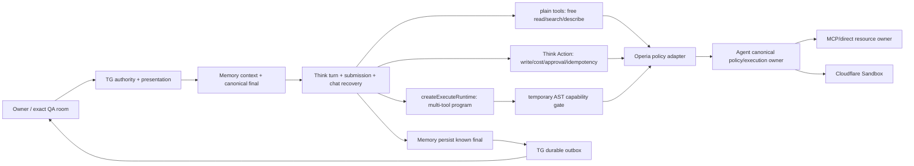

# Operia Cloudflare SDK-first 瘦身与状态机收敛 Spec

## 0. 结论

当前锁定的 `@cloudflare/think@0.15.0`、`agents@0.19.0` 和
`@cloudflare/codemode@0.5.x` 已经提供了此前没有优先复用的能力：

- Think `action()` 的幂等 ledger、授权、同步审批和 `durable-pause`；
- `pendingApprovals()`、`approveExecution()`、`rejectExecution()` 的统一审批面与自动续轮；
- `createExecuteTool()` / `createExecuteRuntime()` 的 durable Code Mode、审计、暂停恢复和 snippets；
- Code Mode `McpConnector`、`ToolSetConnector`、`codemode.search/describe` 与 rollback；
- Agent `runFiber()` / `startFiber()` 的 durable acceptance、恢复、状态、取消和保留结果；
- `ThinkWorkflow.step.prompt()` 的多步、长等待与外部事件恢复；
- Think Messenger 的 Telegram webhook、流式投递和 durable reply fiber。

因此目标不是继续修补现有四层状态机，而是收敛为：

```text
Think official turn/action/codemode state
  -> Operia thin policy + authority adapter
  -> Agent canonical execution owner
  -> resource connector / Sandbox
  -> Telegram thin presentation + durable delivery boundary
```

生产迁移必须双跑、可回滚。当前生产实现先保留；新路径通过全部 recovery/approval/unknown-outcome
合同后，再停止旧写，最后删除旧 runner。现有 D1 表只停止写入并保留审计，不做破坏性 DROP。

## 1. 为什么会变厚

此前 Spec 做了三个过度推论：

1. Telegram 必须由 Operia 拥有，因此 Think 的审批和续轮也必须全部自制；
2. Agent 必须是 policy owner，因此 Code Mode 的 durable execution 也要再建一套 Agent ledger；
3. 外部副作用 unknown 不能盲重试，因此所有本地 read、finalization 和通知也都需要同等级自制恢复。

正确边界应是：owner 只决定业务事实的权威来源，不要求重复实现 SDK 已提供的执行原语。
Operia 必须保留 authority、policy、费用、外部副作用和 Telegram 最终投递边界；SDK 应拥有
turn、action ledger、Code Mode replay、pause/resume、fiber 和 workflow 的机械状态。

## 2. 当前重复面与处置

| 当前自制面 | 当前规模 | 官方等价能力 | 决策 |
| --- | ---: | --- | --- |
| `approvalContinuation.ts` + runner + wake API | 1,170 行源码，另有 migration | Think Action `durable-pause`、action ledger、`pendingApprovals/approveExecution/rejectExecution`、auto-continuation | 双跑后删除源码；旧表只读保留 |
| `codeModeContinuation.ts` + runner + wake API | 839 行源码，另有 migration | Think `createExecuteRuntime` + Code Mode paused execution + Think submission/fiber recovery | 将 runtime 与 Think turn 共置后删除 |
| `operiaCodeMode.ts` + `codemodeDurability.ts` | 732 行 | Code Mode durable log、pending、approve/reject、rollback、executions | 删除外层 execution/receipt 重复；只保留 policy tool adapter |
| 自制 `retryDelay()` 与 Queue 轮询 | 两套近似实现 | durable pause、Fiber、Workflow event；安全 read 可用 `this.retry()` | 不做一比一迁移；由事件/恢复原语替代轮询 |
| 自制 TG webhook/outbox/delivery | 大型既有模块 | Think Telegram Messenger | 当前保留；Messenger 仅做隔离 spike，不直接接管生产 |
| Acorn capability gate | 约 260 行 | 无完整等价 | 暂时保留并上游跟踪 |
| Agent policy、ticket、费用、scope、pause/quarantine | canonical owner | SDK 不知道 Operia 业务政策 | 保留，但变为薄 adapter |
| TG exact private/QA room authority 与未知投递结果 | canonical owner | SDK 不知道家庭群边界和 Bot API 既有副作用 | 保留 |

上表行数是 2026-07-28 当前 checkout 的物理行数，仅用于确定删除量级，不是完成指标。

## 3. 不能直接删除 AST gate 的已验证原因

`@cloudflare/codemode@0.5.0` 和 `0.5.1` 的 `DynamicWorkerExecutor` 生成代码中，
`evaluate(__dispatchers, __connectors)` 与模型函数处于同一函数作用域。公开 connector proxy 最终调用
`__connectors.<name>.callTool()`。因此恶意或被提示注入的代码若能直接引用 `__connectors`，可能绕过
公开 proxy 所在的 durable decision/record 路径。

在 Cloudflare 提供不可命名的内部 binding membrane，或回归测试证明所有直接引用都被 runtime 自身拒绝前：

- 保留 Operia 正向 AST 子集和 `globalOutbound:null`；
- 不把 AST gate 当作业务 policy；所有真实调用仍须经过 Agent；
- 将此差异作为上游兼容项，而不是继续扩大本地 JavaScript 解释器。

## 4. 目标架构



只有三类 Operia 状态继续存在：

1. **业务权威状态**：Agent policy/ticket/budget/idempotency、resource revision/undo；
2. **外部边界状态**：Telegram ingress/outbox、已发生但结果未知的外部副作用；
3. **关联投影**：`request_id/task_id/execution_id` 到官方 SDK 状态的可查询引用。

Think turn、Action pending/settled、Code Mode replay/pause、Fiber/Workflow 生命周期不再复制成第二套状态机。

## 5. 迁移 Gates

### S0：官方能力锁定与依赖卫生

- 固定并验证 `@cloudflare/think@0.15.0`、`agents@0.19.0`、`@cloudflare/codemode@0.5.1`；
- 将源码直接 import 的 `@cloudflare/containers`、`@cfworker/json-schema` 声明为 direct dependency；
- 增加 SDK contract verifier，确认 package exports 与实际 `.d.ts` 同时包含所需能力；
- 每次升级先读官方 changelog/docs 和安装包 diff，再运行 compatibility gate；
- 不改变生产 flags、routes、bindings、数据和运行语义。

### S1：统一只读路径

- `system_status`、search、describe、free read 继续用 plain AI SDK tools；
- 所有工具只通过一个 Agent `preflight -> execute` contract，不再让 Code Mode connector复制 catalog/policy；
- Code Mode 由 `createExecuteRuntime` 暴露同一组 policy-wrapped ToolSet；
- 免费 read 的结果 replay 交给 Code Mode durable log；Agent 只保留 canonical audit，不另存一份结果正文；
- 付费、费用未知、写入和需确认工具不进入 S1 自动执行。

### S2：Think Actions 接管审批与幂等续轮

- 新增泛化的 Think `action()`，使用显式稳定 idempotency key；
- Agent 提供无副作用 preflight 和一次性 exact execution grant；Think 不复制 Agent policy；
- `approval` / `permissions` 由 Agent preflight 投影，`kind="durable-pause"`；
- TG 从 `pendingApprovals()` 读取 authoritative descriptor，按钮解析到
  `approveExecution/rejectExecution`，Think 自动续轮；
- Action `execute` 只消费 exact grant，仍由 Agent 执行并记录 resource receipt；
- 双跑期比较旧 continuation 与官方 Action 的状态/结果 hash，但只允许一侧执行副作用。

S2 通过后停止 `think_approval_continuations` 新写，删除 approval runner/wake API/Think parked-run glue。

### S3：Code Mode 与 Think 共置

- 在 `OperiaThinkHarness` 内创建官方 `createExecuteRuntime`；
- 只注入 policy-wrapped `tools.*`，不注入 Browser、raw network、secret 或默认 workspace bash；
- 复杂任务在同一 Think DO 内 pause/resume，避免 Think -> Agent outer execution -> Memory Queue -> Think submission 环路；
- Code Mode 中的需确认 action 由官方 pending execution 暂停；TG 使用与 S2 相同的审批 UI；
- Agent 只接收独立 canonical tool calls，不再拥有第二个 Code Mode outer state machine。

S3 通过后停止 `think_codemode_continuations` 和 `operia_codemode_*` 新写，删除 code-mode runner、wake API、
outer lease/receipt 实现。旧表按 retention policy 只读保留。

### S4：Fiber/Workflow 收口

- 单次 turn 周边的 durable acceptance 使用 `startFiber()`；
- 多步、长等待或外部 human event 才使用 `ThinkWorkflow`；普通聊天不套 Workflow；
- 安全、无副作用、可判定的 transient read 才可使用 `this.retry()`；
- Provider 调用、Telegram 发送、支付、写入和任何 unknown outcome 不自动 retry；
- 删除两套 Queue 轮询、attempt budget 和 `retryDelay()`。

### S5：Telegram Messenger 评估，不默认迁移

Think Messenger 已支持 Telegram、streaming、conversation resolver 和 durable reply fiber，但当前 Operia 还需要：

- exact family QA chat/thread authority；
- `/pause`、审批按钮、reply/reaction/image/voice/Mini App；
- 已有 D1 ingress、known-final、FIFO outbox 和 Bot API unknown-outcome 证据链。

先做不接生产 webhook 的 fixture spike。只有在逐项覆盖并证明不会复制 conversation truth、不会丢失
unknown-outcome 语义后，才提出 TG owner cutover ADR。S0-S4 不以 Messenger 迁移为前提。

## 6. 验收与删除门槛

每个删除 Gate 必须同时满足：

- 官方 API 在锁定安装版本的 export 与 type declaration 中存在；
- workerd/Miniflare fault injection 覆盖 DO eviction、pause 后重启、重复批准、拒绝、取消、过期；
- 同一 idempotency key 的副作用最多执行一次，unknown outcome 不重试；
- Agent 与 Think 的 authority/policy/args/schema/pause-generation pin 不漂移；
- known model final 先持久化，再 best-effort telemetry，再 TG delivery；
- TG 能显示真实工具/审批状态，并可 `/pause`、stop、approve、reject；
- old/new shadow 的 terminal status、result hash、usage 与 external-write count 一致；
- 关闭 cutover flag 可回旧路径，且不会让新旧两侧同时执行；
- 完整 verify、三个 Worker dry-run 和零模型 synthetic canary 通过。

目标删除量：先删除约 2,700 行 runner/outer-ledger 源码，再删除 `OperiaThinkHarness` 和
`AgentRuntime` 中对应 glue。最终减少量以 `git diff --stat` 为准，不以为了行数而牺牲边界。

## 7. 版本与发布策略

- Think 继续固定 `0.15.0`；它是当前 npm latest，且所需 Action/Execute/Workflow API 已存在；
- Code Mode 升至 `0.5.1`，只包含 MCP result 解包与 MCP v1/v2 structural typing 修复；
- Agents `0.19.0 -> 0.20.0` 是独立 compatibility Gate，不与状态机迁移混装；
- Code Mode 官方仍标 experimental，因此所有升级都需要安装包 diff、typecheck、fault injection 和 flags-off rollout；
- 发布顺序：candidate -> local/workerd -> flags-off deploy -> shadow -> strict cohort -> observation -> old-write freeze -> old-code delete；
- Owner 已另行授权 flags-off 基础设施与零副作用生产 shadow；本 Spec 仍不授权 SDK-first
  真执行、付费模型/工具 canary、cohort 扩大、旧写冻结或旧 runner 删除。

## 8. SDK-first 工程规则

以后新增或修复 Cloudflare 能力时，提交前必须回答：

1. 当前官方文档推荐的 primitive 是什么？
2. 当前锁定安装版本是否实际 export，type signature 是否匹配？
3. 官方 primitive 缺失的具体 Operia 业务不变量是什么？
4. 自制代码能否限制为 adapter，而不是第二套 runtime/ledger/retry engine？
5. 删除条件和上游替代条件是什么？

若 1–2 已满足而 3 为空，不得新增自制实现。若必须自制，Spec 和代码注释必须记录官方缺口、
最小边界、测试和删除条件。

## 9. 2026-07-28 本地实施结果

| Gate | 已落地内容 | 现场证据 | 生产状态 |
| --- | --- | --- | --- |
| S0 | 锁定 SDK 版本、direct dependency、exports/types/生产接线契约 | `verify:cloudflare-sdk-contract` PASS | 无变更 |
| S1 | direct 与 Code Mode 共用 `unifiedReadTools`；官方 `createExecuteRuntime`、`LOADER`、`globalOutbound:null`；Agent `free_read` fail-closed | workerd 调用 `system_status/search/describe/execute`，0 write | flags off |
| S2 | Think `durable-pause` Action、Agent exact grant preflight/consume/revoke、TG authoritative projection与按钮、`onChatResponse` 终态事件 | 重复批准 effect=1、拒绝 effect=0、失败 attempt=1 | flags off |
| S3 | Code Mode 内付费/需确认 read 复用同一 Action 审批面，不再创建 Agent outer Code Mode | workerd approve/replay/reject PASS | flags off |
| S4 | 新路径以 Think terminal hook + Queue event 投影 final；同一 turn 的后续审批可原子替换 TG pending package；无 polling/retry runner；已有 Agent Fiber chaos 继续通过 | SQLite 实测 exact replay、pin drift fail-closed、连续第二次审批投影；`verify:think-sdk-s4` PASS | 旧 runner 仅作 rollback |
| S5 | 检查 Think Telegram Messenger helper 与运行依赖 | helper 存在；缺 `@chat-adapter/telegram`，且 Operia authority/unknown-outcome 未等价 | no cutover |

附加验证：空本地 D1 完整应用 `0001`–`0041`；`npm run verify` 全量通过；Memory、Agent、TG
三个 Worker 的 Wrangler dry-run 均通过；生产新 flags 保持 `false`，未部署、未远程迁移、未调用付费模型。

本提交是 **可部署但尚未授权部署的迁移候选**，不是最终删旧代码的提交。约 2,700 行旧 runner/outer-ledger
只有在另行授权的 flags-off 生产部署、shadow、strict cohort、unknown-outcome/approval recovery 观察全部通过后，
才停止旧写并删除。提前删除会破坏当前生产回滚能力。

依赖审计为 0 critical、0 high、4 moderate。4 项均来自 MCP SDK 的 Windows Hono `serve-static`
公告；当前 Workers 运行面不使用该 Windows adapter。`npm audit fix --force` 会把 `agents` 破坏性降级到
`0.3.4`，因此禁止自动修复，等待上游兼容版本。

## 10. 2026-07-28 flags-off 生产部署

Owner 在本地候选、全量验证和三 Worker dry-run 通过后，明确授权 flags-off 生产部署。本次发布只铺设
SDK-first runtime、Action exact-grant 端点和 TG correlation projection，不启用新执行路径：

- 远端 D1 在 0600 全量备份与 Time Travel bookmark 后应用 additive migration
  `0041_think_sdk_action_projections.sql`；当前无 pending migration，`quick_check=ok`、无外键违反，
  新表行数为 0；
- 按 Agent → Memory → TG 顺序发布 commit <COMMIT>，100% versions 分别为
  `<UUID>`、`<UUID>`、
  `<UUID>`；
- `AGENT_THINK_ACTIONS_ENABLED=false`；`MEMORY_THINK_SDK_CODEMODE_ENABLED=false`、
  `MEMORY_THINK_ACTIONS_ENABLED=false`、`MEMORY_THINK_SDK_CODEMODE_ACTIONS_ENABLED=false`；既有
  Owner/QA Code Mode v2 与 Sandbox read flags 未改变；
- Agent names-only 远端配置由部署前唯一缺少新 flag，收敛为 63 desired / 63 remote / 13 Secrets；
- 发布前后活动 TG inference、outbox、continuation、旧 Think approval/Code Mode continuation 均为 0；
  历史 attention/unknown 计数保持 53 / 4 / 3，不清理、不重放；
- 入口边界保持：Agent/TG root=302、TG Mini App=200、unsigned webhook=401、Memory health=200；
  Container app 无配置变化，仍为 fixed `docker.io/cloudflare/sandbox:0.12.4`。

即时代码回滚点为 Agent `<UUID>`、Memory
`<UUID>`、TG `<UUID>`。回滚不删除 0041；
如需配对回滚，先 TG、再 Memory、最后 Agent。新 SDK 路径激活、shadow、自然 TG/模型/工具 canary、
cohort 扩大、旧写冻结和旧 runner 删除仍需后续独立 Gate。

## 11. 2026-07-28 零副作用生产 shadow Gate

Owner 在 flags-off 版本稳定后授权继续到 shadow。本 Gate 不打开三个真执行开关，而是在现有真实 Think turn
完成后，用已记录的计数、工具键、catalog/policy pins 和上下文投影哈希构造脱敏 trace，运行 Gate C 已验证的
确定性路由比较器：

- `MEMORY_THINK_SHADOW_ENABLED=true` 只存在于 Memory Worker；
- `AGENT_THINK_ACTIONS_ENABLED=false`、`MEMORY_THINK_SDK_CODEMODE_ENABLED=false`、
  `MEMORY_THINK_ACTIONS_ENABLED=false`、`MEMORY_THINK_SDK_CODEMODE_ACTIONS_ENABLED=false` 继续保持；
- Think DO 只同步捕获最多 8 个已用工具键；catalog 超过 256 条时直接记为 incompatible，不在已付费
  主结果链路遍历或序列化无界 catalog；
- shadow 比较在主结果持久化/标记响应后的既有 `waitUntil` telemetry 中运行，不重新组装 prompt，不调用
  第二个模型，不执行工具，不创建 approval/grant，不写外部资源；flag 关闭时在 trace 构造前立即返回；
- 唯一新增写入是 `think_canary_runs` 内部观测列，记录 `pending/shadowed/incompatible/error`、脱敏比较 JSON
  和有界错误码；原始 prompt、messages、arguments、result、secret 均不得进入该 JSON；
- Assembler 的 32-bit 短稳定 hash 在 shadow 边界内只做 64-hex 格式归一化；这不会增加原 hash 的
  抗碰撞强度，因此仅限 telemetry，禁止复用为权限、审批或执行安全 pin；它不改变现有缓存身份，也不把
  原始上下文投影写入观测表；
- shadow 自身异常被收敛为观测状态，不得让已完成、已付费的主 Think 结果失败；旧行迁移后默认
  `sdk_shadow_status=disabled`，不伪造历史样本。

本地验收已通过：空 D1 完整应用 `0001`–`0042`，`quick_check=ok`、无外键违反；旧行 additive migration
默认值测试通过；match/mismatch/incompatible/短 hash 归一化均为零额外 model/tool/external write；
`npm run verify`、Memory/Agent/TG 三 Worker dry-run 全绿；依赖审计仍为 0 critical、0 high、4 moderate。

生产发布顺序固定为：先应用 0042 additive migration，再回读新列、pending migration、`quick_check` 和
外键检查，最后才发布 Memory Worker；Agent/TG 不发布。第一条真实自然 Think 请求之前不会制造付费或工具
canary；是否进入 SDK-first 真执行仍须根据自然样本另行审批。

## 12. 2026-07-28 零副作用生产 shadow 发布结果

Commit <COMMIT> 已推送私有 SSH remote。发布严格按 migration-first 执行：先创建
`/home/<USER>/.<BRANCH>/<MEMORY_SERVICE>-pre-sdk-shadow-20260728T152250+0800.sql`
（0600，99,198,755 bytes），再应用 0042，最后只发布 Memory Worker。

- 0042 回读：pending migration=0、`quick_check=ok`、foreign-key check 空；三列存在且旧 56 行全部
  `sdk_shadow_status=disabled`；
- Memory 100% version 为 `<UUID>`；回滚点为
  `<UUID>`；
- Agent/TG 未发布，继续为 `<UUID>` /
  `<UUID>`；
- 线上变量回读为 `MEMORY_THINK_SHADOW_ENABLED=true`，三个 Memory SDK 真执行开关和 Agent Action
  开关仍为 false；
- workers.dev `/health=200`；Access 保护的 custom-domain `/health=302` 符合入口边界；
- 发布后尚无新自然 Think row，因此未制造 Telegram、模型、Provider 或工具 canary，也尚无可评价的
  shadow match/mismatch 样本。

当前准确状态是 **observer shadow enabled；SDK execution cutover remains false**。下一步只等待 Owner
自然使用产生观测；在样本与错误率读回前不启用 SDK Actions/SDK Code Mode、不扩大 cohort、不冻结旧写、
不删除旧 runner。

## 13. 2026-07-28 Owner 私聊延迟、流式草稿与只读源码工作区

### 13.1 现场问题与归因

生产 D1 的只读关联显示，近期成功的自然 Owner 私聊端到端中位数约 41 秒：入口 Queue/debounce
约 15.5 秒、Memory/Opus 约 17.6 秒、Telegram 多气泡投递约 8.6 秒。当前无 inference/outbox backlog，
因此本 Gate 不把问题误判成单纯 Provider 慢，也不改变同 chat 付费推理串行与 unknown-outcome 禁止盲重放。

### 13.2 入口 P0：唯一 inbox leader 持有 trailing debounce

- webhook 仍只做持久 inbox + Queue handoff，立即唤醒 `<TG_QUEUE>`，不在 HTTP 请求中 sleep；
- Queue consumer 先通过 `0044_tg_debounce_leases.sql` 原子争抢 chat 级 durable leader lease；非 leader
  不接触 inbox，只安排 lease 到期后的恢复唤醒；
- 唯一 leader 才调用 `claimInbox()`，在同一次 consumer invocation 内等待 1.5 秒 quiet window，并用
  同一 claim token 吸收后来消息；付费 run 持久化前必须续租，renew/release 均由 token fencing 保护；
- oldest message 的 5 秒 hard cap 和 16 次 safety cap 继续存在；sleep 不占 Worker CPU；
- `inference.debounce` 只由 leader 写一次，记录 waited、checks、coalesced message count 与 safety exit；
- 既有 active inference/continuation、paid-call idempotency、claim lease、known-final 与 outbox 语义不变。

预期去除的是现场可见的约 12–15 秒 Queue 重投空等；这是部署前估算，必须以发布后同口径 D1 样本验收，
不得把本地 PASS 写成生产延迟已经下降。

### 13.3 Think `onChunk` → Telegram `sendMessageDraft`

本 Gate 不把 TG webhook/会话所有权迁给 Think Messenger，也不把 OpenAI-compatible 主请求改为 legacy SSE。
仅使用 Think 0.15 官方 `onChunk()` hook 观察 `text-delta`：

1. `OperiaThinkHarness` 只累计可见 `text-delta`，明确忽略 reasoning、tool input、tool result 与 raw chunk；
2. 首个可见文本立即投递，之后按 700ms 或 384 字符合并，避免逐 token Queue 写；
3. partial snapshot 经已有 Memory `TG_QUEUE` 进入 `<TG_QUEUE>` 零批等待 consumer；
4. TG 只在 canonical Owner private chat 调 Telegram Bot API `sendMessageDraft`，不传不完整 Markdown；
5. `0043_tg_draft_previews.sql` 用 batch tombstone、attempt generation、desired order 与 non-stealable drain
   lease 串行化 Telegram 网络调用，拒绝并发完成倒序、重启 seq 重置及 final 后迟到 snapshot；
6. preview 是 at-most-once UI：Telegram 429/5xx/timeout/unknown 全部吞掉，不 Queue retry、不进 attention；
7. canonical final 在构建 durable delivery batch 前先关闭 preview ledger，随后仍由原 D1 outbox `sendMessage`
   唯一持久化；preview 永远不是 response truth。

双门禁保持默认关闭：Memory `MEMORY_THINK_TG_DRAFT_ENABLED=false` 与 TG
`TG_DRAFT_PREVIEW_ENABLED=false`。QA room、家庭群、其他私聊和第三方 chat 永不接收草稿。

### 13.4 Agent-owned revision-pinned source workspace

Operia 不读取部署容器的空 `/workspace`，也不获得 GitHub token、任意文件系统或源码写权限。Agent 新增
专用 `SOURCE_SNAPSHOTS` R2 binding，提供三个 canonical free-read 工具：

- `source-code/list` → Think `code_list`；
- `source-code/search` → Think `code_search`；
- `source-code/read` → Think `code_read`。

snapshot 必须从 clean canonical Git commit 构建，返回 40-hex commit SHA、manifest tree hash、file SHA-256、
精确路径与行号。runtime 重新验证 pointer、manifest tree、search shard bytes/hash、search path membership 与
读取文件 hash；绝对路径、遍历、`.git`、`.env`、secret/credential/private-key 路径均 fail-closed。构建器只允许
repo 根下专用 `.source-snapshot*` 目录，内容命中常见私钥/token、高熵凭据格式立即中止；发布器从 clean
Git HEAD 重建 canonical 文件清单，交叉校验 pointer/manifest/tree/entry，`lstat` 拒绝 symlink，并验证
每个对象 bytes/hash、固定 bucket 与唯一 pointer-last，防止任意删除或越界上传。运行时 readiness 还会
实际读取一个文件和一个 search shard，不以 R2 list 代替完整性检查。

源码工具只在 Owner private Think scope 暴露；Agent 再次验证 private scope。Memory
`MEMORY_THINK_CODE_READ_ENABLED=false` 与 Agent `AGENT_CODE_WORKSPACE_ENABLED=false` 必须同时开启，
且 R2 pointer/manifest probe 成功后才允许 rollout。它可进入官方 Code Mode 的只读 `tools.code_*` 组合，
但不能写代码、提交、部署、读取 secret 或取得 raw network。

### 13.5 发布与验收顺序

本地候选完成：typecheck、source/draft/debounce 专项测试、Think production/R7/S3、Agent policy/runtime/task、
TG window/interactions/recovery、control-plane、空 D1 `0001`–`0044` quick check，以及 Memory/Agent/TG 三 Worker
dry-run。当前未部署、未远程迁移、未创建或上传 R2 snapshot、未调用模型、未发送 Telegram。

若 Owner 后续明确授权生产 rollout，严格顺序为：

1. 远端 D1 备份与 bookmark，应用 additive 0043/0044，回读 quick/FK/pending；
2. 创建固定 private R2 bucket，发布当前 clean HEAD snapshot，回读 pointer/manifest/list probe；
3. flags-off 发布 Agent → Memory → TG，回读版本与四个新 flag 仍为 false；
4. 先开 Agent source flag，再开 Memory code-read flag，只做 Owner private read canary；
5. 先开 TG preview consumer，再开 Memory draft producer，只做 Owner private natural-message canary；
6. 对比发布前后 ingress/debounce、TTFT、final total、draft calls、429/unknown、outbox success 与 duplicate count；
7. 任一异常先关 producer，再关 consumer；0043/0044 与 R2 snapshot 可保留只读，不执行破坏性回滚。

## 14. 2026-07-29 Anthropic 缓存与会话折叠修复

Owner 在授权 13.5 的生产 rollout 时指出“只有前缀稳定可读到缓存”。发布前对生产 D1 做了只读聚合，
确认这不是 Cloudflare AI Gateway response cache：Operia 继续发送 `cf-aig-skip-cache=true`，使用的是
Anthropic prompt cache。当前 Opus 4.6 稳定前缀超过 4096-token 最低门槛，1 小时 stable cache 正常；
异常是 111 个部署后自然 Owner/private Think 中有 106 个请求只读取固定 4,174 tokens，同时平均重写
约 5,430 tokens。生产 `tg_chat_state` 已增长到 96 turns / 45,845 JSON chars，而投影最多注入 24 turns /
24KB；折叠又连续出现 `invalid_structured_summary`，因此 history 每轮从头滑窗，破坏 Anthropic
`tools -> system -> messages` 的完整前缀身份。

修复使用 Cloudflare 已提供的原生能力，不新增第二套摘要 runtime：

- Workers AI 继续通过 `env.AI.run()`；结构化摘要请求改用官方 `response_format.type=json_schema`；
- OpenAI-compatible adapter 正确把 Workers AI native binding 返回的对象型 `response` 序列化为 message
  content，不再把已解析对象误当空文本；
- fold trigger 与注入上限统一为 24 turns，并在 24KB 前主动 fold；投影只允许连续 suffix，不跳过中间 turn；
- successful fold 继续写一代 D1 rollback backup；失败时仍保留原 state，不做不可逆丢弃；
- conversation cache TTL 从 5 分钟改为 1 小时，与 stable TTL 一致。生产间隔统计中 94 次在 5 分钟内、
  14 次在 5–60 分钟、2 次超过 1 小时；1 小时写入单价更高，因此发布后以实际 read/write 与延迟观察，
  若没有形成至少两次复用则回退 conversation TTL，不动 stable prefix；
- AI SDK 7 的 `usage.inputTokens` 是 no-cache + cache-read + cache-write 总和。新 `usage-v2` 先拆出
  `noCacheTokens`，D1 的 input/read/write 三桶不再重复计数；cache health 对旧 Think 行按旧合同归一化；
- Think usage log 开始持久化真实 cache TTL label，便于区分 TTL、低于门槛和 marker/layout 问题。

明确不启用 Anthropic automatic caching：当前显式布局最多使用 tool、system、bridge、tail 四个 breakpoint，
自动缓存会占用第五个并被 AI SDK warning 后忽略。也不启用 AI Gateway 完整响应缓存，因为个性化对话与工具
调用不能以完整响应 replay 代替 prompt-prefix cache。

发布前专项验证覆盖：Workers AI 对象型 JSON Mode 响应、24-turn/24KB fold、AI SDK 7 usage
100 no-cache / 800 read / 100 write、live-context freshness、TG window、Think production、cache strategy 与
Anthropic wire；完整 `npm run verify` 和 Agent/Memory/TG 三 Worker dry-run 全部通过。此修复与 13.5
同一授权 rollout 发布；先 flags-off 铺设，再按 source read 与 TG draft 双门禁顺序启用。

Owner 已在本轮明确授权完成 13.5 的 source read 与 TG draft 双门禁 rollout。canonical 配置由默认关闭
切换为四 flag 开启；真实发布仍严格按 Agent source consumer、TG draft consumer、Memory
code-read/draft producer 顺序执行。该授权不改变 private-only scope，不开放源码写入、GitHub 凭据、部署、
第三方 chat 或 group draft，也不启用 SDK Actions / SDK Code Mode Actions。

## 15. 2026-07-29 Cache、源码读取与私聊 Draft 生产发布结果

### 15.1 精确源码与数据前置

- 缓存修复 commit 为 `<COMMIT>`；四项 activation flag 的运行时
  源码 commit 为 `<COMMIT>`。
- 发布前 D1 备份、Time Travel bookmark 均保存于本机权限 `0600` 的 rollout backup 目录；备份恢复到
  临时 SQLite 后 `quick_check=ok`、87 tables、foreign-key check 无记录。
- 远端仅应用 additive `0043_tg_draft_previews.sql` 与 `0044_tg_debounce_leases.sql`；应用后
  pending migrations=0、`quick_check=ok`、foreign-key check 无记录，两张新表存在且发布时均为空。
- 创建固定 private R2 bucket `<SOURCE_SNAPSHOT_BUCKET>`，没有 public domain。最终 pointer 精确指向
  `<COMMIT>`，tree hash
  `0e15a28a8928928d7d521c9c65394cd2507e56fe9d4611868072a4018e3d09d9`；320 files、5 search
  shards、327 objects、3,909,760 bytes。pointer 最后上传，并从远端下载后与本地逐字节一致。

### 15.2 Flags-off 铺设与分阶段启用

先完成 Agent → Memory → TG flags-off 发布：

- Agent `<UUID>`；
- Memory `<UUID>`；
- TG `<UUID>`。

随后按 source consumer → draft consumer → Memory producer 顺序启用，最终 100% versions 为：

- Agent `<UUID>`；
- Memory `<UUID>`；
- TG `<UUID>`。

远端配置回读确认 `AGENT_CODE_WORKSPACE_ENABLED=true`、
`MEMORY_THINK_CODE_READ_ENABLED=true`、`TG_DRAFT_PREVIEW_ENABLED=true` 与
`MEMORY_THINK_TG_DRAFT_ENABLED=true`；stable/conversation cache TTL 均为 1 小时，fold trigger 为
24 turns。源码 R2 binding 指向固定 private bucket。SDK Actions 与 SDK Code Mode Actions 的四个真实写入
flag 继续为 false。

### 15.3 发布后零模型后验与回滚

- Memory workers.dev `/health=200`；Memory、Agent、TG custom-domain 匿名请求继续由 Access 返回 302；
- 发布后 D1 中 active inference、active approval、active Code Mode continuation、draft row 与 debounce
  row 均为 0；历史 pending/attention/unknown 记录保持原状，没有清理、重放或伪造结果；
- 本轮未代 Owner 发送 Telegram、未制造自然消息、未额外调用 Opus 或工具。因此 production source
  catalog、真实 `code_search` / `code_read` tool keys、TG `sendMessageDraft` 首段时间和首次成功 fold
  必须由 Owner 下一条自然私聊触发后再回读，不能用本地 PASS 或配置 readback 冒充现场验收；
- activation 异常时先关 producer 再关 consumer：Memory 回到
  `<UUID>`，TG 回到
  `<UUID>`，Agent 回到
  `<UUID>`。0043/0044 与 private R2 snapshot 保留，不做破坏性 DROP
  或删除。

### 15.4 Owner 自然验收

建议第一条私聊直接覆盖源码工具、流式草稿和折叠：

> 请用 code_search 搜索 normalizeThinkStepUsage，再用 code_read 告诉我它如何拆分缓存 token；同时说出当前源码 commit。

验收后只读关联该 turn，确认：Think decision、`code_search` / `code_read` tool keys、R2 commit/hash、
draft closed/final durable、首段与 final 延迟、`usage-v2` no-cache/read/write 三桶，以及 96-turn 历史是否
成功折叠到保留窗口。若首轮因新 revision/折叠产生 cache write，应在 1 小时内用第二条自然 follow-up 验证
conversation tail cache read；单轮冷写不能被误判为缓存回归。

## 16. 2026-07-30 私聊首个可见输出修复

生产只读时延关联（不读取 `user_text`、`request_json`、final payload 或任何消息正文）确认：最近一组
Owner 私聊无工具任务虽然都能完成，但多数没有进入 `begin_final_response`，因此段落 ledger 的
`last_sequence=0`，4–21 个 canonical 气泡直到模型完成后才统一入 outbox。仅依赖模型自愿选择最终响应
barrier，不能构成稳定的流式体验。

本修复复用 Think 官方 `onChunk()`，不修改 provider-visible tools、instructions、toolChoice、Cache V3
breakpoint 或 final barrier：

- Memory `MEMORY_THINK_TG_DRAFT_ENABLED=true`，恢复 canonical Owner 私聊的 `sendMessageDraft` producer；
- paragraph stream 继续保留：模型确实进入 `begin_final_response` 时，真实段落气泡仍按 durable ledger 发送；
- 未进入 barrier 时，draft 作为 at-most-once、非 canonical 的首屏流式 fallback；final 仍由原 outbox 唯一交付；
- preview 失败、429、timeout 或 unknown 不重试、不进 attention、不影响已付费 final；
- private inbox trailing quiet window 从 1.5 秒降为 0.5 秒，连续 burst hard cap 从 5 秒降为 2 秒；
- webhook 仍只做 durable inbox + Queue handoff，同 chat 付费推理串行、unknown outcome 禁止盲重放均不变；
- 不缩短回答、不换模型、不降低 reasoning，也不把消息正文写入新增遥测。

回滚顺序为先关闭 Memory draft producer，再恢复 TG debounce 1.5/5；不关闭 canonical paragraph/final，
不回退 Cache V3 历史与 anchored wire 不变量。

### 16.1 2026-08-10 Harness-owned final 判定

Owner 新增硬边界：最终回答识别不得依赖模型调用工具；能由 Harness 根据 Provider/AI SDK 协议确定的状态，
必须由 Harness 确定。

因此 `begin_final_response` 从 correctness barrier 降级为兼容性的 live-stream fast path：

- 每个模型 step 结束时，Harness 读取 AI SDK `onStepFinish.finishReason`、`rawFinishReason` 与实际
  `toolCalls.length`；Anthropic `end_turn` 映射为 `stop`，`tool_use` 映射为 `tool-calls`；
- `tool-calls` step 或任何携带 tool call 的不一致 step 均不得公开其中的普通文本；
- 原始 `pause_turn` / `compaction` 是 Provider 续跑信号，不得因 unified `stop/other` 被误升为 final；
- 没有 tool call 且 finish reason 不是 `tool-calls` 的 terminal step，由 Harness 自动认定为唯一 public final，
  只提交该 step 的文本；生产 Harness 取消聚合 session transcript 回退，证据不足时 fail closed；
- 未出现 `begin_final_response` 时，Harness 在 terminal JSON 到达后按既有空行规则一次性 durable stage
  已完成段落，再释放 canonical final；模型是否遵循工具提示不影响正确性与最终交付；
- 生成中途无法从 JSON 证明“后续一定不会再出现 tool use”，所以无模型标记路径的首段最早只能在该 step
  结束后放行。声称能在更早时刻安全放行，要么仍在相信模型，要么会泄露工具前导文字；
- 本次保留 provider-visible tools、instructions、toolChoice 与 cache breakpoint 原样，避免为了修正控制权
  破坏 `anchored_v3` 稳定前缀。后续可单独移除兼容工具，但不得把它重新设为正确性前提。
