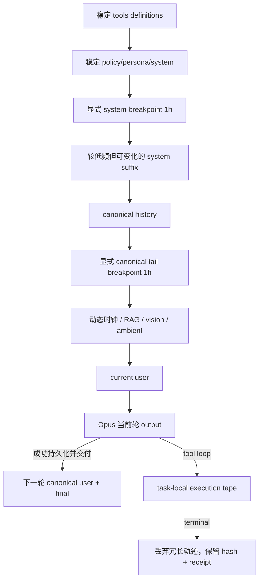

# Operia Operia Cache V3 显式增量缓存与短命工具上下文 Spec

> 2026-07-30 勘误：本文件记录的 `anchored_v3` 版本随后被另一条生产分支覆盖；同时真实多步任务证明
> `begin_final_response` 后清空 `activeTools` 会改变 Provider-visible 工具定义并再次冷写。实现、发布和验收
> 以 `2026-07-30-operia-cache-v3-remediation-spec.md` 为准。

## 0. 结论与 2026-07-29 生产勘误

正确 V3 不再把 Anthropic 顶层 automatic cache 当作生产主策略，而使用 `anchored_v3`：

1. 在最后一个稳定 system block 放显式 1 小时 breakpoint；
2. 在本轮请求中最后一个 canonical history block 放显式 1 小时 breakpoint；
3. 动态时间、动态记忆、视觉上下文和当前 user 全部位于两个 breakpoint 之后；
4. 不在 tool definition 上另放 marker，因为 Anthropic 的 prefix 顺序是 `tools -> system -> messages`，
   system breakpoint 已经覆盖工具定义；
5. 工具调用、工具结果和 reasoning 只在当前任务 execution tape 存活，不进入下一自然轮 canonical history；
6. Provider Context Editing 与紧急本地 prune 继续独立控制单任务工具轨迹。

此前发布的 `automatic_v3` 已被生产证据证伪：三个连续自然请求的稳定前缀 hash 和工具 hash 相同，但每个
model step 的 `cache_read=0`，同时重复 `cache_creation` 约 10k–12.5k tokens。根因是旧实现进入 automatic
模式后删除 system、message 和 tool 上的全部显式 marker，只在不断变化的最后 cacheable block 上写顶层
breakpoint。Anthropic 的 lookback 只寻找“过去实际写过的 prefix entry”，不会替应用自动写入更早的稳定
system，因此该结构会持续冷写。

`automatic_v3` 代码仅保留为明确实验/回退研究路径，不再是 desired production config。本轮没有部署；线上
仍保持旧状态，仓库候选配置已切换为 `anchored_v3`。

## 1. Owner 目标

Owner 要求缓存尽可能接近：

```text
旧稳定前缀和旧 canonical history：cache read
上一轮刚刚成为 canonical 的 user + delivered final：cache create
当前轮动态上下文 + current user：普通 input，不写入可复用 cache
当前模型回答：output；只有成功交付后才在下一自然轮进入 canonical history
工具执行轨迹：当前任务内短命存在，terminal 后不进入下一轮 prompt
```

平台仍有最小缓存长度和 TTL。Claude Opus 4.6 的最小 cacheable prefix 是 4096 tokens；当前 TTL 为 1 小时。
低于阈值时 read/create 都为 0 属正常，TTL 到期后的第一次 eligible 请求也允许重新创建。不得使用付费
keepalive 制造表面命中率。

## 2. 正确的逐轮语义

令自然轮 `n` 的当前输入为 `user(n)`，当前输出为 `final(n)`。在轮 `n` 发起 Provider 请求时，只有截至上一
自然轮已经成功持久化并交付的 user/final pair 属于 canonical history：

```text
cache_read(n)       = stable tools/system + canonical history through final(n-2)
cache_creation(n)   = user(n-1) + final(n-1)
regular_input(n)    = dynamic_context(n) + user(n)
output(n)           = final(n)
next_turn_append    = user(n) + delivered final(n)
discard_after_task  = tool calls/results + reasoning + transient artifacts
```

这里是逻辑语义，不承诺账单 token 精确相等。Provider tokenization、最低长度、TTL、模型、工具 schema、稳定
system、Context Editing 和本地 prune 都可能改变真实数字。

旧 Spec 的 `cache_creation(n)=final(n-1)+user(n)` 是错误的：它会把尚未成为 canonical 的当前 user 放进写入
范围，并与 Owner 要求矛盾。本版以“上一轮 user + delivered final”作为唯一正确增量。

## 3. Canonical conversation 与 execution tape

### 3.1 跨自然轮保留

- 用户原始输入；
- Operia 已知完成、已持久化且成功交付的最终回答；
- 必要时一条最小结构化 receipt：工具类别、资源 revision/hash、结果状态、是否截断、审计引用；
- 已批准或已发生副作用的 canonical receipt，但不保存冗长 payload。

unknown outcome、未交付 final、流式草稿和工具中间态不得提前成为下一轮 cache tail。

### 3.2 只在本任务存活

- tool call / result；
- 搜索候选、源码片段、stdout/stderr；
- Code Mode 中间变量、Sandbox 临时文件；
- provider reasoning/thinking；
- 本任务展开的 Skill/resource 和临时 schema。

任务 terminal 后只保留 hash、token/byte 数、工具名、状态、correlation 和必要 receipt。秘密、完整 prompt、
完整工具 payload 与 hidden reasoning 不写入缓存遥测。

## 4. 最终 wire 架构



常态只使用两个 explicit slots：`system + canonical tail`。第 3、4 个 slot 保留，不默认用于 tool marker 或
基于总历史长度计算的 bridge。

## 5. 20-position lookback 与 bridge 决策

Anthropic 对每个 explicit breakpoint 最多检查 20 个 prefix 位置，包含 breakpoint 自身，因此最远只能找到
距离 19 个 content blocks 的旧 entry。正常自然轮只向 canonical history 追加 `user + final` 两个 wire
blocks，上一轮 tail 距离新 tail 始终为 2，和总历史有多长无关。

因此旧实现的“历史总 blocks >16 就永久增加 bridge”不适合作为 Anchored Think 的模型：它既浪费 slot，
也没有表达“当前 tail 到上一次实际写入”的距离。共享 assembler 为兼容非 Think 消费者继续保留 legacy
bridge；正式 `buildAssembledThinkInput()` 仅在 `anchored_v3` 路径过滤它，避免改变其他调用者合同。

异常导入、恢复或未来多模态 canonical 化若能在一次自然轮之间新增 20 个或更多 wire blocks，当前行为是
接受一次 cold rewrite；现有 `cold_reason` 只会保守记录 `unknown`，尚未实现 state-aware
`conversation_cache_gap` 分类。若以后需要 bridge 或专门诊断，必须先持久化 previous written
tail/checkpoint，再基于最终 Anthropic wire block 距离生成，不能再次按总历史长度估算。

## 6. `anchored_v3` 配置与运行合同

```text
MEMORY_THINK_CACHE_V3_MODE=explicit_v2|automatic_v3|anchored_v3
MEMORY_THINK_CACHE_V3_COHORT_PERCENT=0..100
ANTHROPIC_CACHE_STABLE_TTL=1h
ANTHROPIC_CACHE_CONVERSATION_TTL=1h
# 仅 automatic_v3 实验使用：
MEMORY_THINK_CACHE_V3_TTL=1h
```

### `anchored_v3`

- 保留 assembler 生成的唯一稳定 system marker；
- 保留唯一 canonical history tail marker；
- 删除工具 definition 上的冗余 marker；
- 不发送顶层 `cache_control`；
- preflight 要求 system marker 恰好 1、message marker 不超过 2、tool marker 为 0、总 slots 不超过 4；
- preflight 按最终 `tools -> system -> messages -> automatic` 顺序验证 TTL，禁止 `5m` marker 后再出现 `1h`；
- `ANTHROPIC_CACHE_ENABLED=false` 时删除所有 marker 和 top-level cache option；
- final wire 使用 AI SDK 7 / `@ai-sdk/anthropic` 官方字段转换，不手写第二套 Provider transport。

### 模式命名与遥测

现有 D1 `cache_mode` 约束只有 `explicit_v2|automatic_v3`。`anchored_v3` 的真实 wire 本来就是 explicit，故
遥测继续记录 `cache_mode=explicit_v2`；configured strategy 加入 stable-prefix hash，区分旧显式基线与新候选，
无需只为名称新增 schema migration。

### `automatic_v3`

保留为纯 automatic 实验路径：显式 marker 全部移除，顶层自动 breakpoint 开启。它不进入 desired production
配置。Anthropic API 实际允许 automatic 与 explicit 共存，automatic 占四个 slots 之一；Operia 不再把“二者
Provider 不兼容”写成事实。若最后 block 已有同 TTL explicit marker，automatic no-op；TTL 不同会返回 400。

## 7. Context Editing 与本地 prune

### Provider Context Editing

```text
MEMORY_THINK_CONTEXT_EDIT_ENABLED=true
MEMORY_THINK_CONTEXT_EDIT_TRIGGER_INPUT_TOKENS=32000
MEMORY_THINK_CONTEXT_EDIT_KEEP_TOOL_USES=3
MEMORY_THINK_CONTEXT_EDIT_CLEAR_AT_LEAST_TOKENS=8000
```

- 使用官方 `clear_tool_uses_20250919`；
- 保留最近 3 次 tool uses，清理至少 8k input tokens，`clearToolInputs=true`；
- approval/action/Code Mode/finalization 等关键工具按 wire tool name 排除；
- Provider 编辑发生在模型读取 prompt 之前，不改变客户端 transcript，也不代表 canonical 已删除；
- 只有被清内容落在某个 cached prefix 内时才会使该 prefix 失效；当前稳定 system/canonical-tail anchors 位于
  task-local tool tape 之前，正常应继续复用。若未来新增包含被清内容的后续 prefix，其首次 rewrite 才是
  可解释事件，遥测必须与普通 cache regression 区分；
- 参数和 beta header 在同一 cohort 内保持稳定，不逐轮开关。

### 本地 `pruneMessages` 紧急阀

```text
MEMORY_THINK_LOCAL_PRUNE_ENABLED=false
MEMORY_THINK_LOCAL_PRUNE_TRIGGER_INPUT_TOKENS=64000
```

- 默认关闭，只作 emergency fallback；
- 只清理已闭合旧 tool pairs，未 settle call/result/approval 时完全跳过；
- 审批、parked continuation、Code Mode continuation 不启用；
- 本地 prune 改变 prefix，允许一次明确的 `prefix_changed` cold write。

## 8. 从源头减少模型 step

缓存不能代替好的工具编排。继续保留 Agent-owned、只读、有界的
`code_inspect(query,prefix,max_files,max_lines)`：

- 在可信宿主完成 search、唯一路径解析、pinned snapshot 校验和 bounded read；
- 成功且未截断才允许 terminal plan；
- 正常源码读取目标为 `model call 1 -> code_inspect -> model call 2 final`；
- 失败、零命中或截断回退 direct tools，不用 regex 解析不可信 JSON。

## 9. 测试合同

### 9.1 最终 wire fixture

测试必须直接经过生产 `assemble -> buildAssembledThinkInput -> inputAdapter -> prepareCacheV3Input -> AI SDK 7 ->
mock fetch`，断言：

- `wire.cache_control` 不存在；
- 恰好 1 个 system marker，TTL=1h；
- 短历史恰好 1 个 canonical tail marker；
- tool definition 没有 marker，但 schema/description 不变；
- 动态时钟、RAG 和 current user 均无 marker；
- Context Editing snake_case wire 与 beta header 存在；
- cache master off 时所有 marker 消失。

### 9.2 三轮增量 fixture

```text
T1 history=u0,a0             current=u1
T2 history=u0,a0,u1,a1       current=u2
T3 history=u0,a0,u1,a1,u2,a2 current=u3
```

按最终 `tools -> system -> message content blocks` 展平并模拟官方 lookback，必须证明：

- 三轮 system breakpoint prefix 完全相同；
- T2 找到 T1 tail、T3 找到 T2 tail，距离均为 2 blocks；
- T2 只创建 `u1+a1`，T3 只创建 `u2+a2`；
- 当前轮动态内容和 current user 不进入写入 endpoint；
- 完整请求 hash 每轮确实不同；
- tool schema 或稳定 system 改变会明确使 system/message prefix 失效；
- lookback 边界为距离 19 命中、20/21 不命中。

fixture 不伪造 Provider token 数。真实 `cache_read/cache_creation` 仍需满足 4096-token 最低长度的后续自然
Provider canary。

## 10. 遥测与判定

每 model step 只记录数字与 hash：

```text
step_index, finish_reason, model, input/output tokens,
cache_read/cache_creation tokens, latency,
stable_prefix_hash, message_prefix_hash, active_tools_hash/count,
tool catalog revision/name, payload bytes,
context edit requested/applied/cleared,
local prune applied, cold reason
```

不保存 prompt、消息正文、secret 或完整工具 payload。遥测仍通过 `waitUntil` best-effort，失败不能吞掉已经
付费且已知完成的 final。

判定顺序：

- 首次 eligible、TTL 到期、tool/system/schema 改变、Context Edit、local prune、低于 4096 tokens，以及
  单轮 canonical delta 超出 lookback 都是可解释 cold write；后者当前通过 wire 证据诊断，尚无专属枚举；
- 只有相同最终 wire prefix、同模型、同 TTL、无 edit/prune 且连续自然轮仍 read=0/create≈full-prefix，才是回归；
- 任务累计 token 卡只作展示，工程判定必须看逐 step telemetry。

## 11. 回滚与上线 Gate

回滚顺序：

```text
CODE_INSPECT_TERMINAL off
-> LOCAL_PRUNE off
-> CONTEXT_EDIT off
-> CACHE_V3_MODE=explicit_v2
-> ANTHROPIC_CACHE_ENABLED=false 仅作最后 master kill switch
```

候选进入生产前必须：

1. typecheck、Cache V3、Assembler、Think production/reachability 和完整回归通过；
2. Memory Worker Wrangler dry-run 通过；
3. 独立只读 release review 无 P1/P2；
4. 单独获得 deploy 授权；
5. flags/readback 确认 `anchored_v3`，不允许部署后仍为 `automatic_v3`；
6. Owner 自然发起至少三轮满足最低缓存长度的会话；
7. 逐 step 看到第二轮开始 `cache_read>0`，且 creation 只随新 canonical suffix 增长；
8. 任一轮再次出现 read=0 且 create≈full-prefix 时停止扩大，不自动重试付费 Provider。

## 12. 当前实现状态

本地候选已经完成：

- `cacheV3.ts` 新增 `anchored_v3` strategy 与统一 input preparation；
- `OperiaThinkHarness` 不再自己分散地删 marker，使用单一 cache plan；
- 共享 assembler 保留 legacy bridge；`buildAssembledThinkInput()` 只为 Anchored Think 过滤它；
- `buildAssembledThinkInput()` 成为生产与测试共用的唯一 Assembler -> AI SDK 适配层；
- desired Wrangler 配置改为 `anchored_v3`；
- Cache V3 verifier 捕获真实 AI SDK 7 最终 wire，锁定三轮增量、cache-off、approval/Code Mode continuation
  和 19/20/21 边界；
- TTL 使用 `ANTHROPIC_CACHE_STABLE_TTL` / `ANTHROPIC_CACHE_CONVERSATION_TTL`，并在 Provider 前验证顺序；
- `automatic + explicit` 的官方兼容性已修正，不再以错误 conflict 断言代替 slot budget；
- 未新增 migration，未部署，未调用真实 Provider，未要求 Owner 测试。

## 13. 官方依据

- [Anthropic Prompt caching](https://platform.claude.com/docs/en/build-with-claude/prompt-caching)
- [Anthropic Context editing](https://platform.claude.com/docs/en/build-with-claude/context-editing)
- [Anthropic Tool use with prompt caching](https://platform.claude.com/docs/en/agents-and-tools/tool-use/tool-use-with-prompt-caching)
- [AI SDK Anthropic provider](https://ai-sdk.dev/providers/ai-sdk-providers/anthropic)
- [Cloudflare Think](https://developers.cloudflare.com/agents/harnesses/think/)
