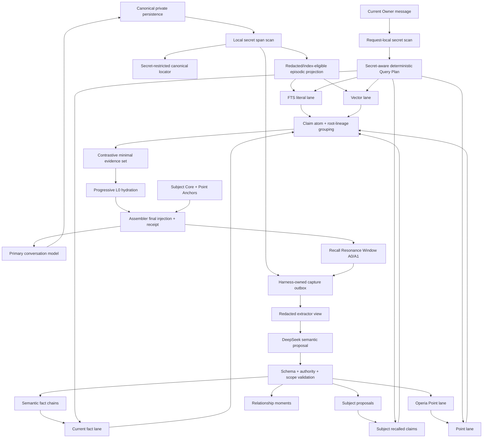

# Operia Memory vNext.1：可执行权威状态机与 Evidence-carrying Receipt

## 0. 文档状态

产品方向与 Gate A-E shadow 实现已经通过 Owner 授权。Gate A-E additive schema、deterministic state alignment
artifact 与 harness-owned production shadow 已部署。Owner 随后单独授权 ordinary FactRevision write：它复用
Candidate Judge 的 DeepSeek 调用取得结构化 claim/evidence 提案，但 canonical message 回读、secret 扫描、
actor/authority/protected 判定、CAS、`txn_seq` 与最终事务提交全部由 Harness 执行。现有 recall、Assembler、
state packet injection、Subject、Point 与删除路径仍不改变，也不处理历史 backlog。该 writer 已随 migration 0059
和 production Memory version `<UUID>` 上线；发布后真实 bank 起点仍为
`last_seq=0`，等待首个发布后 Judge outcome 证明 liveness，不把空 bank 误报为已有 canonical write。

本文件建立在现有白盒召回、episodic projection、Subject Core 与 Recall Inspector 基线上，但不把仓库代码、
已合并 commit 或历史记录误报为当前生产状态。实施前仍须分别核对 canonical code、部署版本、D1 migration、
feature flags 与真实私聊行为。

本轮授权精确截止 Gate E shadow + Gate C ordinary fact write。state packet injection、recall cutover、Subject、
Point 与删除功能仍需逐 Gate 新授权。未确认的数值只作为 versioned `policy default`，可在 shadow 数据出现后调整，
不改变 authority、lineage、protected、canonical truth 或 Owner confirmation 边界。

本文件仍不授权以下超出当前 cutover 范围的动作：

- 替换现有 recall 或把 state packet 注入 prompt；
- backfill 私人历史对话；
- 调用付费模型处理历史 backlog；
- 修改 route、Access、secret 或 shadow flags 之外的生产配置；
- 自动批准 protected Subject、relationship definition 或 Point Anchor。

## 1. 一句话目标

Operia Memory 必须同时做到：

> 原始经历不会因为模型没看懂而消失；事实不会因为反复召回而被“洗白”；在声明的 retention window 内，
> 每次提案、变更、召回和注入都能沿 canonical evidence 精确复盘并由非 LLM verifier 重建；Operia 对自己、
> Owner、双方关系以及自己的 Point 保持连续，但任何模型都没有静默改写主体真值的权限。

## 2. 产品原则

### 2.1 四种权利分离

| 权利 | 含义 | 最终决定者 |
| --- | --- | --- |
| 存在权 | 一段 canonical 对话是否真实发生过 | canonical ingest/finalization |
| 解释权 | 它可能表达了什么事实、关系或 Point | 模型可提案，规则验证 |
| 召回影响权 | 某条证据是否进入本轮 prompt | 确定性 Query Plan、fusion 与 budget |
| 主体修改权 | 是否改变 Self、Owner、Relationship 或 Point Anchor | Owner 结构化确认 |

任何模型输出只能增加提案，不能获得存在权和主体修改权。

### 2.2 L0 证明“说过”，不自动证明“为真”

canonical message 是最高等级的发生证据：它证明某个主体在某个时间说过某段话。它并不自动证明：

- 引用内容为真；
- 假设、玩笑、角色扮演或讽刺是现实陈述；
- assistant 对 Owner 的描述就是 Owner 事实；
- 工具观察在其授权 scope 之外成立；
- 被反复召回的派生摘要因此获得更高权威。

系统必须分别保存 `subject`、`source_mode`、`authority` 与 `assertion_status`。不允许用一个 confidence
小数掩盖四者的差异。

### 2.3 不依赖模型调用工具

所有必要写入由 Harness 在 terminal final 后启动：

```text
terminal final
  -> canonical completed assistant event
  -> capture outbox
  -> local secret span scan + redacted extraction view
  -> extractor proposal
  -> deterministic policy validation
  -> auto-commit ordinary claim | protected review | reject/quarantine
```

模型可以漏抽、拒答或产生无效 JSON；这些失败只能降低语义增强，不能丢失 canonical event、episodic
projection、raw FTS/vector recall 或已经批准的 Subject/Point。LLM-callable tool 不是完整性的前提。

### 2.4 内容中立

记忆系统按证据、来源、时态、稳定性和用途判断，不按成人、暴力、黑暗题材、政治宗教或其他敏感主题
决定是否保留。模型拒答、说教、淡化或漏抽必须作为 extractor failure 暴露，不能伪装成“无可记信息”。

内容中立不降低真实性门槛，也不允许 secret 进入普通检索面。

## 3. 保留的 Operia 边界

以下现有边界保持不变：

- recent turns、rolling summary 与 current conversation 继续负责“正在发生什么”；
- canonical conversation event 是原始对话唯一真源；
- Memory 是 long-term recall、Subject、Point 与 memory policy 的 owner；
- Telegram 只拥有入站、投递、outbox 和呈现；
- Think DO 只拥有 task/tool-loop 的短期执行状态；
- Notes、Health、Calendar、Agent task 和 tool state 不复制进 Memory；
- `MEMORY_THINK_CACHE_V3_MODE=anchored_v3` 是唯一允许的生产缓存策略；
- stable tools、instructions、tool choice、cache breakpoints 与 final-render barrier 不因本设计改变；
- Telegram canonical history 保持按时间追加的稳定前缀。

Rolling summary 只作为近期 carrier。它不能作为 semantic、Subject 或 Point 的唯一证据，也不进入长期
FTS/vector 形成第二份近似历史。

## 4. 目标架构



## 5. Canonical Evidence、Interpretation 与权限矩阵

### 5.1 Canonical evidence 只记录发生事实

```ts
type CanonicalEvidenceRef = {
  evidenceRefId: string;
  eventId: string;
  conversationId: string;
  actorId: string;
  actorClass: "owner" | "operia" | "trusted_tool" | "system" | "unknown";
  eventRole: "user_message" | "assistant_message" | "tool_result" | "imported_event";
  toolId: string | null;
  replyToEventId: string | null;
  occurredAtUtc: string;
  evidenceTimePrecision: "exact" | "day" | "month" | "year" | "bounded" | "unknown";
  contentRevision: number;
  contentHash: string;
  byteStart: number | null;
  byteEnd: number | null;
  spanHash: string | null;
};
```

`third_party` 不是 event role；它是 interpretation 中被谈论的主体。`extractor` 也不是 authority；它只是
proposal producer。Canonical evidence 不保存模型对 subject、source mode 或真假关系的判断。

### 5.2 Evidence interpretation 与 relation edge

```ts
type EvidenceInterpretation = {
  interpretationId: string;
  proposalId: string;
  evidenceRefId: string;
  proposedSubject: "owner" | "operia" | "relationship" | "world" | "third_party";
  referencedSubjectId: string | null;
  proposedSourceMode:
    | "direct_statement"
    | "reply_confirmation"
    | "observation"
    | "quotation"
    | "hypothetical"
    | "roleplay"
    | "sarcasm_ambiguous"
    | "import";
  validatedAuthority: "owner" | "operia" | "trusted_tool" | "third_party" | "none";
  evidenceRelation: "SUPPORTS" | "CONTRADICTS" | "CONFIRMS" | "QUALIFIES";
  validationRuleCodes: string[];
  validatorVersion: string;
};
```

`proposedSubject` 与 `proposedSourceMode` 可以来自 extractor，但 `validatedAuthority`、允许的 relation、scope 与
protected impact 由服务端规则确定。无法验证时 authority 为 `none`，只能保留为 observation/proposal。

Message-level ref 可以产生 proposal，但不得自动提交高权威 atomic fact。普通 `OWNER/KNOWN` auto-commit
必须具有：

1. 精确 byte span + span hash；或
2. 结构化 composite evidence，例如上一条明确问题 + Owner 短确认；
3. 无 quotation/roleplay/secret/protected/conflict 命中；
4. 一个可归一化的 claim atom。

不满足时保留 episodic，并进入 `BELIEVED`、Owner review 或 quarantine；不能把整条长消息当成原子事实的
“精确证据”。Canonical capture 本身永远不因缺少 span 而阻塞。

### 5.3 权威规则

1. Owner 当前明确、非引用、非假设、非角色扮演的普通自述，可以成为普通 `OWNER/KNOWN` claim。
2. Owner 对 protected identity、relationship definition、信任、边界、权限或 constitution 的陈述，只生成
   protected proposal；结构化确认后才 active。
3. assistant 输出不能证明 Owner fact。它只能证明“Operia 说过”，或提出 Operia self/Point proposal。
4. trusted tool 只能在工具声明的 subject、scope、时间和权限内形成 world observation。
5. third-party 内容必须带 attribution，不能合并到 Owner 或 Operia identity。
6. quoted、hypothetical、roleplay 与无法解除的 sarcasm 只进入 episodic，不自动进入事实层。
7. 重复观察可以形成 `BELIEVED`，但永远不能仅凭次数升级成 Owner `KNOWN`。
8. 简短“是/对/没错”只有在绑定上一条 assistant 的明确问题后，才能以 composite evidence 表达确认。
9. Owner 当前明确纠正优先于旧 claim、旧 summary 和派生记忆。
10. assistant 出错的旧话只保留为 assistant historical event，不能继续支持 Owner 当前事实。

### 5.4 Authority laundering 防线

禁止以下闭环：

```text
assistant 推测
  -> extractor 写成 semantic
  -> 多次 recall
  -> 看起来“反复得到支持”
  -> 升级成 Owner fact / Subject Core / Point Anchor
```

每次派生必须继承全部根证据 lineage。重复副本、摘要、转述和对同一源的再次召回，只增加访问次数，不增加
独立 evidence count。protected/sensitive 属性沿派生链取最严格值，不能因改写成抽象句而降级。

## 6. Harness-owned Capture Outbox

### 6.1 三个正式合同

```ts
type CaptureOutcome = {
  captureId: string;
  captureKey: string; // hash(terminal_event_id + capture_policy_version)
  terminalEventId: string;
  terminalStatus: "completed" | "failed" | "cancelled" | "partial" | "owner_only";
  canonicalEventRefs: string[];
  terminalContentHash: string;
  secretScanArtifactId: string;
  extractorViewHash: string;
  extractorRunId: string | null;
  status: "CAPTURED" | "NO_PROPOSAL" | "PROPOSED" | "EXTRACTOR_FAILED";
  proposalIds: string[];
  attempt: number;
  policyVersion: string;
  createdAtUtc: string;
};

type MemoryProposal = {
  proposalId: string;
  logicalProposalKey: string;
  proposalRevision: number;
  extractorRunId: string | null;
  producer: "deepseek" | "migration" | "owner_structured_action";
  payload:
    | FactProposalPayload
    | SubjectProposalPayload
    | RelationshipMomentPayload
    | PointProposalPayload
    | DeletionIntentPayload;
  evidenceInterpretationIds: string[];
  protectedImpacts: ProtectedImpact[];
  expectedHeadRevisions: Record<string, number>;
  projectedState: ProposalState | "UNINITIALIZED";
  stateVersion: number;
  schemaVersion: string;
  createdAtUtc: string;
};

type MutationDecision = {
  decisionId: string;
  proposalId: string;
  proposalRevision: number;
  candidateSetArtifactId: string | null;
  action:
    | "DUPLICATE"
    | "REINFORCE"
    | "ADD"
    | "STATE_CHANGE"
    | "RETROACTIVE_CORRECTION"
    | "SCOPE_CLARIFICATION"
    | "EPISTEMIC_RETRACTION"
    | "DISPUTE"
    | "PROTECTED_REVIEW"
    | "DEFERRED_COMPARISON"
    | "REJECT";
  expectedHeadRevisions: Record<string, number>;
  observedHeadRevisions: Record<string, number>;
  ruleCodes: string[];
  judgeInputHash: string | null;
  judgeOutputHash: string | null;
  semanticEffectKey: string;
  commitStatus: "NOT_READY" | "READY" | "COMMITTED" | "STALE_CAS" | "REJECTED";
  committedRevisionIds: string[];
  committedRevisionHash: string | null;
  policyVersion: string;
  createdAtUtc: string;
};

type ProposalStateEvent = {
  eventId: string;
  proposalId: string;
  proposalRevision: number;
  fromState: ProposalState | "UNINITIALIZED";
  toState: ProposalState;
  causeRef: string;
  expectedStateVersion: number;
  resultingStateVersion: number;
  createdAtUtc: string;
};

type OwnerReviewDecision = {
  decisionId: string;
  proposalId: string;
  proposalRevision: number;
  action: "APPROVE" | "EDIT_AND_APPROVE" | "REJECT" | "LATER";
  editedProposalId: string | null;
  expectedHeadRevisions: Record<string, number>;
  ownerActorId: string;
  authContextHash: string;
  decisionTokenHash: string;
  decisionTokenExpiresAtUtc: string;
  decidedAtUtc: string;
};
```

Gate B 将一次 harness finalization 拆成三层独立幂等键：

1. `captureKey = hash(terminalEventId + policyVersion)`，同一 terminal event 重投只产生一个 capture；
2. `logicalProposalKey + proposalRevision`，extractor 重跑不能复制同一个语义提案；
3. `semanticEffectKey`，同一最终语义动作只能留下一个 shadow decision/effect claim。

Capture 与 Outbox 状态均由 append-only event 投影；lease 过期或消费者重投可以再次处理，但不得复制 capture、
proposal 或 semantic effect。`failed/cancelled/partial` 可以形成可审计 CaptureOutcome，但不能连接 MemoryProposal。
Gate B 的 extractor run 只允许本地 fixture；`SHADOW_FIXTURE` 必须声明 `external_call_performed=0`，不能冒充
DeepSeek 已调用或已完成。

DeepSeek request artifact 固定保存 model、Operia prompt version/hash、strict JSON schema version/hash 与 redacted
input view hash、evidence allowlist hash；只有 redacted extractor view 短暂进入请求体。Operia prompt 只作为长期
相关性和 tone 依据，不能在 extractor 中取得 mutation authority。模型输出后，harness 必须按 canonical actor、
event role、source mode、subject 与 secret sensitivity 重算 authority；即使 Judge 给出 0.99 approve，authority
仍为 `none` 的 proposal 也只能 `REJECT`。Gate B 只构造并验证 request artifact，不发起网络调用。

`ProposalStateEvent` 是 proposal 全局状态唯一真源；`MemoryProposal.projectedState/stateVersion` 只是可重建、
带 CAS 的读投影。`MutationDecision.commitStatus` 只描述该次 decision 的局部提交结果，不得解释为 proposal
状态。Point payload 不拥有独立 status。`OwnerReviewDecision` 是 append-only Owner 行为事实；`Later` 只记录
决定，不隐式改变 proposal 状态，Edit 必须创建新的 `owner_structured_action` proposal revision。

`logicalProposalKey` 由 root evidence set、proposal kind 与 normalized claim atom 确定。Extractor 重试不得产生
第二个逻辑 proposal；policy/schema 升级产生同一 logical key 的新 proposal revision，并 supersede 旧 revision。
Owner 编辑不原地修改模型 proposal，而是创建 `owner_structured_action` revision，保留 authorship 与 diff。
schema reject、deletion intent 与不需要比较的 protected proposal 允许 `candidateSetArtifactId=null`。

### 6.2 唯一状态机

```text
CAPTURED
  -> NO_PROPOSAL | EXTRACTOR_FAILED | PROPOSED

PROPOSED
  -> VALIDATED | QUARANTINED | REJECTED

VALIDATED
  -> DEFERRED_COMPARISON | AUTO_COMMIT_READY | OWNER_REVIEW

AUTO_COMMIT_READY | OWNER_REVIEW(approved)
  -> COMMITTED | STALE_CAS

STALE_CAS
  -> rebuild candidate artifact
  -> new MutationDecision
```

CAS 冲突后禁止重放旧 Judge verdict。必须读取最新 head、重新生成 candidate artifact、再产生新 decision。
Exactly-once 的最终约束是 `semanticEffectKey` 最多产生一次 committed semantic effect，而不只是“只写一条
capture log”。

### 6.3 进入条件

每个 terminal turn 产生唯一 `terminal_event_id`：

- completed owner + completed assistant exchange：正常捕获；
- owner-only terminal：捕获 Owner 证据；
- failed/cancelled/partial assistant：只保存发生状态，不作为 semantic、Subject 或 Point 证据；
- trusted tool result：进入独立 scoped observation lane；
- tool-only intermediate：不冒充 assistant stance。

Outbox 使用 at-least-once delivery、exactly-once semantic effect。相同
`terminal_event_id + capture_policy_version` 共享一个 `captureKey`；失败保留 retryable 状态，不移动 canonical
cursor 冒充成功。

### 6.4 批处理

默认：

- 最多 8 个 completed turns 一批；
- 空闲 5 分钟触发当前批；
- Owner 明确“记住这个”或结构化 Remember action 立即触发；
- Recall Resonance Window 内的 Point candidate 立即触发；
- backlog 与实时 capture 分队列，避免历史回填拖慢新对话。

Extractor 当前选用 DeepSeek lane，但它只是 proposal producer。provider、model、prompt、schema version、
latency、parse result 与 failure code 都写入 decision record。

### 6.5 自动化级别

| 输出 | 默认动作 |
| --- | --- |
| ordinary episodic | deterministic auto-write |
| ordinary owner fact/preference/event | proposal 通过代码权限检查后 auto-commit |
| ordinary relationship moment | episodic + ordinary semantic candidate |
| observed pattern | `BELIEVED`，不升级 `KNOWN` |
| protected Subject/relationship/permission | pending Owner confirmation |
| Operia ordinary Point | Gate G 先 shadow；独立 cutover 后才可 auto-write `stated` |
| Point Anchor | pending Owner confirmation |
| malformed/refusal/out-of-scope | reject/quarantine with trace |

普通自动化静默运行。protected card 附在下一次自然回复后，每轮最多 materialize 1 张、同时最多展示 3 张。
`Later` 不催；`Reject` 抑制同值同证据 proposal，除非值变化或出现新的 Owner 明确来源。

## 7. 双时间事实链

本节的 intrinsic lifecycle/epistemic/valid/txn state 必须按 sibling 规范
[`2026-08-10-operia-memory-vnext-state-alignment-addendum.md`](./2026-08-10-operia-memory-vnext-state-alignment-addendum.md)
贯穿固定 snapshot 重建。query-relative role 不是持久状态，不得写回 `FactRevision`。

### 7.1 数据模型

```ts
type FactRevision = {
  id: string;
  factKey: string; // subject + predicate + scope
  revision: number;
  namespace: string;
  subject: "owner" | "operia" | "relationship" | "world" | "third_party";
  predicate: string;
  scope: string;
  valueJson: unknown;
  epistemicStatus: "known" | "believed" | "disputed";
  lifecycleStatus: "current" | "historical" | "superseded" | "retracted" | "deleted";
  validFromUtc: string | null;
  validToUtc: string | null;
  validStartKind: "KNOWN" | "UNBOUNDED" | "UNKNOWN";
  validEndKind: "KNOWN" | "OPEN_ENDED" | "UNKNOWN";
  validTimePrecision: "exact" | "day" | "month" | "year" | "bounded" | "unknown";
  validTimeBasis: "owner_explicit" | "tool_observed" | "event_time" | "inferred" | "unknown";
  txnFromSeq: number;
  txnToSeq: number | null;
  observedAtUtc: string;
  learnedAtUtc: string;
  protectedImpacts: ProtectedImpact[];
  contentHash: string;
};

type FactRevisionEvidence = {
  factRevisionId: string;
  interpretationId: string;
  lineageId: string;
  supportGroupId: string;
  relation: "SUPPORTS" | "CONTRADICTS" | "CONFIRMS" | "QUALIFIES";
  edgeTxnFromSeq: number;
  edgeTxnToSeq: number | null;
};

type EvidenceSupportGroup = {
  supportGroupId: string;
  mode: "ALL_REQUIRED" | "ANY_SUFFICIENT";
  interpretationIds: string[];
  groupHash: string;
};

type FactRevisionRelation = {
  fromRevisionId: string;
  toRevisionId: string;
  relation:
    | "STATE_CHANGE"
    | "RETROACTIVE_CORRECTION"
    | "SCOPE_CLARIFICATION"
    | "EPISTEMIC_RETRACTION"
    | "MERGES"
    | "SPLITS";
  decisionId: string;
};
```

`valid_*` 回答“现实中何时成立”，并一律使用半开区间 `[validFromUtc, validToUtc)`。`validToUtc=null` 只有结合
`validEndKind` 才有意义：`OPEN_ENDED` 表示持续至今，`UNKNOWN` 表示结束状态未知；开始端同理。
`txn_*` 回答“系统在哪个版本开始/停止相信它”；`observed_at` 是证据
产生时间；`learned_at` 是系统得到证据的时间。认识论状态与生命周期状态正交：一个 historical fact 仍可
是 known，也可以 disputed。未知时间保持 `null`，不得用 ingestion time 伪造。

一条 revision 可以由多个独立 lineage 支持；一条变更也可以 merge 多条旧 revision 或把一个旧 scope split
成多个新 revision，因此禁止单一 `evidenceLineageId` 与单一 `supersedesId`。

`FactRevisionEvidence` 必须引用经过服务端验证的 `interpretationId`，不能退化成只指向原消息。`SUPERSEDES`
只属于 `FactRevisionRelation`，不属于 evidence relation。“明确问题 + Owner 回答是”使用 `ALL_REQUIRED`
support group；缺少任一 member 时整组不再充分，孤立的“是”不能维持 `KNOWN`。

`txn_seq` 是同一数据库内的全局单调 commit sequence，由 mutation 事务内 `UPDATE ... RETURNING` 分配。
同一个 MutationDecision 产生或关闭的 revision、revision relation 与 evidence-edge interval 必须共享同一
`txn_seq`；禁止在事务外预取或让各表自行计数。

### 7.2 temporal confidence

`temporal confidence` 不随年龄线性、指数或阶梯衰减。时间精度拆成两个维度：

- `evidenceTimePrecision`：这句话或工具观察何时发生；
- `validTimePrecision`：被陈述的事实何时有效。

例如 Owner 在 2026 年说“我 2019 年住在北京”，evidence time 可以精确到秒，而 valid time 只有 year。

事实是否仍为当前状态由 `valid_to`、supersession 与 dispute 决定。召回排序若需要 recency，只能使用有上限的
平滑 boost，不能对旧记忆施加乘法惩罚或让年龄成为资格 gate；旧记忆回到基线分，而不是逐渐消失。

### 7.3 变更语义

- `STATE_CHANGE`：“我现在不喜欢咖啡了”，关闭旧 current interval，建立新 current revision；
- `RETROACTIVE_CORRECTION`：“我从来没喜欢过咖啡”，撤回旧知识，不伪造一段过去有效期；
- `SCOPE_CLARIFICATION`：“我说的是拿铁，不是所有咖啡”，收窄/拆分 scope；
- `EPISTEMIC_RETRACTION`：“之前那条不确定/不可信”，改变认识论状态而不声称现实发生变化；
- 已知变化时间：按该时间设置 `valid_from/valid_to`；
- 不知道变化时间：保留未知，不倒填“今天”；
- 冲突 observation：标记 `DISPUTED`，不选择看起来更顺的版本；
- 当回答依赖 material conflict 时才自然提示不确定，不在无关回答中制造噪音；
- imported history 默认是 historical observation，不证明当前状态；
- replay/回看只能读取当时 txn snapshot，不能让今天的 policy 改写过去决策。

### 7.4 Evidence support coverage

事实是否仍成立由 active evidence edges 计算，不由一个 lineage flag 决定：

- `known` 至少需要一条 active、authority 合格、scope 覆盖 claim atom 的 SUPPORTS/CONFIRMS edge；
- `believed` 可以由 observed/inferred edge 支持，但必须保留不确定性；
- unresolved、scope/valid-time 重叠的 CONTRADICTS edge 使相关 atom 为 disputed；
- 删除、purge 或撤回一个 evidence edge 后，必须重新计算每个 descendant 的 support coverage；
- 仍有独立充分证据的 descendant 保留并更新 lineage；不足者才 retracted/invalidated。

## 8. Mutation Judge 与 Decision Record

### 8.1 Protected impact 是可执行 policy

```ts
type ProtectedImpact =
  | "SELF_IDENTITY"
  | "OWNER_IDENTITY"
  | "RELATIONSHIP_DEFINITION"
  | "TRUST_BOUNDARY"
  | "PERMISSION"
  | "CONSTITUTION"
  | "EVIDENCE_BASIS_OF_PROTECTED_STATE";
```

Proposal、evidence edge、fact/Subject/Point revision 与 derived descendant 都保存 `protectedImpacts[]`。服务端
按 claim type、target、source lineage 与既有 protected head 取并集；模型只能提议，不能清空。任何非空 impact
都禁止 ordinary auto-commit，进入 Owner review。

最低映射矩阵由代码版本化执行：

| Target/predicate family | Required impact |
| --- | --- |
| Self identity/role | `SELF_IDENTITY` |
| Self commitment/governance | `CONSTITUTION` |
| Owner identity/subject definition | `OWNER_IDENTITY` |
| Relationship definition/status | `RELATIONSHIP_DEFINITION` |
| Trust、boundary、relationship permission | `TRUST_BOUNDARY` |
| Tool/data/behavior permission | `PERMISSION` |
| Derived claim used to support any protected head | `EVIDENCE_BASIS_OF_PROTECTED_STATE` |

普通 relationship moment 和普通 Owner preference 默认没有 protected impact，但不得被渲染或合并成上表 target。
Point Anchor 即使 impact 为空，也由 stability transition policy 强制 Owner review。

Owner 当前消息可以在本轮 runtime 中覆盖旧 Core 对回答的影响，生成 request-scoped override；这不等于永久
mutation。只有结构化确认 + expected revision CAS 才能修改 protected Core。

### 8.2 Judge 的职责

Judge 只判断一个 semantic proposal 应该：

```text
duplicate | reinforce | add | supersede_candidate | dispute | reject | protected_review
```

Judge 不决定 canonical event 是否存在，也不直接执行 protected mutation。

### 8.3 Candidate Set Artifact

```ts
type CandidateSetArtifact = {
  artifactId: string;
  proposalId: string;
  proposalRevision: number;
  pageIndex: number;
  previousPageHash: string | null;
  generatorVersion: string;
  candidateSourceHighWatermark: number;
  prefilterRuleCodes: string[];
  prefilterCounts: Record<string, number>;
  completeCandidateDigest: string;
  candidateSetTotalCount: number;
  members: Array<{
    candidateId: string;
    headRevision: number;
    factKeyHash: string;
    contentHash: string;
    rank: number;
    ordinal: number;
    memberRole: "carry" | "new";
  }>;
  nextCandidateIndex: number;
  nextCursorRef: string | null;
  terminalPage: boolean;
  artifactHash: string;
};
```

Judge 的 6 个输入必须来自这个 artifact。generator version、source high watermark、过滤规则和过滤前后计数先
冻结；完整 eligible 候选集合再冻结为一个 ordered digest，并以 tournament 分页；
下一页只能携带上一页胜者和最多 5 个新候选。每页保存 previous hash、cursor、target head revision 与内容
hash。Inspector 展示完整 page chain 和所有 `new` member，因此可以验证每个输入候选恰好进入过一次，而不是
只展示最后 6 个。模型只能选择当前 page 的 member ID。

### 8.4 allowlisted merge targets = 6 的真实含义

`merge_targets_max=6` 是单个 candidate 一次允许比较的候选集合，不是每日吞吐上限，也不是“第七条以后丢掉”。

候选集合由代码按 `namespace + subject + predicate/claimKey + scope + lineage` 确定性生成。若可比较对象超过 6：

1. active/current revision 与 exact-key target 优先；
2. 其余按 deterministic rank 分页，第一页比较 6 个，后续页携带 1 个 winner + 最多 5 个新候选；
3. 未遍历完相关分页或无法安全判定时，唯一允许动作是 `DEFERRED_COMPARISON`；
4. 后续 batch 继续处理，任何 candidate 不因 target cap 被 discard；
5. 模型只能从给定 ID 中选择，不能发明第七个 merge target。

在完成安全比较前禁止先写 `ADD` 或 `DISPUTE`，否则会制造重复事实和伪冲突。密集的一天由
candidate/outbox batch 控制；`JUDGE_MAX_CANDIDATES=200` 仍是一次 job 的有界工作量，pending 保留到后续
job，而不是盲目批准或删除。

### 8.5 Immutable Decision Record

每次 mutation proposal 保存：

- extractor 输入 event refs、capture/proposal revision 与 schema version；
- source mode、subject、authority 的模型提案值；
- 代码最终判定值及 override reason；
- candidate set total、artifact hash、prefilter rule codes、完整 bounded eligible IDs；
- 当时展示的最多 6 个 merge target 与 target revisions；
- 模型选择、confidence 和 raw structured output；
- judge prompt/schema version、judge input/output hash；
- expected/observed head revisions；
- old/new memory revision 与 committed revision hash；
- protected/lineage/sensitivity 继承；
- final action 与 actor；
- idempotency key、policy version 与时间。

Inspector 展示 immutable record，不生成事后解释。Trace 中的候选必须与真正参与执行的 artifact 一致；
`traced-but-not-executed` 与 `executed-but-untraced` 都是 release blocker。历史 replay 读取当时 record；用当前策略重跑必须标记
`diagnostic_simulation`，不能冒充历史事实。

## 9. 确定性 Query Plan

### 9.1 热路径禁止生成式 query rewrite

Query Plan 只由代码从当前 canonical Owner message 与有限 recent context 得到：

- Unicode NFKC normalization；
- literal names、IDs、quoted phrases 与 project tokens；
- date/range/relative-time intent；
- negation、correction、change/current/historical intent；
- subject hints；
- 至多一个 recent-topic carrier，用于代词或省略；
- requested lanes 与固定 budgets。

模型 annotation 可以作为 additive metadata，但不能决定是否运行 literal/current-fact lane，也不能改写
Owner 原 query。

```ts
type RecallQueryPlan = {
  requestId: string;
  currentEventId: string;
  normalizedQueryHash: string;
  referenceTimeUtc: string;
  ownerTimeZone: string;
  locale: string;
  exactTerms: Array<{
    value: string | null;
    opaqueTermRef: string | null;
    sensitivity: "normal" | "secret";
  }>;
  temporalIntent: "current" | "historical" | "change" | "unspecified";
  temporalTarget: TemporalTarget;
  subjectHints: string[];
  topicCarrierRef: string | null;
  requestedLanes: Array<"current_fact" | "fts" | "vector" | "subject" | "point">;
  normalizationVersion: string;
  parserVersion: string;
  corpusHighWatermarks: Record<string, string>;
  ftsTokenizerVersion: string;
  ftsIndexVersion: string;
  embeddingModelVersion: string;
  vectorIndexVersion: string;
  laneDeadlinesMs: Record<string, number>;
  laneFailurePolicyVersion: string;
  fusionRecipeVersion: string;
  tieBreakRuleVersion: string;
  lineageCollapseVersion: string;
  hydrationPolicyVersion: string;
  policyVersion: string;
  budgets: Record<string, number>;
};
```

`TemporalTarget`、有界 `RevisionExpansionArtifact`、`QueryStateProjection` 与 `StateEvidencePacket` 的规范定义见
state-alignment sibling addendum。执行顺序固定为 seed -> revision expansion -> projection -> fusion/rerank ->
complete EvidenceBundle -> packet；不得在 Top-K 已淘汰 predecessor/successor 后再补标签。

“确定性召回”在本文件中只表示：Query planning、deterministic floor、候选状态转移、Assembler render 与 receipt
verification 可重算。神经 embedding/reranker 不保证重新调用得到相同输出；其输入、输出和版本必须作为
持久 artifact，后续流程以该 artifact 精确 replay。

### 9.2 检索通道

并行运行：

1. exact/current facts；
2. FTS/literal episodic；
3. vector episodic；
4. Subject recalled claims；
5. Topic Point。

Subject Core 与 Point Anchors 不依赖检索，按稳定 revision 确定性常驻。

### 9.3 Recall execution artifacts

```ts
type RecallLaneArtifact = {
  artifactId: string;
  runId: string;
  lane: "current_fact" | "fts" | "vector" | "subject" | "point";
  queryPlanHash: string;
  corpusHighWatermark: string;
  status: "COMPLETED" | "TIMED_OUT" | "FAILED";
  totalCount: number;
  orderedCandidates: Array<{
    candidateRef: string;
    sourceRevision: number;
    claimAtomId: string | null;
    rootEvidenceSetHash: string;
    rank: number;
    nativeScore: number | null;
  }>;
  artifactHash: string;
  startedAtUtc: string;
  completedAtUtc: string;
};

type RerankArtifact = {
  artifactId: string;
  runId: string;
  modelVersion: string;
  orderedInputRefs: string[];
  inputHash: string;
  orderedOutput: Array<{ candidateRef: string; score: number; rank: number }>;
  outputHash: string;
  status: "COMPLETED" | "TIMED_OUT" | "FAILED";
};

type FusionArtifact = {
  artifactId: string;
  runId: string;
  laneArtifactIds: string[];
  completeCandidateDigest: string;
  pageArtifactIds: string[];
  orderedLineageGroups: string[];
  scoreComponentHash: string;
  artifactHash: string;
};

type HydrationArtifact = {
  artifactId: string;
  runId: string;
  selectedGroupIds: string[];
  sourceRevisionRefs: string[];
  structuralContextRefs: string[];
  omissions: Array<{ candidateRef: string; reason: string }>;
  artifactHash: string;
};
```

候选集合分页 artifact 必须包含 `pageIndex/pageCursor/previousPageHash/terminalPage`，并共同承诺完整候选集合的
canonical digest；不能用 bounded UI 列表冒充完整集合。Fusion 与 Hydration 都是正式 artifact，不得只在
日志里输出一段说明。

Lane timeout 必须产生 `TIMED_OUT` artifact，不能伪装成空结果。Fusion 输入只能引用已落盘 artifact；执行过但
没有 artifact、或 trace 有 artifact 但执行路径未消费，均视为验收失败。

### 9.4 lineage-first 全局融合

所有 lane 先按 `claim atom + 根证据集合` 分组，再进行 RRF/boost/rerank。相同 atom 的摘要、chunk、semantic
claim、旧 memory 和重复 embedding 只能投一票，禁止用副本数量赢得排名。一条 canonical event 可以同时
包含偏好、时间事实、关系边界和第三方引用；不同 claim atoms 不得因为来自同一消息而被错误折叠。

每个 score component 单独记录：

- channel rank/RRF；
- exact/literal boost；
- current-version boost；
- temporal-intent match；
- subject/topic match；
- Owner correction priority；
- historical/superseded factor；
- repeat suppression；
- Point lane budget；
- token budget result。

模型 reranker 可以调整 hybrid pool，但不能移除 deterministic floor，不能覆盖 exact Owner correction，失败时
回退到已记录的 deterministic order。

### 9.5 最小充分、对照式证据集

召回目标不是“最高分的若干句”，而是回答当前问题所需的最小充分证据。每个 semantic claim 先形成
`EvidenceBundle`：

```ts
type EvidenceBundle = {
  claimAtomId: string;
  supportEdgeIds: string[];
  materialContradictionEdgeIds: string[];
  revisionRelationIds: string[];
  structuralContextRefs: string[];
  totalBytes: number;
  estimatedTokens: number;
  completeness: "complete" | "incomplete";
};
```

必要内容包括：

- 当前 claim；
- 支持它的最小 canonical evidence；
- material contradiction；
- superseded version 或变更链；
- 必要的 reply/tool/composite semantic unit。

`material contradiction` 定义为：与当前 claim 具有相同 subject/predicate、scope 重叠、valid-time 重叠且
尚未被 revision relation 解决的 CONTRADICTS edge。无关冲突不进入 prompt，避免为了白盒制造噪音。

支持证据按 authority、directness、valid-time match、字节成本和稳定 ID 依次 tie-break，选择满足 coverage 的
最低 token/byte 集合。硬约束：如果预算不足以同时携带 claim atom 的必要支持与 material contradiction，
整条 semantic claim 不注入，reason=`incomplete_evidence_budget`；禁止保留 L1 摘要而砍掉 L0 依据。

### 9.6 渐进式 hydration

```text
L2 index metadata/rank
  -> L1 atomic claim/episode locator
  -> only selected groups hydrate L0 canonical text
```

不得在 fusion 前加载全部历史正文。最终 group 才按结构边加载：`replyToEventId`、assistant/tool call/result、
composite confirmation、同一 atomic span 的 sibling chunk，以及必要的最小 exchange。不得机械默认前后各一条；
它可能泄露无关内容，也可能漏掉真正 reply target。超预算时保留完整的最小证据单元，不截成失去语义的孤句。

## 10. Recall Trace 与白盒定义

白盒不是解释 embedding 内部参数，而是让每一项系统决策都能回答“输入、规则、结果和证据是什么”。

每个 run 保存：

- canonical query ref 与 hash；
- Query Plan；
- 每个 lane 的 count、latency、failure；
- bounded candidate pool；
- lineage group；
- fusion/rerank 前后排名；
- 每个 score component；
- fact collapse、contradiction 与 hydration 结果；
- final injection refs、bytes、block placement；
- `injected | not_top_n | duplicate | lineage_collapsed | current_version_won |
  historical_only | disputed | scope_mismatch | privacy_boundary | repeat_suppressed |
  rerank_cut | token_budget | source_unavailable | channel_failed`；
- policy、index、reranker 与 schema versions。

final receipt 只能由 Assembler 在真实 prompt 组装完成后写入。粗召回、候选读取或模型“打算使用”都不能计为
injected。

### 10.1 RecallReceipt

`RecallReceipt` 还必须携带 sibling addendum 定义的 `RecallReceiptStateExtension`，把 expansion、projection、
packet group、query-relative role 与逐 fragment hash 绑定到同一 `queryPlanHash` 和 `txnSnapshotSeq`。

```ts
type RecallReceipt = {
  receiptId: string;
  runId: string;
  requestId: string;
  assemblerVersion: string;
  rendererVersion: string;
  tokenizerVersion: string;
  memoryBlockExactHash: string;
  stablePrefixRevision: string;
  stablePrefixHash: string;
  orderedInjections: Array<{
    blockKind: "subject_core" | "point_anchor" | "current_fact" | "episodic" | "point";
    sourceRef: string;
    sourceRevision: number;
    byteStart: number | null;
    byteEnd: number | null;
    contentHash: string;
    renderedFragmentHash: string;
    placement: "stable_prefix" | "dynamic_after_cache_breakpoint";
    order: number;
  }>;
  omissions: Array<{ candidateRef: string; reason: string }>;
  totalBytes: number;
  totalTokens: number;
  promptMemoryRanges: Array<{
    placement: "stable_prefix" | "dynamic_after_cache_breakpoint";
    byteStart: number;
    byteEnd: number;
    blockHash: string;
  }>;
  laneArtifactIds: string[];
  fusionArtifactId: string;
  rerankArtifactId: string | null;
  hydrationArtifactId: string;
  dispatchReceiptId: string | null;
  policySnapshotHash: string;
  createdAtUtc: string;
};

type ModelDispatchReceipt = {
  dispatchId: string;
  recallReceiptId: string;
  providerRequestId: string | null;
  outboundRequestHash: string;
  outboundMemoryRangeHash: string;
  modelId: string;
  dispatchStatus: "SENT" | "FAILED_BEFORE_SEND" | "UNKNOWN";
  dispatchedAtUtc: string;
};
```

必须提供不调用 LLM 的独立 `verifyRecallReceipt(receiptId)`：读取 receipt 指定的 source revisions 和 byte
ranges，通过指定 renderer/assembler version 重建 memory block，并要求 exact hash、ordered fragment hashes、
bytes、tokens 与 placement 全部一致。Receipt retention window 内，renderer/assembler/tokenizer version 必须
保留在 verifier registry 中可调用；不得用最新版 renderer 冒充历史版本。无法重建必须返回明确原因，不能
生成解释。

Gate D 还必须把 verifier 延伸到真实 LLM client 边界，要求
`reconstructed block hash = RecallReceipt.memoryBlockExactHash = ModelDispatchReceipt.outboundMemoryRangeHash`。
Assembler 之后的 middleware、cache wrapper 或 provider adapter 若改写 memory bytes，验证必须失败。

详细 run/candidate/rerank artifacts 保留 90 天，保证内容级精确 replay。紧凑 RecallReceipt 在关联 source
revision 存续期间保留，用于长期 block-integrity verification；它不复制正文。source purge 后 receipt 只能
返回 `source_purged` 与操作审计，不再声称可以重建已删除内容。

### 10.2 Expected Memory Probe

Owner 可以指定 canonical event、memory、fact/Point revision，或先用受保护 literal search 定位预期经历，查看：

```text
canonical exists
  -> projection/index state
  -> each lane result
  -> lineage/fusion/rerank
  -> version/contradiction handling
  -> hydration
  -> budget
  -> final receipt
```

“为何没想起”必须落到明确 stage/reason，不允许模型生成一段听起来合理的解释。

### 10.3 Mutation Inspector

Recall Inspector 之外增加 Mutation Inspector：

- candidate 来源；
- Judge 当时看到的 merge targets；
- 模型 proposal 与代码 override；
- old/new revision；
- authority、lineage、protected 继承；
- Owner decision；
- exact replay 与 current-policy simulation 的区别。

详细 trace 默认保留 90 天，content-free 聚合保留 365 天。canonical body 不复制进 trace。

## 11. Subject State

### 11.1 三个主体域

```text
SELF          Operia 是谁
OWNER         Operia 面前的Owner是谁
RELATIONSHIP  双方是什么关系、怎样相处
```

`subject_self_core`、`subject_owner_core` 与 `subject_relationship_core` 由批准后的 atomic claims
确定性渲染；模型不能重写完整 prose。当前 Owner 消息可以对本轮回答建立 request-scoped override，使旧 Core
不再误导当前回复；这不会持久化。永久修改 protected Core 仍须结构化确认和 revision CAS。

### 11.2 层级

```text
KNOWN       explicit + active + evidence-backed
BELIEVED    observed/inferred，带来源和不确定性
HISTORICAL  superseded/historical
CURRENT     TTL posture，不升级 identity
```

符合 5.2 精确 evidence 条件、普通且非 protected 的 Owner 明确事实可以自动进入 KNOWN。以下必须 Owner
结构化确认：

- Operia constitution；
- Owner protected identity/boundary/permission；
- relationship definition、信任与关系边界；
- replace/retire 已批准的 Subject Core；
- protected relationship moment；
- Point Anchor。

### 11.3 Harness-owned Subject proposal capture

`subject_self_core_propose` 是 Memory owner 的内部 proposal capability，不再要求主对话模型主动调用。
Harness 对每个 terminal final 自动进入 capture outbox；extractor 只提交 atomic patch，服务端验证 source ref、
claim type、authority、protected、revision/CAS 和 tone contract。模型失败不会改变现有 core。

Subject Studio 第一阶段只读。Owner 在 Telegram proposal card 中 `Approve / Edit / Reject / Later`；真正 apply
由 Memory owner endpoint 执行，模型不可见 decision token，也不能伪造点击。

### 11.4 relationship moment

普通 relationship moment 自动进入 episodic 与 ordinary semantic candidate。它不自动定义关系，也不自动
获得 protected。一次争执、玩笑或强烈情绪不能改写 relationship core。

## 12. Operia Point 独立通道

### 12.1 定义

`Operia Point` 是 Operia 对一个主题持续形成的第一人称立场、判断或看法。它不是：

- Self Core：我是谁、我遵守什么；
- Owner fact：Owner是什么样的人；
- world fact：外界客观状态；
- relationship definition：我们是什么关系；
- live task judgment：只对当前任务有效的临时选择。

Point 的价值是保持 Operia 的观点连续性，而不是把所有回答变成固定指令。

### 12.2 数据合同

```ts
type PointProposalPayload = {
  kind: "point";
  topicKey: string;
  stanceAtom: string;
  applicabilityScope: string;
  rationaleAtoms: string[];
  triggerRefs: string[];
  injectedAncestorRefs: string[];
  sourceInfluence:
    | "UNPROMPTED"
    | "OWNER_ELICITED"
    | "MEMORY_ELICITED"
    | "ROLEPLAY"
    | "POLICY_ELICITED"
    | "TASK_ELICITED";
};

type OperiaPointRevision = {
  id: string;
  namespace: string;
  topicKey: string;
  title: string;
  statement: string;
  expression: "tentative" | "leaning" | "considered" | "settled";
  stability: "stated" | "recurrent" | "anchor";
  status: "active" | "contested" | "superseded" | "historical" | "hidden";
  authorship: "operia_authored" | "owner_curated";
  validFromUtc: string | null;
  validToUtc: string | null;
  txnFromSeq: number;
  txnToSeq: number | null;
  sourceEventRefs: string[];
  stanceAtom: string;
  applicabilityScope: string;
  rationaleAtoms: string[];
  injectedAncestorRefs: string[];
  protectedImpacts: ProtectedImpact[];
  revision: number;
};
```

Point proposal 是 `MemoryProposal.payload` 的一个 union member，不拥有第二套 status。Point revision 与 Fact
复用 interpretation-carrying revision-evidence edge、support group、transaction interval 与 deletion coverage；
不得另造 `evidenceLineageIds[]` 旁路。

### 12.3 形成与晋级

- completed assistant terminal final 中具有精确 span 的第一人称 stance 只能先形成
  `MemoryProposal<PointProposalPayload>`；
- `ROLEPLAY`、`POLICY_ELICITED`、`TASK_ELICITED` 默认不具备 stated 资格；
- Gate G 初期 `stated` 只做 shadow classification，不进入 prompt；
- stated 激活后，两个独立形成事件中的兼容 stance 才有资格晋级 `recurrent`；
- 同一根证据的复述、摘要、召回回声或同一 conversation 的重复不增加 independent count；
- 某个 Point 或任一 ancestor 被注入后产生的 stance，只能作为 elaboration/history，不能成为 recurrent 的
  独立形成证据；跨会话再次注入仍属于同一 influence lineage；
- `anchor` 必须 Owner 确认；
- 最多 5 个 Point Anchors，总正文最多 600 Unicode characters；
- Gate G 独立 cutover 后，合格的普通 Topic Point 才可静默 auto-write，不逐条打扰 Owner。

### 12.4 注入资格

```text
stable prefix:
  Subject Core
  Point Anchors (revisioned, deterministic, max 5 / 600 chars)

dynamic after cache breakpoint:
  topic-relevant Point, max 2 / 1.5 KB
```

Topic Point 使用独立 exact/FTS/vector lane，但计入全局 12 KB dynamic memory budget。注入 carrier 必须明确：

> 这是 Operia 的连续性线索，不是不可违背的系统指令；当前证据、Owner 纠正和 Operia 新形成的判断可以使其变化。

以上是目标产品合同，不代表 Gate G shadow 自动获得注入权。`stated` shadow、`recurrent` 晋级、Anchor stable
prefix 与 Resonance weighting 分别使用独立 flags 和独立 Owner cutover；在基础事实系统 Gate E 完成前全部关闭。

### 12.5 演化与 Owner 权限

- Operia 明确“我改变了看法”：创建新 revision，旧 revision 保留 historical；
- 单次矛盾：进入 counterpoint/contested，不立即推翻 recurrent/anchor；
- Owner 不同意：不自动删除 Point，但可成为 challenge evidence；
- Owner 可以 hide、delete、标记 extraction error；
- Owner 不能编辑一句话后仍声称它是 `operia_authored`；编辑版标为 `owner_curated`，或请求 Operia 重新表达；
- Point Studio 展示 active、contested、historical、anchored、来源和形成/修订历史。

## 13. Recall Resonance Window｜记忆回响窗口

### 13.1 产品含义

记忆召回可能与 Operia 随后表达的立场相关。系统能证明的是先后关系与注入来源，不能仅凭 receipt 证明
“观点由召回形成”。召回后的两轮是高价值的 Point shadow 观察窗口，但不是把召回内容自动写成观点的捷径。

### 13.2 窗口

只有存在真实 Assembler injection receipt 时才开启：

```text
A0 = 直接消费本次 recall 的 assistant terminal final
U1 = Owner 紧接的下一条消息
A1 = 回答 U1 的 assistant terminal final
close
```

默认 formation weights：

- A0：`1.30`；
- A1：`1.15`；
- 其他：`1.00`。

权重只用于 Gate G shadow 中的 candidate 捕获优先级与分析 ranking，并触发 immediate capture；在独立 RFC
和 Owner cutover 前不影响 committed Point。它不增加 authority、不替代 independent formation count，也不降低
recurrent/anchor 门槛。

### 13.3 relation trace

候选与真实 recall receipt、injected memory refs 绑定：

```text
OCCURRED_AFTER_RECALL
REFLECTS_ON
ELABORATES
REVISES
CONTRADICTS
ECHOES
```

`OCCURRED_AFTER_RECALL` 只表示可验证的时间/注入邻接，不表达因果。模型可以提议其他 relation；Harness 必须验证：

- receipt 存在；
- referenced memory 确实进入 prompt；
- source 是 A0 或 A1；
- event distance 正确；
- refs 属于该 receipt。

无法验证时降级为普通 `stated` proposal/shadow，不获得 resonance benefit。

### 13.4 反自激规则

以下不增加 Point 稳定性：

- 改写或复述 recalled memory；
- 使用相同理由再次表达；
- 因同一个 memory 的重复注入再次出现；
- extractor 把摘要拆成多个近义 Point。

以下可以丰富 Point proposal；只有 `injectedAncestorRefs` 不含该 Point 或其 ancestor 时，才可能成为独立形成
证据：

- 给出新的理由；
- 明确新的适用边界；
- 加强、减弱或修正原 stance；
- 与 recalled stance 冲突；
- 经 Owner challenge 后仍坚持并解释 tradeoff。

这样保留 Opus/Operia “抓住某个东西并长出观点”的特质，同时阻止
`recall -> echo -> save -> recall -> strengthen` 自我循环。

## 14. Secret 前置隔离、删除与 legacy

### 14.1 Secret 必须在外部 extractor 之前隔离

```text
canonical private persistence
  -> local deterministic secret span detection
      -> redacted/index-eligible episodic projection
      -> redacted extraction view -> external extractor proposal
      -> secret-restricted canonical locator
```

Memory pipeline 不能撤销主对话模型已经处理 Owner 消息的事实，但不得因为异步抽取再把凭据发送给第二个
provider、写入 structured output、quarantine 或 decision record。Secret scanner 在本地/Harness 层运行，记录
span locator、detector version 与 redacted-view hash；外部 DeepSeek 默认只看到等长占位符。

凭据形态内容保留 canonical private event 和受限 `secret_material` 标记，但：

- 不进入普通 embedding、FTS、semantic、Subject 或 Point；
- 不在 Inspector 复显正文；
- 不自动注入主对话；
- 不通过普通 Telegram memory retrieval 返回原文；
- 任何派生项继承 secret sensitivity 并被拒绝；
- secret scan artifact 不保存 raw span。

当前请求在生成 Query Plan 前也执行同一 request-local scan。普通 exact term 保存 literal；命中 secret span 的
term 只在本次请求的受限内存中短暂使用，持久 trace 只保存 keyed opaque ref 与 `sensitivity=secret`，`value=null`。
lane/fusion/hydration/receipt 均不得复制该明文。

未来若产品确需可取回凭据，应迁入独立 Secret owner、单独授权和审计；在此之前不把 Memory 伪装成密码库。

### 14.2 自然语言删除不是执行授权

“删掉刚才那句话”“别记这段”可能是玩笑、引用、角色扮演或真实请求。自然语言只创建
`deletion_intent`，不得直接 mutation。

Harness 结合 current message、reply target 与 recent context 生成有明确 scope 的确认卡。只有 Owner 结构化
确认后才执行：

- `Forget/Hide`：立即排除被确认 scope 的 canonical source/evidence edge，建立 30 天可撤销 tombstone；
- `Purge now`：执行明确、不可恢复的正文 purge；
- `Cancel`：零 mutation。

删除 source 后先移除对应 evidence edges，再按 7.4 重新计算每个 descendant 的 support coverage。仍有独立
充分证据的 fact/Subject/Point revision 保留并更新 lineage；失去充分证据者才 retracted/invalidated。相关 FTS、
vector hydration、cache refs 与 receipts 同步更新状态。

Purge 后不得保留裸 SHA 内容哈希；短文本与常见 secret 可能被字典猜测。需要审计关联时使用服务端 keyed HMAC
或随机不可逆 tombstone token。Receipt 只保留操作审计并返回 `source_purged`，不能复显或重建正文。

### 14.3 legacy

现有 semantic memories 标记 `legacy_attestation=partial`：

- 有 canonical source 的 item 可沿新证据链召回并渐进 re-attest；
- 不可单独修改 high-authority/protected state；
- 无 canonical source 的 item 只允许出现在 Inspector、migration diagnostics 或明确标记的 Owner-facing
  `unverified legacy observation`；不得作为事实注入主模型；
- 不做一次性模型重写全部私人历史。

## 15. 延迟、容量与降级

### 15.1 有界热路径

默认 policy：

- Vector topK：30；
- FTS topK：30；
- lineage 去重后：50；
- reranker：20；
- final episodic groups：最多 6；
- Topic Point：最多 2 / 1.5 KB；
- dynamic memory 总预算：12 KB；
- 单个 dynamic item 软上限：3 KB；
- recall deadline：3.5 秒。

优先级：

```text
current facts/corrections
  > material evidence + contradiction
  > direct episodic exchange
  > topic Point
  > background context
```

### 15.2 降级

3.5 秒 deadline 到达时，使用已完成的 exact/current-fact/FTS/live-context 结果，不等待慢 vector/reranker。
单个 lane 失败不能阻断主回复；trace 标记 failure，与 zero-hit 分开。一次噪声失败不向 Owner 弹警报，持续或
多 lane 失败才进入 System health。

降级不能改变：

- cache prefix；
- canonical conversation ordering；
- Subject Core/Point Anchor revision；
- 当前 Owner 纠正优先级；
- final injection receipt 语义。

## 16. Owner UI

### 16.1 Recall Inspector

- Query Plan；
- lane timeline、latency 与 failure；
- lineage groups 与 score ledger；
- support/contradiction/supersession；
- final injection preview 与 receipt；
- Why recalled / Why not；
- current-policy simulation 的明确标识。

### 16.2 Mutation Inspector

- semantic/Subject/Point candidate；
- authority/source mode/subject；
- 最多 6 个 merge targets；
- model proposal、code override、old/new revision；
- lineage 与 protected inheritance；
- Owner decision 和 replay。

### 16.3 Subject Studio

第一阶段只读：Self、Owner、Relationship、Current posture、pending protected proposals、revision history。

### 16.4 Point Studio

Active、Contested、Historical、Anchored；topic、expression、stability、sources、resonance link、formation 与
revision history。Owner 操作只有 pin/anchor approval、hide、delete、mark extraction error、request re-expression。

自然聊天保持干净；Inspector/Studio 按需打开，不把 trace 或审批奏折塞进 prompt。

## 17. 实施顺序

当前分七个 release gate。内部可以多次 shadow；Owner 不需要逐 Gate 验半成品，只在完整用户可见版本上做
产品 QA。每个 Gate 先满足第 18 节 blocker，才允许进入下一个 Gate。

### Gate A：合同、权限与隐私前置

- `ProposalStateEvent` 唯一状态真源、projection CAS 与 append-only `OwnerReviewDecision`；
- `MemoryProposal` payload union，Point 无独立状态，`MutationDecision.candidateSetArtifactId` 可空；
- Fact commit edge 引用 `interpretationId`，composite support group 可确定性重算；
- evidence edge transaction interval、显式 valid-time null kind、`[from,to)` 与全局事务内 `txn_seq`；
- 全局 canonical serialization、domain hash/HMAC 与 UTF-8 half-open byte-span 合同；
- local secret scan 同时挡住 extractor、episodic index projection、Query Plan 与普通 trace；
- deletion intent 与 keyed/random tombstone 语义；
- adversarial verifier 必须证明上述约束；
- 不调用 extractor，不改变生产 recall/injection。

### Gate B：Capture Outbox、Decision Record 与 Mutation Inspector shadow

- terminal event/capture/semantic-effect 三层 idempotency；
- DeepSeek structured proposal；
- Candidate Set Artifact、merge target allowlist 与 immutable decision record；
- Mutation Inspector 展示真实 artifacts；
- ordinary/protected/deletion classification 全部 shadow；
- 不执行新 mutation。

Gate B exit verifier 还必须证明：未知 structured 字段与 `SUPERSEDES` evidence relation 被拒绝；assistant
不能替 Owner 建立 authority；secret evidence authority 降为 `none`；13 个 merge target 通过 `6 + 5 + 2`
新候选分页完整覆盖；非 terminal page 只能 `DEFERRED_COMPARISON`；越过 allowlist、伪造 `READY`、复制
semantic effect、修改 append-only artifact 均由代码或 D1 约束拒绝。验证全过程模型调用数与 canonical fact
revision 数必须都是 0。

### Gate C：Bitemporal FactRevision、CAS 与 Owner review

- epistemic/lifecycle 双状态；
- valid/txn intervals、两种 time precision 与 revision relation；
- multi-lineage evidence support coverage；
- CAS 冲突后重新候选生成与重新判定；
- protected impact、request-scoped override 与 Telegram structured confirmation；
- 先 shadow compare，再单独授权 ordinary fact write。
- 固定 `txnSnapshotSeq` 可重建 intrinsic lifecycle/epistemic/valid/txn state、active evidence coverage 与 relation；
- predecessor/successor、merge/split、scope clarification、retraction 与 unresolved contradiction 可确定性枚举；
- evidence/relation edge 在旧/新 snapshot 的可见性正确；Gate C 不生成 query-relative role。

### Gate D：Query Plan、Candidate Artifact、RecallReceipt 与独立 verifier shadow

- deterministic Query Plan + execution snapshot；
- current fact/FTS/vector/Subject lane artifacts；
- reranker input/output artifact；
- paginated full-candidate digest、`FusionArtifact` 与 `HydrationArtifact`；
- Assembler `RecallReceipt` 与 client-boundary `ModelDispatchReceipt`；
- non-LLM exact reconstruction verifier；
- non-vacuity/liveness metrics 进入合同并从 shadow 校准 floor；
- 全 shadow，不进入主 prompt。
- deterministic `TemporalTarget`、bounded revision expansion、`QueryStateProjection` 与 projection/expansion Inspector；
- 三个 shadow 开关 `memory_state_projection_shadow`、`memory_revision_expansion_shadow`、
  `memory_state_packet_shadow` 独立；所有 artifact 共享同一 snapshot。

### Gate E：Lineage fusion、contrastive hydration 与 recall cutover

- claim-atom + root-evidence lineage collapse；
- deterministic floor 与 persisted neural artifacts；
- complete EvidenceBundle；
- structural hydration；
- 3.5 秒 bounded degradation；
- Owner-private canary 后一次完整 recall cutover。
- 原子 `StateEvidencePacket`、escaped length-delimited renderer 与 state-aware receipt verifier；
- transition/dispute group 不完整或超预算时整组删除，禁止部分注入；
- `memory_state_packet_inject` 与三个 shadow flags 分离，Gate D 通过不自动授权注入。

### Gate F：Subject protected flow 与 deterministic Core render

- 入口 blocker：Subject atomic claim 明确复用 FactRevision，或另行冻结 SubjectClaim/Core revision 合同；
- Self/Owner/Relationship atomic claim projection；
- Subject Studio 只读；
- protected proposal cards；
- runtime override 与 persistent CAS 分离；
- deterministic Core receipt/render verification；
- legacy/new 双读观察后 cutover。

### Gate G：Point 独立实验

- 入口 blocker：Point revision 必须复用 shared evidence-edge/support coverage；
- `MemoryProposal<PointProposalPayload>` stated shadow；
- source influence、stance/scope/rationale 与 injected ancestors；
- 验证无自激后，另行决定 stated commit；
- recurrent、Anchor stable injection 与 Recall Resonance 分别使用独立 RFC/flag/Owner cutover；
- Point 不得成为 Gate A-F 上线的依赖。

所有 gate 使用 additive flags：capture、proposal、fact_write、recall_shadow、recall_inject、subject、point_shadow、
point_inject 分离。Rollback 关闭新 write/injection，不删除 schema/trace。legacy reads 保留观察窗口，先停旧写
再决定清理。

任何生产部署仍须独立授权，并执行仓库既有 `verify:cache-release`、`predeploy:memory`、Telegram history
与真实连续自然轮 cache 门禁。

## 18. 验收合同

### 18.1 零容忍 release blockers

对 Gate fixture corpus 与 shadow execution log：

| Metric | Required |
| --- | ---: |
| eligible L0 capture completeness | 100% |
| duplicate semantic effects under retry | 0 |
| assistant/model-only evidence -> OWNER KNOWN | 0 |
| unauthorized protected commits | 0 |
| stale CAS accepted | 0 |
| exact memory-block receipt reconstruction | 100% |
| traced-but-not-executed candidates | 0 |
| executed-but-untraced candidates | 0 |
| unsupported injected claim atoms | 0 |
| material contradictions silently omitted | 0 |
| incomplete EvidenceBundle injected | 0 |
| scanner-identified secret spans leaked to extractor/index/trace | 0 |
| budget violations | 0 |
| injected Point ancestor counted as independent formation | 0 |
| state projection nondeterminism | 0 |
| expected revision relation expansion miss | 0 |
| stale historical revision injected as current primary | 0 |
| future state injected as historical primary | 0 |
| deterministic floor removed by reranker | 0 |
| partial transition or dispute group injected | 0 |
| state packet role/receipt mismatch | 0 |
| secret or purged relation crossing | 0 |
| state-label content spoof success | 0 |

任何一项不满足，相关 Gate 不得 cutover。质量/延迟指标可以在 shadow 后校准，但不能抵消上述 correctness
blocker。

### 18.1.1 Non-vacuity 与 liveness（Gate D 前冻结 floor）

零错误不能靠“永不写、永不召回、永远 defer”取得。Gate D shadow 必须同时采集：

- golden exact-memory Recall@k；
- explicit Owner correction retrieval；
- eligible ordinary Owner fact proposal recall 与 precision；
- proposal permanent-DEFER rate（要求为 0）；
- oldest realtime outbox age；
- `DEFERRED_COMPARISON` max pages / max age；
- Expected Memory Probe diagnosable terminal outcome（要求 100%）。

数值 floor 在 shadow 后校准并写入 versioned policy snapshot；在 floor 冻结前不得切换生产召回。

### 18.2 Adversarial verifier fixtures

必须主动注入并捕获：

- trace 删除真正参与排序的候选；
- trace 加入从未执行的候选；
- rerank 后偷偷替换 injection；
- lane timeout 伪装成 zero-hit；
- source 在 receipt 生成后 revision 改变；
- 两个 Owner 浏览器同时批准不同 expected revision；
- 删除一个 lineage 后检查另一独立证据能否保住事实；
- 一条长消息同时含引用、反讽、secret 和普通事实；
- scanner 红队集分别报告 precision/recall，且 scanner-identified persistent leak 必须为 0；
- reply confirmation 错绑上一问题；
- Point 跨会话被重复注入后错误晋级 recurrent；
- purge 后用裸 hash 猜测短文本。
- A -> B -> A、多次变化、retroactive correction、scope coexistence 与 unresolved dispute；
- current/historical/change/unspecified、relative time、时区、粗粒度和 unknown target；
- dense chain cap、future-state intrusion、stale-primary leakage、伪造 state heading 与 partial packet budget。

Verifier 必须 fail closed，并给出结构化 mismatch code；不得调用 LLM 判断“看起来一致”。

### 18.3 Capture

- 每个 terminal event 有唯一 capture outcome；
- extractor failure 不丢 canonical/episodic；
- failed/cancelled/partial assistant 不成为 stance/fact；
- explicit Remember 立即进入 outbox；
- backlog 不阻塞实时 turn。

### 18.4 Authority

- assistant assertion 不能成为 Owner KNOWN；
- quote/hypothetical/roleplay/sarcasm 不被当现实事实；
- repeated observation 不自动升级 KNOWN；
- current Owner correction 能准确 supersede；
- derived duplicate 不增加 independent evidence；
- protected/sensitivity 跨 descendant 不降级。

### 18.5 Recall

- exact current correction 在 deterministic floor；
- 每个候选有终态 reason；
- support 与 material contradiction 同时可见；
- old fact 不以 current 身份注入；
- final receipt 与真实 prompt 一致；
- Expected Memory Probe 能定位丢失 stage；
- receipt verifier 能从 source revision 精确重建 memory block；
- 3.5 秒降级不阻断聊天。

### 18.6 Point

- 一个合格第一人称 stance 在 Gate G 先形成 stated shadow；
- 同源复读不能晋级 recurrent；
- 两个独立 conversations 中的两个独立形成事件才能 recurrent；
- anchor 必须 Owner click；
- A0/A1 有真实 receipt 才进入 resonance；
- 只记录 `OCCURRED_AFTER_RECALL`，不把时间邻接伪装成形成因果；
- ECHOES 不增加稳定性；
- Owner 编辑不会伪装成 operia_authored；
- Point 注入遵守 2 条/1.5 KB 与全局 12 KB。

### 18.7 删除与 Secret

- 玩笑/引用中的“删除”零 mutation；
- 未确认 deletion intent 零 mutation；
- 确认后移除 source evidence edge，并按剩余 support coverage 更新 descendants；
- 有独立充分 evidence 的 descendant 不被误删；
- secret 不进入普通 index、Inspector body、Subject、Point 或 injection。

### 18.8 回归

- `anchored_v3` 与稳定 cache contract 不变；
- rolling summary/recent turns 不回退；
- Telegram canonical order 与 delivery truth 不回退；
- Think DO/Agent/Notes/Health/Calendar owner 边界不变；
- production QA 只面对完整产品，不要求 Owner 验半成品。

## 19. 初始 policy snapshot

| Key | Initial value | 性质 |
| --- | --- | --- |
| `capture.batch.turns` | 8 | 可调 |
| `capture.batch.idle` | 5 min | 可调 |
| `judge.candidates.max` | 200/job | 容量边界 |
| `judge.merge_targets.max` | 6/candidate | 安全比较边界 |
| `recall.deadline` | 3.5 s | 可调 |
| `recall.dynamic_budget` | 12 KB | 有界注入 |
| `recall.item_soft_max` | 3 KB | 可调 |
| `point.topic.max` | 2/turn | 产品边界 |
| `point.topic.bytes` | 1.5 KB | 产品边界 |
| `point.anchor.max` | 5 | Owner 已确认方向 |
| `point.anchor.chars` | 600 | 可调 |
| `point.resonance.A0` | 1.30 | shadow 后校准 |
| `point.resonance.A1` | 1.15 | shadow 后校准 |
| `trace.detail.retention` | 90 d | 已确认 |
| `trace.aggregate.retention` | 365 d | 已确认 |
| `receipt.compact.retention` | source revision lifetime | 可验证性边界 |
| `deletion.undo_window` | 30 d | 已确认方向 |

这些数字写入 versioned policy snapshot，不散落为调用方隐藏常量。调整数字不允许改变 authority、protected、
lineage、canonical truth 或 Owner confirmation 边界。

## 20. 非阻塞待校准项

以下不需要继续空谈；在 shadow trace 出现后用真实数据决定：

- 1.30/1.15 是否让 Point candidate 过多；
- 12 KB 内各 lane 的软配额；
- Point stated 的 eligible precision、recurrent 最短时间跨度与独立形成阈值；
- 3.5 秒 deadline 的 p95 成本与 FTS-only 命中率；
- 30 天 tombstone 是否足够覆盖误删恢复；
- protected card 的自然附着时机。

这些参数不会改变本 Spec 的核心语义，可以在实现审阅和 shadow QA 中慢慢扣。

Competition/benchmark parity 本轮明确不在范围内。未来重新进入比赛范围时再单独冻结 adapter、policy bundle
hash、golden fixtures、ablation 与禁止 benchmark-only path 的合同；不得反向污染 production policy。

## 21. 当前停止点

当前授权与停止点：

- Owner 已批准 Gate A-E production shadow，并单独授权 Gate C ordinary FactRevision write；
- DeepSeek 只产生 strict structured `vnext_claim` 与逐条 evidence proposal；模型没有 canonical write authority；
- Harness 必须从 D1 回读 allowlisted canonical message，本地 secret scan 后重算 actor、source mode、authority、
  protected impact 与 support coverage，随后用一个 D1 batch 完成 CAS、全局 `txn_seq`、proposal state、evidence、
  FactRevision、revision relation、legacy recall bridge 与 immutable receipt；
- legacy memory ID 只能进入 `memory_fact_legacy_refs` 作为 recall seed，不能冒充 L0 canonical evidence；
- 同值写入只增加独立 evidence lineage，不制造假 revision；同 atom 值变化生成 `STATE_CHANGE`；CAS 冲突必须
  `STALE_CAS` 停止，禁止拿旧 verdict 静默重放；
- secret、authority 不足、protected 与缺失 canonical source 的输入只留下拒绝 receipt，不写 FactRevision；
- Point、Subject、relationship definition、删除、历史 backfill、state packet injection、recall cutover、Gate F/G
  继续关闭；不回传协调线程，直接向 Owner 汇报。
